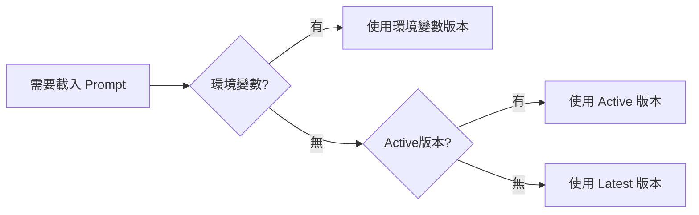
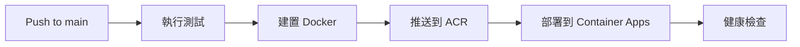

# 環境變數與 Prompt 版本管理完整指南

> 最後更新：2025-08-16  
> 版本：2.0.0 (整合版)  
> 適用對象：開發團隊、運維團隊

---

## 📌 快速參考

### 最常用指令

```bash
# 部署前檢查
./scripts/pre-deploy-check.sh

# 查看當前生產環境設定
az containerapp show --name airesumeadvisor-api-production \
  --resource-group airesumeadvisorfastapi \
  --query "properties.template.containers[0].env" -o table

# 臨時更新 Gap Analysis 版本（會被下次 CI/CD 覆蓋）
./scripts/update-gap-version-azure.sh 2.1.9

# 永久更新（編輯 CI/CD 檔案）
vim .github/workflows/ci-cd-main.yml  # 第 341-370 行
```

---

## 🎯 版本選擇優先順序

系統載入 Prompt 時的決策順序（由高到低）：

1. **環境變數** → `GAP_ANALYSIS_PROMPT_VERSION=2.1.7`
2. **程式碼指定** → `load_prompt_config("gap_analysis", version="2.1.5")`  
3. **Active 狀態** → YAML 中 `status: "active"`
4. **Latest 版本** → 版本號最高的檔案

### 決策流程



---

## 🔧 環境變數管理位置

### 管理層級表

| 優先級 | 位置 | 檔案/指令 | 持久性 | 用途 |
|--------|------|-----------|--------|------|
| **1** | CI/CD | `.github/workflows/ci-cd-main.yml`<br>第 341-370 行 | ✅ 永久 | **生產部署** |
| **2** | Azure CLI | `az containerapp update --set-env-vars` | ❌ 臨時 | 緊急調整 |
| **3** | 本地 | `.env` | 本地 | 開發測試 |

⚠️ **重要**：CI/CD 每次部署會完全覆蓋所有環境變數！

---

## 📊 當前環境變數配置表

### Prompt 版本設定

| 環境變數 | 當前值 | 來源 |
|---------|--------|------|
| `GAP_ANALYSIS_PROMPT_VERSION` | 2.1.8 | 偵測 active 或預設 |
| `KEYWORD_EXTRACTION_PROMPT_VERSION` | latest | 預設值 |
| `INDEX_CALCULATION_PROMPT_VERSION` | latest | 預設值 |
| `RESUME_FORMAT_PROMPT_VERSION` | latest | 預設值 |
| `RESUME_TAILOR_PROMPT_VERSION` | latest | 預設值 |

### LLM 模型設定（硬編碼）

| 環境變數 | 設定值 | 用途 |
|---------|--------|------|
| `LLM_MODEL_KEYWORDS` | gpt-4.1-mini | 快速關鍵字提取 |
| `LLM_MODEL_GAP_ANALYSIS` | gpt-4.1 | 詳細差距分析 |
| `LLM_MODEL_RESUME_FORMAT` | gpt-4.1 | 履歷格式化 |
| `LLM_MODEL_RESUME_TAILOR` | gpt-4.1 | 履歷客製化 |

### 系統設定

| 環境變數 | 設定值 | 說明 |
|---------|--------|------|
| `ENVIRONMENT` | production | 執行環境 |
| `LOG_LEVEL` | INFO | 日誌級別 |
| `MONITORING_ENABLED` | false | 重度監控關閉 |
| `LIGHTWEIGHT_MONITORING` | true | 輕量監控開啟 |

---

## 📁 .env 檔案結構與用途

### 檔案概覽

專案包含 4 個 .env 檔案，各有不同用途：

| 檔案 | 用途 | 特點 | Git 狀態 |
|------|------|------|----------|
| **.env** | 本地開發主檔案 | 真實 API keys + 真實資料庫 | ❌ gitignored |
| **.env.example** | 新成員參考範本 | 佔位符 + 完整說明 | ✅ 可提交 |
| **.env.simple** | 快速開始版本 | 最少設定（僅 API key） | ✅ 可提交 |
| **.env.test** | 測試環境配置 | Mock 值，TESTING=true | ❌ gitignored |

### 詳細比較表

| 設定類別 | .env | .env.example | .env.simple | .env.test |
|----------|------|--------------|-------------|-----------|
| **基本設定** | | | | |
| ENVIRONMENT | `development` | `production` | - | `test` |
| LOG_LEVEL | `INFO` | `INFO` | - | `ERROR` |
| TESTING | - | - | - | `true` |
| **Azure OpenAI** | | | | |
| AZURE_OPENAI_ENDPOINT | 真實 URL | 真實 URL | - | Mock URL |
| AZURE_OPENAI_API_KEY | 真實 key | `your-shared-api-key` | `your-api-key-here` | `test-key` |
| **GPT-4.1 設定** | | | | |
| GPT4_DEPLOYMENT | `gpt-4.1-japan` | `gpt-4.1-japan` | - | `test-deployment` |
| GPT41_MINI_DEPLOYMENT | `gpt-4-1-mini-japaneast` | `gpt-4-1-mini-japaneast` | - | `test-deployment` |
| **Legacy LLM2** | | | | |
| LLM2_ENDPOINT | ✅ 有（相容性） | ❌ 無 | - | ✅ Mock 值 |
| LLM2_API_KEY | ✅ 有（相容性） | ❌ 無 | - | ✅ Mock 值 |
| **PostgreSQL** | | | | |
| POSTGRES_HOST | ✅ 真實主機 | ✅ 真實主機 | - | Mock 主機 |
| POSTGRES_DATABASE | `coursesdb` | `coursesdb` | - | `testdb` |
| POSTGRES_USER | `coursesadmin` | `coursesadmin` | - | `testuser` |
| POSTGRES_PASSWORD | ✅ 真實密碼 | `your-password-here` | - | `test-password` |
| POSTGRES_SSL_MODE | `require` | `require` | - | `disable` |
| **安全設定** | | | | |
| JWT_SECRET_KEY | ✅ 真實 key | 佔位符 | - | `test-secret-key` |
| CONTAINER_APP_API_KEY | ✅ 真實 key | 佔位符 | - | `test-api-key` |
| **其他設定** | | | | |
| USE_RULE_BASED_DETECTOR | `true` | `true` | - | `true` |
| Prompt 版本設定 | 註解（可選） | 註解（可選） | - | 註解（可選） |
| 監控日誌設定 | 註解（可選） | 有說明 | - | 註解（停用） |
| CORS_ORIGINS | 生產域名 | 生產域名 | - | localhost |

### 使用指南

#### 新成員入門
```bash
# 1. 複製範本
cp .env.example .env

# 2. 填入真實的 API keys
vim .env
# 更新 AZURE_OPENAI_API_KEY、JWT_SECRET_KEY 等

# 3. 確認資料庫連接（Gap Analysis 需要）
# 更新 POSTGRES_PASSWORD
```

#### 快速測試
```bash
# 使用簡化版本快速開始
cp .env.simple .env
# 只需填入一個 API key 即可
```

#### 執行測試
```bash
# 測試會使用 mock 值，不需要真實 API
# 測試框架會設定 os.environ，不會載入 .env.test
pytest
```

### 重要注意事項

1. **PostgreSQL 是必需的**：Gap Analysis API 會調用 Course Availability Check，需要資料庫連接
2. **LLM2 設定要保留**：用於向後相容，程式碼中有 alias 處理
3. **測試隔離**：.env.test 使用完全的 mock 值，避免意外使用真實 API
4. **安全性**：永遠不要提交包含真實 secrets 的 .env 檔案

---

## 🚀 開發團隊操作指南

### 0. Pre-Push 配置確認（新增）

當你要 push 到 main 分支時，系統會自動：
1. 顯示將被部署的環境變數配置
2. 列出 Prompt 版本（從 active YAML 檔案偵測）
3. 顯示 LLM 模型設定
4. 檢查 GitHub Secrets 狀態（如有 gh CLI）
5. 要求你確認後才會 push

```bash
# 當執行 git push origin main 時
# 會自動觸發 scripts/pre-push-check.sh
# 顯示配置並要求確認：

┌─────────────────────────────────────┬──────────────┐
│ GAP_ANALYSIS_PROMPT_VERSION         │ 2.1.8        │
│ KEYWORD_EXTRACTION_PROMPT_VERSION   │ latest       │
│ INDEX_CALCULATION_PROMPT_VERSION    │ latest       │
└─────────────────────────────────────┴──────────────┘

Type 'yes' to continue or 'no' to cancel: 
```

### 1. 本地開發測試

```bash
# 設定測試版本
export GAP_ANALYSIS_PROMPT_VERSION=2.1.9
python src/main.py

# 或編輯 .env
echo "GAP_ANALYSIS_PROMPT_VERSION=2.1.9" >> .env
source .env
```

### 2. 新增 Prompt 版本

```bash
# 1. 創建新版本檔案
cp src/prompts/gap_analysis/v2.1.8.yaml \
   src/prompts/gap_analysis/v2.1.9.yaml

# 2. 編輯 metadata
vim src/prompts/gap_analysis/v2.1.9.yaml
# 設定 status: "testing"

# 3. 測試通過後改為 active
# status: "active"
# 同時將舊版本改為 "production"
```

### 3. 查看版本載入邏輯

```python
from src.core.simple_prompt_manager import prompt_manager

# 查看實際會載入的版本
version = prompt_manager.get_resolved_version("gap_analysis", "latest")
print(f"Will use: {version}")

# 列出所有版本
versions = prompt_manager.list_versions("gap_analysis")
for v in versions:
    print(f"{v['version']}: {v.get('status', 'unknown')}")
```

---

## 🔧 運維團隊操作指南

### 1. 部署前檢查

```bash
# 執行檢查腳本
./scripts/pre-deploy-check.sh

# 會顯示：
# ✓ 所有 Prompt 版本設定
# ✓ LLM 模型配置
# ✓ 系統環境變數
# ✓ GitHub Secrets 狀態
```

### 2. 查看生產環境實際值

```bash
# 所有環境變數
az containerapp show \
  --name airesumeadvisor-api-production \
  --resource-group airesumeadvisorfastapi \
  --query "properties.template.containers[0].env" \
  -o table

# 特定 Prompt 版本
az containerapp show \
  --name airesumeadvisor-api-production \
  --resource-group airesumeadvisorfastapi \
  --query "properties.template.containers[0].env[?name=='GAP_ANALYSIS_PROMPT_VERSION'].value | [0]" \
  -o tsv
```

### 3. 緊急版本切換

```bash
# 方法 A：臨時切換（立即生效，下次部署會覆蓋）
./scripts/update-gap-version-azure.sh 2.1.7

# 方法 B：永久修改（需要 git push）
vim .github/workflows/ci-cd-main.yml
# 修改第 294 行：
# echo "gap-analysis-version=${GAP_VERSION:-2.1.7}" >> $GITHUB_OUTPUT
git add . && git commit -m "Update Gap Analysis version"
git push  # 觸發 CI/CD
```

### 4. 版本回滾

```bash
# 快速回滾到特定版本
az containerapp update \
  --name airesumeadvisor-api-production \
  --resource-group airesumeadvisorfastapi \
  --set-env-vars GAP_ANALYSIS_PROMPT_VERSION=2.1.7

# 回滾到上一個 revision
az containerapp revision list \
  --name airesumeadvisor-api-production \
  --resource-group airesumeadvisorfastapi \
  --query "[-2].name" -o tsv

az containerapp revision set-mode \
  --name airesumeadvisor-api-production \
  --resource-group airesumeadvisorfastapi \
  --mode single \
  --revision <previous-revision-name>
```

---

## 🏷️ Prompt Status 定義

| 狀態 | 含義 | 自動載入 | 使用場景 |
|------|------|----------|----------|
| **active** | 生產使用中 | ✅ 是 | 正式部署版本 |
| **production** | 生產就緒 | ❌ 否 | 已測試待啟用 |
| **testing** | 測試中 | ❌ 否 | 開發測試階段 |
| **inactive** | 已停用 | ❌ 否 | 歷史版本 |

**重要規則**：
- 每個任務只能有**一個** active 版本
- 新版本流程：testing → production → active → inactive

---

## 📝 CI/CD 配置詳解

### 關鍵檔案位置

```yaml
# .github/workflows/ci-cd-main.yml

# 基本設定（第 8-12 行）
env:
  CONTAINER_APP_NAME: airesumeadvisor-api-production
  RESOURCE_GROUP: airesumeadvisorfastapi

# Prompt 版本偵測（第 287-298 行）
GAP_VERSION=$(find_active_version "gap_analysis")
echo "gap-analysis-version=${GAP_VERSION:-2.1.8}" >> $GITHUB_OUTPUT

# 環境變數設定（第 341-370 行）
az containerapp update \
  --set-env-vars \
    GAP_ANALYSIS_PROMPT_VERSION="${{ steps.prompt-versions.outputs.gap-analysis-version }}" \
    LLM_MODEL_GAP_ANALYSIS=gpt-4.1 \
    # ... 其他變數
```

### 修改 CI/CD 設定

1. **改變預設版本**：
   ```yaml
   # 第 294 行
   echo "gap-analysis-version=${GAP_VERSION:-2.1.9}" >> $GITHUB_OUTPUT
   ```

2. **改變 LLM 模型**：
   ```yaml
   # 第 359 行
   LLM_MODEL_GAP_ANALYSIS=gpt-4.1-turbo \
   ```

3. **新增環境變數**：
   ```yaml
   # 第 370 行後新增
   NEW_VARIABLE=value \
   ```

---

## 🔍 故障排除

### 問題 1：錯誤版本被載入

```bash
# 診斷步驟
# 1. 檢查環境變數
echo $GAP_ANALYSIS_PROMPT_VERSION

# 2. 檢查 active 版本
grep -l 'status:.*active' src/prompts/gap_analysis/*.yaml

# 3. 查看 Azure 實際值
az containerapp show \
  --name airesumeadvisor-api-production \
  --query "properties.template.containers[0].env[?name=='GAP_ANALYSIS_PROMPT_VERSION'].value"
```

### 問題 2：CI/CD 部署後版本不對

```bash
# 查看 GitHub Actions 日誌
# GitHub → Actions → 最近的 workflow run
# 展開 "Detect prompt versions" 步驟

# 確認只有一個 active
for file in src/prompts/gap_analysis/*.yaml; do
  echo -n "$file: "
  grep "status:" "$file"
done
```

### 問題 3：Azure 修改被覆蓋

**原因**：CI/CD 使用 `--set-env-vars` 會完全覆蓋  
**解決**：必須修改 `.github/workflows/ci-cd-main.yml`

---

## 📊 A/B 測試配置

### 設定 A/B 測試

```python
# 在程式碼中實現
import random
import os

def setup_ab_test():
    if random.random() < 0.5:
        os.environ["GAP_ANALYSIS_PROMPT_VERSION"] = "2.1.8"  # Control
    else:
        os.environ["GAP_ANALYSIS_PROMPT_VERSION"] = "2.1.9"  # Treatment
```

### 使用環境變數分流

```bash
# CI/CD 中設定比例
if [ $((RANDOM % 100)) -lt 20 ]; then
  # 20% 使用新版本
  echo "gap-analysis-version=2.1.9" >> $GITHUB_OUTPUT
else
  # 80% 使用舊版本
  echo "gap-analysis-version=2.1.8" >> $GITHUB_OUTPUT
fi
```

---

## 🚢 GitHub Actions CI/CD 工作流程

### 部署流程概覽



### 主要 Workflows

| Workflow | 檔案 | 觸發條件 | 用途 |
|----------|------|----------|------|
| **主 CI/CD** | `ci-cd-main.yml` | Push to main | 完整建置、測試、部署 |
| **Prompt 版本更新** | `prompt-version-update.yml` | 手動 | 快速切換 prompt 版本 |
| **回滾** | `rollback.yml` | 手動 | 回滾到先前版本 |
| **清理** | `cleanup.yml` | 每週日/手動 | 清理 30 天前舊版本 |

### CI/CD 自動版本偵測

```yaml
# .github/workflows/ci-cd-main.yml
# 自動掃描 active 版本（第 273-283 行）
for file in $dir/v*.yaml; do
  if grep -qE 'status:\s*["'\''\']?active["'\''\']?' "$file"; then
    basename "$file" .yaml | sed 's/^v//'
    return
  fi
done
```

### 部署操作

#### 自動部署（推送到 main）
```bash
git add .
git commit -m "feat: 新功能"
git push origin main
# → 自動觸發 CI/CD
```

#### 手動切換 Prompt 版本（不重建映像）
```bash
# 使用 GitHub Actions（推薦）
gh workflow run prompt-version-update.yml \
  -f task=gap_analysis \
  -f version=2.1.1 \
  -f environment=production

# 或使用本地腳本
./scripts/update-gap-version-azure.sh 2.1.1
```

#### 手動回滾
```bash
# GitHub Actions 回滾
gh workflow run rollback.yml \
  -f reason="版本問題" \
  -f revision="前一版本名稱"

# 或 Azure CLI 回滾
az containerapp revision set-mode \
  --name airesumeadvisor-api-production \
  --resource-group airesumeadvisorfastapi \
  --mode single \
  --revision <revision-name>
```

---

## 📊 Prompt 版本歷程追蹤

### Gap Analysis 版本演進

| 版本 | 狀態 | 主要改進 | 部署日期 |
|------|------|----------|----------|
| v2.1.8 | **active** | 三層技能分類、4級證據評估 | 2025-08-14 |
| v2.1.7 | production | 角色分類優化 | 2025-08-13 |
| v2.1.1 | production | 100字限制、移除數字預測 | 2025-08-13 |
| v2.1.0 | production | [Skill/Presentation Gap] 標記 | 2025-01-16 |

### 其他 API 當前版本

| API | 版本 | 狀態 | 特性 |
|-----|------|------|------|
| Keyword Extraction | v1.4.0 | active | 多語言支援 |
| Index Calculation | v2.0.0 | active | 增強匹配 |
| Resume Format | v1.0.0 | active | 基礎格式化 |
| Resume Tailoring | v2.1.0 | active | 改進客製化 |

---

## 🔐 安全注意事項

1. **GitHub Secrets**
   - 永遠不要在程式碼中硬編碼
   - 定期輪換 API Keys
   - 使用最小權限原則

2. **環境變數**
   - 生產環境不要開啟 DEBUG
   - 敏感資料使用 Secrets
   - 避免在日誌中輸出環境變數

3. **版本控制**
   - 不要將 `.env` 檔案提交到 Git
   - 使用 `.env.example` 作為範本
   - 記錄所有版本變更

---

## 🔄 版本管理最佳實踐

### 新版本部署流程

1. **開發階段**
   ```bash
   # 創建新版本
   cp src/prompts/gap_analysis/v2.1.8.yaml \
      src/prompts/gap_analysis/v2.1.9.yaml
   
   # 設定 status: "testing"
   vim src/prompts/gap_analysis/v2.1.9.yaml
   ```

2. **測試階段**
   ```bash
   # 本地測試
   export GAP_ANALYSIS_PROMPT_VERSION=2.1.9
   pytest test/integration/test_gap_analysis.py
   ```

3. **預生產**
   ```bash
   # 改為 production
   # status: "production"
   ```

4. **正式部署**
   ```bash
   # 設為 active，舊版本改為 production
   # v2.1.9: status: "active"
   # v2.1.8: status: "production"
   ```

### A/B 測試配置

```python
# 程式碼實現
import random
import os

def setup_ab_test():
    if random.random() < 0.2:  # 20% 新版本
        os.environ["GAP_ANALYSIS_PROMPT_VERSION"] = "2.1.9"
        return "treatment"
    else:  # 80% 舊版本
        os.environ["GAP_ANALYSIS_PROMPT_VERSION"] = "2.1.8"
        return "control"
```

---

## 📅 維護排程建議

| 頻率 | 任務 | 負責人 |
|------|------|--------|
| 每次部署前 | 執行 `pre-deploy-check.sh` | 開發團隊 |
| 每週 | 檢查並清理 inactive 版本 | 運維團隊 |
| 每月 | 審查環境變數設定 | 架構師 |
| 每季 | 更新 API Keys | 安全團隊 |

---

## 🔑 Azure 資源與認證設定

### Azure 資源資訊
- **Subscription ID**: `5396d388-8261-464e-8ee4-112770674fba`
- **Resource Group**: `airesumeadvisorfastapi`
- **Container App**: `airesumeadvisor-api-production`
- **Container Registry**: `airesumeadvisorregistry`
- **Region**: Japan East

### GitHub Secrets 必要設定

| Secret 名稱 | 說明 | 取得方式 |
|-------------|------|----------|
| `AZURE_CLIENT_ID` | Service Principal ID | `az ad sp create-for-rbac` |
| `AZURE_CLIENT_SECRET` | Service Principal 密碼 | 同上 |
| `AZURE_TENANT_ID` | Azure Tenant ID | 同上 |
| `AZURE_SUBSCRIPTION_ID` | Azure 訂閱 ID | `5396d388-8261-464e-8ee4-112770674fba` |
| `ACR_USERNAME` | Container Registry 用戶 | `az acr credential show` |
| `ACR_PASSWORD` | Container Registry 密碼 | 同上 |
| `AZURE_OPENAI_API_KEY` | OpenAI API Key | Azure Portal |
| `JWT_SECRET_KEY` | JWT 簽名金鑰 | 自行產生 |
| `CONTAINER_APP_API_KEY` | API 認證金鑰 | 自行設定 |

### Service Principal 設定
```bash
# 建立 Service Principal
az ad sp create-for-rbac \
  --name "github-actions-azure-container" \
  --role Contributor \
  --scopes /subscriptions/5396d388-8261-464e-8ee4-112770674fba/resourceGroups/airesumeadvisorfastapi \
  --sdk-auth

# 授予 ACR 權限
ACR_ID=$(az acr show --name airesumeadvisorregistry --query id -o tsv)
az role assignment create \
  --assignee <clientId> \
  --role AcrPush \
  --scope $ACR_ID
```

---

## 🆘 緊急處理與故障排除

### 常見問題處理

| 問題 | 原因 | 解決方案 |
|------|------|----------|
| **認證錯誤** | Service Principal 過期 | 重新建立並更新 GitHub Secrets |
| **映像推送失敗** | ACR 權限不足 | 檢查 AcrPush 權限 |
| **部署失敗** | 環境變數錯誤 | 檢查 CI/CD 設定 |
| **版本載入錯誤** | 多個 active 版本 | 確保只有一個 active |

### 查看日誌
```bash
# Container App 即時日誌
az containerapp logs show \
  --name airesumeadvisor-api-production \
  --resource-group airesumeadvisorfastapi \
  --follow

# 特定 revision 日誌
az containerapp logs show \
  --name airesumeadvisor-api-production \
  --resource-group airesumeadvisorfastapi \
  --revision <revision-name>
```

### 緊急聯絡
- **Azure 問題**：檢查 Azure Status Page
- **GitHub Actions 失敗**：查看 workflow logs
- **API Key 問題**：聯繫安全團隊
- **版本回滾**：使用上述回滾程序

---

## 📚 相關檔案

- **CI/CD 配置**：`.github/workflows/ci-cd-main.yml`
- **部署前檢查**：`scripts/pre-deploy-check.sh`
- **版本更新**：`scripts/update-gap-version-azure.sh`
- **Prompt 管理器**：`src/core/simple_prompt_manager.py`
- **Prompt 檔案**：`src/prompts/{task}/v*.yaml`

---

## 📈 監控與效能

### 測試覆蓋率
- **總測試案例**: 197 個
- **單元測試**: 127 個
- **整合測試**: 70 個
- **測試通過率**: 100%

### 監控端點
- **健康檢查**: `/health`
- **API 文檔**: `/docs`
- **生產環境**: https://airesumeadvisor-api-production.calmisland-ea7fe91e.japaneast.azurecontainerapps.io

### Application Insights
- 整合完整遙測
- 監控 API 效能和錯誤率
- 自定義指標追蹤

---

最後更新：2025-08-16 | 維護者：DevOps Team | 版本：4.0.0（含 .env 檔案比較表）