# Course Availability Check Decision Tree

## Overview

This document describes the complete decision flow for the course availability check system used in the Gap Analysis API endpoint (`/api/v1/index-cal-and-gap-analysis`). The system implements a sophisticated multi-stage filtering and quota system with dynamic supplementation to ensure optimal course recommendations.

## Key Features

1. **Dynamic Caching**: MD5-based cache keys with 30-minute TTL
2. **Smart Quotas**: Category-specific quotas with reserve pools
3. **Deficit Filling**: Automatic supplementation from course reserves
4. **Similarity Sorting**: Final ranking by relevance across all types

## Decision Flow Diagram

```mermaid
flowchart TD
    Start([開始: Gap Analysis 生成 SkillSearchQueries]) --> CheckCache{檢查動態快取<br/>ENABLE_COURSE_CACHE}
    
    CheckCache -->|啟用快取| CacheLookup[對每個 skill 生成快取 key<br/>MD5 embedding_text + category + threshold]
    CheckCache -->|停用快取| DirectQuery[所有 skills 進入查詢佇列]
    
    CacheLookup --> CacheHit{快取命中?}
    CacheHit -->|是| UseCached[使用快取資料<br/>< 1ms 回應]
    CacheHit -->|否| AddToQueue[加入未快取佇列]
    
    AddToQueue --> DirectQuery
    DirectQuery --> BatchEmbedding[批次生成 Embedding<br/>單次 API 呼叫]
    
    BatchEmbedding --> ParallelQuery[並行查詢<br/>最多 20 個並發任務]
    
    ParallelQuery --> SQLQuery[執行 pgvector SQL 查詢]
    
    SQLQuery --> Stage1[Stage 1: 初始過濾<br/>similarity >= 0.35<br/>取前 80 個候選]
    
    Stage1 --> Stage2[Stage 2: 類別閾值過濾<br/>SKILL: ≥0.40<br/>FIELD: ≥0.35<br/>DEFAULT: ≥0.40]
    
    Stage2 --> Stage3[Stage 3: 按 course_type 分組<br/>計算每組排名和數量]
    
    Stage3 --> Stage4{應用擴展配額}
    
    Stage4 -->|SKILL| SkillQuota[SKILL 擴展配額<br/>course: 25 incl. 10備用<br/>project: 5<br/>certification: 2<br/>specialization: 2<br/>degree: 1]
    Stage4 -->|FIELD| FieldQuota[FIELD 擴展配額<br/>specialization: 12<br/>degree: 4<br/>course: 15 incl. 10備用<br/>certification: 2<br/>project: 1]
    Stage4 -->|DEFAULT| DefaultQuota[DEFAULT 擴展配額<br/>course: 20 incl. 10備用 <br/>specialization: 5<br/>project: 3<br/>certification: 2<br/>degree: 2]
    
    SkillQuota --> SQLResult[SQL 返回結果<br/>包含 id, similarity, type]
    FieldQuota --> SQLResult
    DefaultQuota --> SQLResult
    
    SQLResult --> PyPost[Python 後處理開始]
    
    PyPost --> SplitCourses[分離 course 類型<br/>基本配額 vs 備用池]
    
    SplitCourses --> AllocateQuotas[按原始配額分配<br/>各類型課程]
    
    AllocateQuotas --> CalcTotal[計算總缺額<br/>Σ 配額 - 實際]
    
    CalcTotal --> HasDeficit{總缺額 > 0?}
    
    HasDeficit -->|是| FillGap[從 course 備用池<br/>取 N 個補充<br/>N = min 總缺額, 備用數]
    HasDeficit -->|否| NoFill[不需補充]
    
    FillGap --> CombineAll[合併所有課程]
    NoFill --> CombineAll
    
    CombineAll --> SortBySim[按相似度排序<br/>所有課程統一排序]
    
    SortBySim --> Check25{總數 > 25?}
    
    Check25 -->|是| Trim25[取前 25 個]
    Check25 -->|否| KeepAll[保持所有]
    
    Trim25 --> UpdateCache{快取啟用?}
    KeepAll --> UpdateCache
    
    UpdateCache -->|是| SaveCache[儲存到動態快取<br/>TTL: 30 分鐘]
    UpdateCache -->|否| SkipCache[跳過快取]
    
    SaveCache --> FinalResult[返回最終結果]
    SkipCache --> FinalResult
    UseCached --> FinalResult
    
    FinalResult --> ResponseFormat[格式化回應<br/>has_available_courses<br/>course_count<br/>available_course_ids<br/>type_diversity<br/>course_types]
    
    %% 簡化的計算邏輯
    CalcTotal -.->|計算方式| CalcEx[["📊 簡單計算<br/>===原始配額===<br/>project: 5, spec: 2, cert: 2<br/>===實際數量===<br/>project: 3, spec: 1, cert: 2<br/>===缺額計算===<br/>(5-3)+(2-1)+(2-2) = 3<br/>需從備用取 3 個"]]
    
    %% 修正後的範例
    Stage4 -.->|範例 1| Ex1[["🔵 Python (SKILL)<br/>===SQL 返回===<br/>course: 20 (15基本+5備用)<br/>project: 3, cert: 2, spec: 1"]]
    Ex1 -.-> Ex1Process[["計算：<br/>project 缺 2 (5-3)<br/>spec 缺 1 (2-1)<br/>總缺額 = 3<br/>從 5 個備用 course 取 3<br/>最終: 20+3 = 23 個"]]
    
    Stage4 -.->|範例 2| Ex2[["🟠 Data Science (FIELD)<br/>===SQL 返回===<br/>spec: 10, degree: 4<br/>course: 12 (5基本+7備用)<br/>cert: 1, project: 0"]]
    Ex2 -.-> Ex2Process[["計算：<br/>spec 缺 2 (12-10)<br/>cert 缺 1 (2-1)<br/>project 缺 1 (1-0)<br/>總缺額 = 4<br/>從 7 個備用 course 取 4<br/>最終: 10+4+5+1 = 20 個"]]
    
    Stage4 -.->|範例 3| Ex3[["🟢 Rust (SKILL)<br/>===SQL 返回===<br/>course: 6 (全部)<br/>project: 2<br/>無其他類型"]]
    Ex3 -.-> Ex3Process[["計算：<br/>course 無備用 (只有6個)<br/>project 缺 3 (5-2)<br/>無法補充<br/>最終: 6+2 = 8 個"]]
    
    %% 效能說明
    CacheHit -.->|效能| Perf1[["🚀 快取命中<br/>回應時間: < 1ms<br/>無 DB 查詢"]]
    
    ParallelQuery -.->|效能| Perf2[["⚡ 快取未命中<br/>Embedding: ~50ms<br/>DB 查詢: ~300ms<br/>Python 處理: ~5ms<br/>總計: ~355ms"]]
    
    %% 樣式
    classDef processNode fill:#e1f5fe,stroke:#01579b,stroke-width:2px
    classDef checkNode fill:#fff3e0,stroke:#e65100,stroke-width:2px
    classDef cacheNode fill:#e8f5e9,stroke:#2e7d32,stroke-width:2px
    classDef quotaNode fill:#f3e5f5,stroke:#4a148c,stroke-width:2px
    classDef pyProcessNode fill:#fff9c4,stroke:#f57f17,stroke-width:2px
    classDef exampleNode fill:#fce4ec,stroke:#880e4f,stroke-width:1px,stroke-dasharray: 5 5
    classDef perfNode fill:#e0f2f1,stroke:#00695c,stroke-width:1px,stroke-dasharray: 3 3
    
    class CacheLookup,UseCached,SaveCache,UpdateCache cacheNode
    class Stage1,Stage2,Stage3,SQLResult,BatchEmbedding,ParallelQuery processNode
    class CheckCache,CacheHit,Check25,Stage4,HasDeficit checkNode
    class SkillQuota,FieldQuota,DefaultQuota quotaNode
    class PyPost,SplitCourses,AllocateQuotas,CalcTotal,FillGap,CombineAll,SortBySim pyProcessNode
    class Ex1,Ex1Process,Ex2,Ex2Process,Ex3,Ex3Process,CalcEx exampleNode
    class Perf1,Perf2 perfNode
```



## Stage Descriptions

### Stage 1: Initial Filtering
- **Purpose**: Cast a wide net to get sufficient candidates
- **Threshold**: similarity >= 0.35 (MIN_SIMILARITY_THRESHOLD)
- **Limit**: 80 candidates
- **Rationale**: Ensures enough courses for diversity while maintaining baseline quality

### Stage 2: Category-Specific Thresholds
- **Purpose**: Apply stricter quality filters based on skill category
- **Thresholds** (configurable via environment variables):
  - SKILL: ≥0.40 (technical skills require higher relevance)
  - FIELD: ≥0.35 (domain knowledge accepts broader matches)
  - DEFAULT: ≥0.40 (fallback for uncategorized skills)

### Stage 3: Type Ranking
- **Purpose**: Rank courses within each type for quota application
- **Process**: 
  - Group by course_type_standard
  - Calculate rank within each group
  - Count total in each group

### Stage 4: Extended Quota Application
- **Purpose**: Apply quotas with reserve pools for supplementation

#### Original Quotas (Target Distribution)
| Category | course | project | certification | specialization | degree |
|----------|--------|---------|---------------|----------------|--------|
| SKILL    | 15     | 5       | 2             | 2              | 1      |
| FIELD    | 5      | 1       | 2             | 12             | 4      |
| DEFAULT  | 10     | 3       | 2             | 5              | 2      |

#### Extended Quotas (With Reserves)
| Category | course | project | certification | specialization | degree |
|----------|--------|---------|---------------|----------------|--------|
| SKILL    | 25 (+10) | 5     | 2             | 2              | 1      |
| FIELD    | 15 (+10) | 1     | 2             | 12             | 4      |
| DEFAULT  | 20 (+10) | 3     | 2             | 5              | 2      |

## Python Post-Processing Logic

### Deficit Calculation and Filling

```python
# Pseudocode for deficit filling mechanism
def process_course_results(sql_result):
    # 1. Parse and categorize courses
    courses_by_type = group_by_type(sql_result.course_data)
    
    # 2. Separate basic allocation from reserves
    # For SKILL category example:
    basic_courses = courses_by_type['course'][:15]
    reserve_courses = courses_by_type['course'][15:25]
    
    # 3. Calculate total deficit
    total_deficit = 0
    for type_name, quota in ORIGINAL_QUOTAS[category].items():
        actual_count = len(courses_by_type.get(type_name, []))
        deficit = max(0, quota - actual_count)
        total_deficit += deficit
    
    # 4. Fill from reserve pool
    final_courses = []
    # Add all non-course types up to quota
    for type_name in ['project', 'certification', 'specialization', 'degree']:
        final_courses.extend(courses_by_type.get(type_name, [])[:quota])
    
    # Add basic course allocation
    final_courses.extend(basic_courses)
    
    # Supplement from reserves if needed
    if total_deficit > 0 and reserve_courses:
        supplement_count = min(total_deficit, len(reserve_courses))
        final_courses.extend(reserve_courses[:supplement_count])
    
    # 5. Sort by similarity across all types
    final_courses.sort(key=lambda x: x['similarity'], reverse=True)
    
    # 6. Limit to 25 courses
    return final_courses[:25]
```

### Example Calculations

#### Example 1: Python (SKILL)
- **SQL Returns**: course: 20, project: 3, cert: 2, spec: 1
- **Deficits**: project: 2 (5-3), spec: 1 (2-1)
- **Total Deficit**: 3
- **Reserve Available**: 5 courses (positions 16-20)
- **Action**: Take 3 from reserves
- **Final Count**: 23 courses

#### Example 2: Data Science (FIELD)
- **SQL Returns**: spec: 10, degree: 4, course: 12, cert: 1, project: 0
- **Deficits**: spec: 2 (12-10), cert: 1 (2-1), project: 1 (1-0)
- **Total Deficit**: 4
- **Reserve Available**: 7 courses (positions 6-12)
- **Action**: Take 4 from reserves
- **Final Count**: 20 courses

#### Example 3: Rust (SKILL with insufficient courses)
- **SQL Returns**: course: 6, project: 2
- **Deficits**: course: 9 (15-6), project: 3 (5-2)
- **Total Deficit**: 12
- **Reserve Available**: 0 (only 6 courses total)
- **Action**: Cannot supplement
- **Final Count**: 8 courses

## Performance Characteristics

### Cache Hit Path
- **Response Time**: < 1ms
- **Database Queries**: 0
- **Cache Hit Rate**: ~70% in production

### Cache Miss Path
- **Embedding Generation**: ~50ms (batch)
- **Database Query**: ~300ms (parallel)
- **Python Processing**: ~5ms
- **Total**: ~355ms

### Optimization Strategies
1. **Dynamic Cache**: 30-minute TTL with LRU eviction
2. **Batch Embeddings**: Single API call for all skills
3. **Parallel Queries**: Up to 20 concurrent database queries
4. **Single SQL Query**: No secondary queries for supplementation

## Configuration

### Environment Variables
```bash
# Similarity Thresholds
COURSE_THRESHOLD_SKILL=0.40      # Default: 0.40
COURSE_THRESHOLD_FIELD=0.35      # Default: 0.35
COURSE_THRESHOLD_DEFAULT=0.40    # Default: 0.40
COURSE_MIN_THRESHOLD=0.35        # Default: 0.35

# Cache Settings
ENABLE_COURSE_CACHE=true         # Default: true
```

### Monitoring Events
- `CourseAvailabilityCheck`: Tracks check performance and cache metrics
- `CourseAvailabilityCheckFailed`: Individual skill check failures
- `CourseAvailabilitySystemError`: System-level failures

## Benefits of This Design

1. **Diversity**: Ensures variety of course types when available
2. **Flexibility**: Automatically supplements when specific types are scarce
3. **Relevance**: Final sorting ensures most relevant courses are selected
4. **Performance**: Single SQL query with efficient post-processing
5. **Resilience**: Graceful degradation when courses are insufficient

## Future Improvements

1. **Personalized Quotas**: Adjust quotas based on user profile
2. **Dynamic Thresholds**: Learn optimal thresholds from user feedback
3. **Weighted Supplementation**: Prefer certain types when supplementing
4. **Regional Variations**: Different quotas for different markets

---

**Document Version**: 1.0.0  
**Last Updated**: 2025-01-20  
**Author**: Claude Code + WenHao