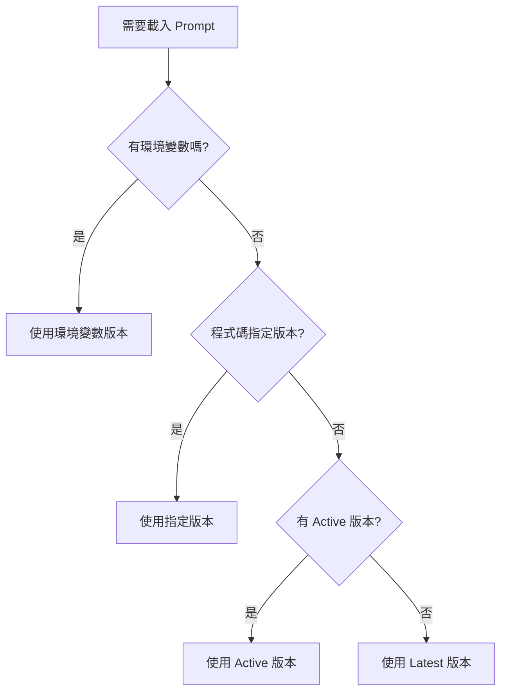

# Prompt 版本管理規則文檔

> 建立日期：2025-08-16  
> 版本：1.0.0  
> 狀態：Active

## 📋 目錄

1. [版本選擇優先順序](#版本選擇優先順序)
2. [版本狀態定義](#版本狀態定義)
3. [版本引入方式](#版本引入方式)
4. [命名規範](#命名規範)
5. [最佳實踐](#最佳實踐)
6. [問題診斷](#問題診斷)

---

## 🎯 版本選擇優先順序

當系統需要載入 prompt 時，按照以下優先順序選擇版本：

### 優先級（由高到低）

1. **環境變數覆蓋** (最高優先級)
   - 格式：`{TASK}_PROMPT_VERSION`
   - 例如：`GAP_ANALYSIS_PROMPT_VERSION=2.1.8`
   - 用途：緊急覆蓋、A/B 測試、臨時切換

2. **程式碼指定版本**
   - 直接指定：`load_prompt_config("gap_analysis", version="2.1.5")`
   - 用途：特定功能需要特定版本

3. **Active 狀態版本**
   - metadata 中 `status: "active"` 的版本
   - 用途：生產環境的預設版本
   - **重要**：每個任務只能有一個 active 版本

4. **Latest 版本** (最低優先級)
   - 版本號最高的檔案
   - 用途：開發環境的預設行為

### 決策流程圖



---

## 🏷️ 版本狀態定義

### Status 欄位含義

| 狀態 | 含義 | 用途 | 影響 |
|------|------|------|------|
| **active** | 生產環境使用 | 正式部署的版本 | 優先載入（除非被覆蓋） |
| **production** | 生產就緒 | 經過測試但未啟用 | 不自動載入 |
| **testing** | 測試中 | 開發測試階段 | 不自動載入 |
| **inactive** | 已停用 | 舊版本或廢棄版本 | 不自動載入 |
| **experimental** | 實驗性 | 新功能試驗 | 不自動載入 |

### 狀態轉換規則

```
experimental → testing → production → active → inactive
                  ↓           ↓           ↓
              inactive    inactive    production
```

- 新版本從 `experimental` 或 `testing` 開始
- 測試通過後改為 `production`
- 準備部署時改為 `active`（同時將舊 active 改為 `production` 或 `inactive`）
- 廢棄版本改為 `inactive`

---

## 🔧 版本引入方式

### 1. 環境變數方式

**本地開發**
```bash
export GAP_ANALYSIS_PROMPT_VERSION=2.1.8
export KEYWORD_EXTRACTION_PROMPT_VERSION=1.4.0
python src/main.py
```

**Docker 容器**
```dockerfile
ENV GAP_ANALYSIS_PROMPT_VERSION=2.1.8
ENV KEYWORD_EXTRACTION_PROMPT_VERSION=1.4.0
```

**Azure Container Apps**
```bash
az containerapp update \
  --name airesumeadvisor-api-production \
  --resource-group airesumeadvisorfastapi \
  --set-env-vars GAP_ANALYSIS_PROMPT_VERSION=2.1.8
```

**CI/CD Pipeline**
```yaml
env:
  GAP_ANALYSIS_PROMPT_VERSION: ${{ steps.prompt-versions.outputs.gap-analysis-version }}
```

### 2. 程式碼指定方式

**直接指定版本**
```python
from src.core.simple_prompt_manager import prompt_manager

# 指定具體版本
config = prompt_manager.load_prompt_config("gap_analysis", version="2.1.5")

# 使用 active 版本
config = prompt_manager.load_prompt_config("gap_analysis", version="active")

# 使用最新版本
config = prompt_manager.load_prompt_config("gap_analysis", version="latest")
```

### 3. Metadata 配置方式

**在 YAML 檔案中設定**
```yaml
version: "2.1.8"
metadata:
  status: "active"  # 這個版本會被自動選擇
  author: "AI Resume Advisor Team"
  created_at: "2025-08-14T00:00:00Z"
```

### 4. CI/CD 自動偵測

**GitHub Actions 工作流程**
```bash
# 自動尋找 active 版本
find_active_version() {
  local task=$1
  local dir="src/prompts/$task"
  
  for file in $dir/v*.yaml; do
    if grep -qE 'status:\s*["'\'']?active["'\'']?' "$file"; then
      basename "$file" .yaml | sed 's/^v//'
      return
    fi
  done
}
```

---

## 📝 命名規範

### 檔案命名格式

```
v{major}.{minor}.{patch}[-{language}].yaml
```

**範例**：
- `v2.1.8.yaml` - 預設英文版本
- `v2.1.8-zh-TW.yaml` - 繁體中文版本
- `v2.1.8-experimental.yaml` - 實驗性版本

### 版本號規則

- **Major (主版本)**：重大改變，可能不相容
- **Minor (次版本)**：新功能或改進
- **Patch (修訂版)**：錯誤修復或小調整

### 環境變數命名

```
{TASK_NAME}_PROMPT_VERSION
```

- 任務名稱全大寫
- 連字號改為底線
- 例如：`gap-analysis` → `GAP_ANALYSIS_PROMPT_VERSION`

---

## ✅ 最佳實踐

### 1. 版本管理原則

- ✅ **單一 Active**：每個任務只保持一個 active 版本
- ✅ **逐步升級**：新版本先設為 testing，測試後改為 production，最後改為 active
- ✅ **保留歷史**：舊版本改為 inactive 而非刪除
- ✅ **文檔同步**：更新版本時同步更新文檔

### 2. 部署流程

```bash
# 1. 開發新版本
創建 v2.1.9.yaml，status: "testing"

# 2. 本地測試
export GAP_ANALYSIS_PROMPT_VERSION=2.1.9
pytest test/integration/test_gap_analysis.py

# 3. 改為 production
將 status 改為 "production"

# 4. 部署到測試環境
az containerapp update --set-env-vars GAP_ANALYSIS_PROMPT_VERSION=2.1.9

# 5. 正式啟用
將 v2.1.9 status 改為 "active"
將 v2.1.8 status 改為 "production"

# 6. CI/CD 自動偵測並部署
git push → GitHub Actions → Container Apps
```

### 3. 回滾策略

**快速回滾（秒級）**
```bash
# 使用環境變數覆蓋
az containerapp update \
  --set-env-vars GAP_ANALYSIS_PROMPT_VERSION=2.1.7
```

**永久回滾**
```yaml
# 修改 YAML 檔案
# v2.1.9.yaml
status: "inactive"

# v2.1.8.yaml  
status: "active"
```

### 4. A/B 測試

```python
import random
import os

def get_ab_test_version():
    """50/50 A/B 測試"""
    if random.random() < 0.5:
        os.environ["GAP_ANALYSIS_PROMPT_VERSION"] = "2.1.8"
        return "control"
    else:
        os.environ["GAP_ANALYSIS_PROMPT_VERSION"] = "2.1.9"
        return "treatment"
```

---

## 🔍 問題診斷

### 常見問題與解決方案

#### 1. 錯誤版本被載入

**症狀**：系統使用了非預期的版本

**診斷步驟**：
```python
from src.core.simple_prompt_manager import prompt_manager

# 檢查實際載入的版本
resolved = prompt_manager.get_resolved_version("gap_analysis", "latest")
print(f"Will use version: {resolved}")

# 列出所有版本及狀態
versions = prompt_manager.list_versions("gap_analysis")
for v in versions:
    print(f"{v['version']}: {v.get('status', 'unknown')}")
```

**解決方案**：
1. 檢查環境變數是否設定
2. 確認只有一個 active 版本
3. 驗證檔案 status 欄位格式（注意引號）

#### 2. CI/CD 使用錯誤版本

**症狀**：GitHub Actions 選擇了錯誤版本

**診斷**：
```bash
# 在 CI/CD 中加入診斷
echo "Detecting versions..."
ls -la src/prompts/gap_analysis/
grep -H "status:" src/prompts/gap_analysis/*.yaml
```

**解決方案**：
1. 確保 grep 正則表達式正確處理引號
2. 檢查檔案權限
3. 驗證預設值設定

#### 3. 版本衝突

**症狀**：多個版本標記為 active

**診斷**：
```bash
grep -l 'status:.*active' src/prompts/gap_analysis/*.yaml
```

**解決方案**：
```bash
# 保留最新的 active，其他改為 production
for file in src/prompts/gap_analysis/*.yaml; do
  if [[ "$file" != "*v2.1.8.yaml" ]]; then
    sed -i 's/status:.*active/status: "production"/' "$file"
  fi
done
```

---

## 📊 版本載入決策表

| 場景 | 環境變數 | 程式碼指定 | Active 版本 | 最終使用 |
|------|----------|------------|-------------|----------|
| 生產環境預設 | ❌ | ❌ | v2.1.8 | v2.1.8 |
| 緊急切換 | v2.1.7 | ❌ | v2.1.8 | v2.1.7 |
| A/B 測試 | v2.1.9 | ❌ | v2.1.8 | v2.1.9 |
| 特定功能 | ❌ | v2.1.5 | v2.1.8 | v2.1.5 |
| 開發環境 | ❌ | ❌ | ❌ | latest |

---

## 🚀 快速參考

### 環境變數列表
```bash
GAP_ANALYSIS_PROMPT_VERSION
KEYWORD_EXTRACTION_PROMPT_VERSION
INDEX_CALCULATION_PROMPT_VERSION
RESUME_FORMAT_PROMPT_VERSION
RESUME_TAILOR_PROMPT_VERSION
```

### 狀態變更指令
```bash
# 將版本設為 active
sed -i 's/status:.*/status: "active"/' src/prompts/gap_analysis/v2.1.9.yaml

# 停用舊版本
sed -i 's/status:.*active/status: "inactive"/' src/prompts/gap_analysis/v1.*.yaml
```

### Azure 快速部署
```bash
# 更新版本
./scripts/update-gap-version-azure.sh 2.1.9

# 查看當前版本
az containerapp show \
  --name airesumeadvisor-api-production \
  --query "properties.template.containers[0].env[?name=='GAP_ANALYSIS_PROMPT_VERSION'].value"
```

---

## 📝 變更記錄

| 日期 | 版本 | 變更內容 |
|------|------|----------|
| 2025-08-16 | 1.0.0 | 初始版本，建立完整規則文檔 |

---

## 🔗 相關文檔

- [Prompt 版本管理](./prompt-version-management.md)
- [CI/CD 配置](./github-actions-cicd.md)
- [Gap Analysis 實作歷程](./issues/index-cal-and-gap-analysis-v4-refactor/)