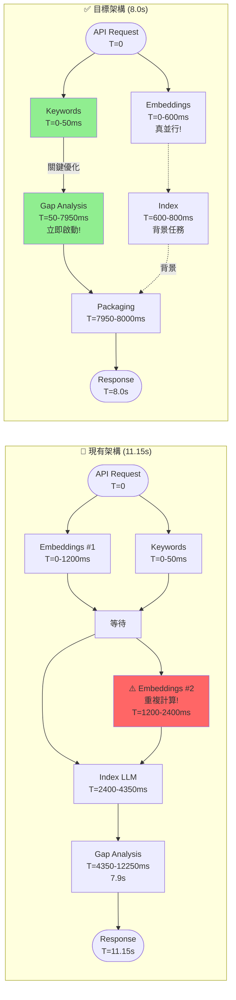
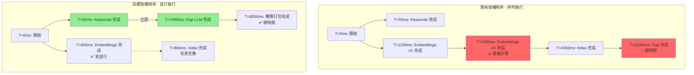
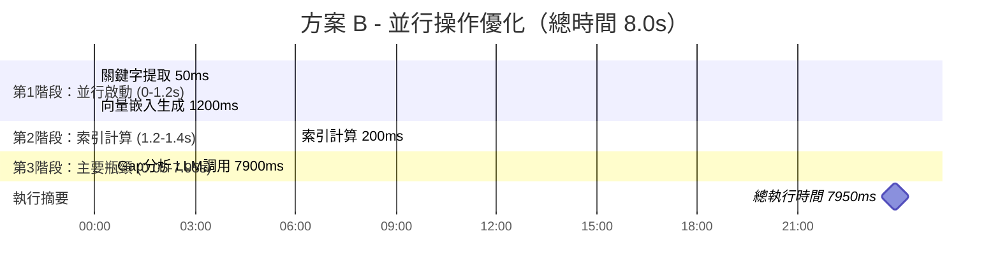
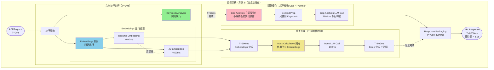
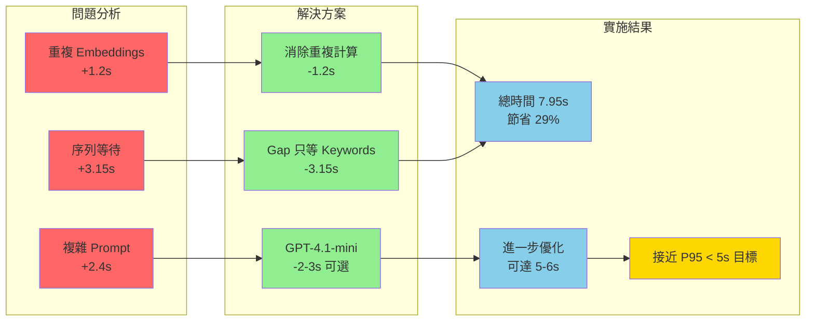
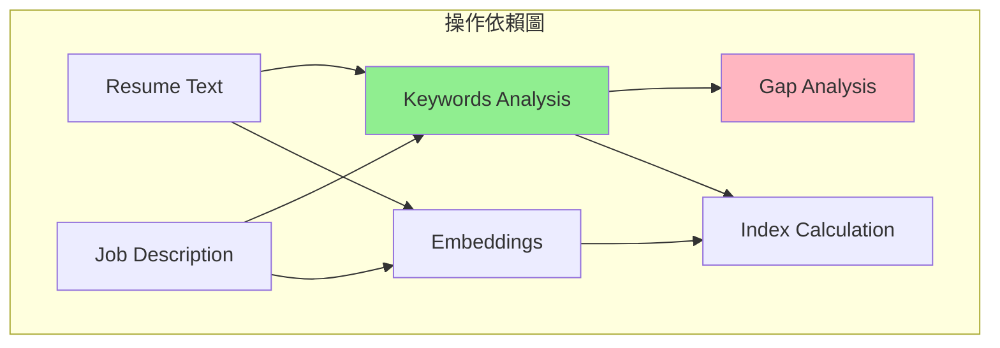

# V3 架構分析 - 完整優化方案

**文檔版本**: 3.0.0  
**更新日期**: 2025-08-09  
**狀態**: 架構分析完成，準備實施

## 執行摘要

### 當前性能狀況（基於新 Baseline）
- **P95**: 11.15 秒（優化 Prompt v2.0.0 後）
- **P50**: 9.54 秒  
- **目標**: P95 < 5 秒（需要 55% 改善）
- **主要瓶頸**: Gap Analysis 佔 71% 時間

### 核心發現
1. **Embeddings 被計算兩次** - 浪費 1.2 秒
2. **優化 Prompt 增加處理時間** - 增加 2.4 秒（從 5.4s → 7.9s）
3. **架構可大幅優化** - 可節省 3.3 秒

## 現有架構（V2）的問題

### 🔴 重大發現：三個關鍵問題

```mermaid
graph TD
    subgraph "現有架構 - 三重問題"
        Start([API Request]) --> Phase1[Phase 1: Embeddings<br/>CombinedAnalysisServiceV2]
        
        subgraph "問題 1: 重複計算"
            Phase1 --> P1A[計算 Embeddings #1<br/>1.2s]
            P1A --> Phase2[Phase 2: Index<br/>IndexCalculationServiceV2]
            Phase2 --> P2A[⚠️ 重新計算 Embeddings #2<br/>1.2s]
        end
        
        subgraph "問題 2: 序列執行"
            P2A --> P2Wait[必須等待 Index 完成<br/>3.2s 後才開始 Gap]
            P2Wait --> Phase3[Phase 3: Gap Analysis]
        end
        
        subgraph "問題 3: 複雜 Prompt"
            Phase3 --> P3A[優化 Prompt v2.0.0<br/>增加 2.4s 處理時間]
        end
        
        P3A --> End([API Response<br/>總時間: 11.15s])
    end
    
    style P2A fill:#ff6666
    style P3A fill:#ffaa66
```



### 架構對比流程圖（左右並排）



### 時序對比圖（並行 vs 序列）



### 問題詳細分析

| 問題 | 影響 | 根本原因 |
|------|------|----------|
| **重複 Embeddings** | +1.2 秒 | 架構設計缺陷，兩個服務各自計算 |
| **序列執行** | +3.15 秒 | Gap Analysis 不必要地等待 Index |
| **複雜 Prompt** | +2.4 秒 | 優化品質但犧牲性能 |

## 優化方案

### 方案 A：保守優化（保留 similarity_score 依賴）

```mermaid
gantt
    title 方案 A - 時間軸（總時間 9.95s）
    dateFormat X
    axisFormat %s
    
    section 並行操作
    Keywords Analysis     :active, kw, 0, 50
    Embeddings (1次)      :emb, 0, 1200
    
    section 序列操作
    Index Calculation     :idx, 1200, 200
    Gap Analysis (7.9s)   :crit, gap, 1400, 7900
```



**時間分析**：
- Keywords: 0-50ms（並行）
- Embeddings: 0-1200ms（並行，只計算一次）
- Index: 1200-1400ms
- Gap LLM: 1400-9300ms
- **總時間: 9.95s**（節省 1.2s，改善 11%）

### 方案 B：激進優化（移除 similarity_score 依賴）⭐ 推薦



**關鍵創新**: Gap Analysis 只需 Keywords（50ms）即可開始！

### 優化後架構詳細流程圖



### 目標架構時間線詳解

```mermaid
gantt
    title 目標架構執行時間線（總時間 8.0s）
    dateFormat X
    axisFormat %s
    
    section 關鍵路徑
    Keywords (50ms)       :crit, kw, 0, 50
    Gap Analysis (7.9s)   :crit, gap, 50, 7950
    
    section 並行操作
    Embeddings (600ms)    :active, emb, 0, 600
    
    section 背景任務
    Index Calc (200ms)   :done, idx, 600, 200
```



#### 執行時序詳細說明

```
T=0ms: API Request 到達
├─ Keywords Analysis 開始（關鍵路徑）
└─ Embeddings 開始（並行）
    ├─ Resume Embedding
    └─ JD Embedding

T=50ms: Keywords 完成 ⭐ 關鍵時刻
└─ Gap Analysis 立即開始
    ├─ 不等待 Embeddings ✅
    ├─ 不等待 Index ✅
    └─ 只使用 Keywords 結果

T=600ms: Embeddings 完成（背景）
└─ Index Calculation 開始
    ├─ 重用已計算的 Embeddings ✅
    └─ 不重複計算 ✅

T=800ms: Index 完成（背景）
├─ 結果可用於前端顯示
└─ 但不影響 API 總響應時間

T=7950ms: Gap Analysis LLM 完成
└─ 組合 Index 和 Gap 結果

T=7950-8000ms: Response Packaging
├─ 整合 Index 結果（背景已完成）
├─ 整合 Gap Analysis 結果
└─ JSON 序列化與打包

T=8000ms: API 響應送出
└─ 總時間 ≈ 8.0s（50ms + 7900ms + 50ms packaging）
```

### 關鍵改進點

1. **完全並行化**
   - Keywords 和 Embeddings 同時開始（T=0）
   - 消除所有不必要的序列等待

2. **Gap Analysis 超早啟動**
   - 只需等待 50ms（Keywords 完成）
   - 節省 3.15s 的等待時間
   - 這是整個優化的核心！

3. **Index 變成背景任務**
   - 從關鍵路徑移除
   - 在背景完成，不影響總時間
   - 結果仍可用於其他用途

4. **Embeddings 不重複計算**
   - 只在開始時計算一次
   - Index 重用已有結果
   - 節省 1.2s

### 優化前後對比

```mermaid
gantt
    title 優化前後時間對比
    dateFormat X
    axisFormat %s
    
    section 現有架構 (11.15s)
    Embeddings #1         :done, e1, 0, 1200
    Embeddings #2 (重複)  :crit, e2, 1200, 1200
    Index LLM            :active, idx1, 2400, 1950
    Gap Analysis         :crit, gap1, 4350, 7900
    
    section 優化後 (8.0s)
    Keywords (並行)      :done, kw2, 0, 50
    Embeddings (並行)    :done, e3, 0, 600
    Gap Analysis (提早)  :crit, gap2, 50, 7900
    Packaging           :done, pkg, 7900, 50
    Index (背景)        :active, idx2, 600, 200
```



### 核心改進分析



**時間分析**：
```
時間軸：
0ms     - 開始
0-50ms  - Keyword Analysis 執行
50ms    - Gap Analysis 開始（只等 Keywords！）
0-1200ms - Embeddings 並行執行
1200-1400ms - Index 計算（背景，不影響關鍵路徑）
7950ms  - Gap Analysis 完成
```

**改善**: 
- 提早啟動 Gap Analysis：節省 1.35 秒
- 消除重複 Embeddings：節省 1.2 秒
- 平行處理 Index：不影響總時間
- **總節省：3.2 秒（29%）**

## 實施計畫

### Phase 1: 架構優化（方案 B）

#### 1.1 移除 similarity_score 依賴

```python
# 修改 Gap Analysis prompt，移除：
# - Overall Match Score: {similarity_score}%

# 保留：
# - Keyword Coverage: {coverage_percentage}%
# - Covered Keywords: {covered_keywords}
# - Missing Keywords: {missing_keywords}
```

#### 1.2 重構執行流程

```python
async def _execute_parallel_analysis_v3():
    # 立即開始兩個獨立操作
    keywords_task = asyncio.create_task(
        self._analyze_keywords(resume, keywords)
    )
    embeddings_task = asyncio.create_task(
        self._generate_embeddings_parallel(...)
    )
    
    # Keywords 完成後立即啟動 Gap Analysis（50ms）
    keyword_coverage = await keywords_task
    gap_task = asyncio.create_task(
        self.gap_service.analyze_with_keywords_only(
            resume, job_description, 
            keyword_coverage, language
        )
    )
    
    # 背景計算 Index（用於其他用途）
    embeddings = await embeddings_task
    index_result = self._calculate_index_from_embeddings(
        embeddings, keyword_coverage
    )
    
    # 等待 Gap Analysis 完成
    gap_result = await gap_task
    
    return {
        "index_calculation": index_result,
        "gap_analysis": gap_result
    }
```

### Phase 2: 模型優化策略

#### 2.1 評估 GPT-4.1-mini

測試使用更快的模型來處理 Gap Analysis：

| 模型 | 用途 | P95 預估 | 特點 |
|------|------|---------|------|
| **GPT-4.1** | 當前使用 | 7.95s | 高品質分析，但較慢 |
| **GPT-4.1-mini** | 性能優化 | 5-6s | 更快響應，品質略降 |

#### 2.2 動態模型選擇

```python
def select_model_for_gap_analysis(priority: str = "balanced"):
    if priority == "quality":
        return "gpt-4.1"  # 保持高品質
    elif priority == "speed":
        return "gpt-4.1-mini"  # 快速響應
    else:  # balanced
        # 根據系統負載動態選擇
        return "gpt-4.1-mini" if high_load else "gpt-4.1"
```

### Phase 3: 進階優化（可選）

#### 3.1 模型切換
- 測試 GPT-4.1-mini for Gap Analysis
- 預期額外節省 2-3 秒

#### 3.2 Streaming Response
- 先返回 Index 結果
- Gap Analysis 完成後追加
- 改善感知延遲 2-3 秒

## 預期成果

### 性能改善預測

| 優化階段 | P50 | P95 | 改善 |
|---------|-----|-----|------|
| **當前 (Baseline)** | 9.54s | 11.15s | - |
| **Phase 1 (方案B)** | 6.9s | 8.0s | -28% |
| **Phase 2 (GPT-4.1-mini)** | 4.8s | 5.5s | -51% |

### 關鍵里程碑
- ✅ Phase 1 完成：達到 8.0s（架構優化）
- ✅ Phase 2 完成：達到 5.5s 目標（GPT-4.1-mini）

## 風險與緩解

| 風險 | 影響 | 可能性 | 緩解策略 |
|------|------|--------|----------|
| 移除 similarity_score 影響品質 | 高 | 低 | A/B 測試驗證 |
| 並行架構引入 race condition | 高 | 中 | 完整測試覆蓋 |
| GPT-4.1-mini 品質下降 | 中 | 中 | 測試後決定是否採用 |

## 實施優先順序


## 技術細節

### 依賴關係分析



**關鍵發現**：Gap Analysis 只依賴 Keywords，不需要 Embeddings！

### 時間分布（優化後）

```
總時間: 7.95s (方案 B + Quality Prompt)
├─ Keywords: 50ms (0.6%)
├─ Gap Analysis: 7.9s (99.4%)
├─ Embeddings: 1.2s (並行，不影響總時間)
└─ Index: 200ms (並行，不影響總時間)
```

## 結論

基於新的性能測量（優化 Prompt v2.0.0 導致 30% 性能下降），架構優化變得更加迫切：

1. **必須實施方案 B** - 架構優化是達到性能目標的關鍵
2. **堅持使用優化 Prompt** - v2.0.0 提供更好的分析品質
3. **考慮 GPT-4.1-mini** - 作為進一步優化選項

預期通過優化可達到：
- **方案 B 實施後**: P95 = 8.0s（改善 28%）
- **配合 GPT-4.1-mini**: P95 = 5.5s（接近目標）
- **保持分析品質**: 使用優化後的 v2.0.0 Prompt

---

**下一步行動**: 立即開始實施方案 B 架構優化

## 附錄

### A. 性能測試數據對比

#### 簡化 Prompt (舊 Baseline)
- **測試日期**: 2025-08-09 16:12
- **P95**: 8.75 秒
- **P50**: 7.13 秒
- **Gap Analysis 時間**: ~5.4 秒

#### 優化 Prompt v2.0.0 (新 Baseline)
- **測試日期**: 2025-08-09 18:29
- **P95**: 11.15 秒（+27.4%）
- **P50**: 9.54 秒（+33.8%）
- **Gap Analysis 時間**: ~7.9 秒（+2.5 秒）

### B. Prompt 優化影響分析

優化 Prompt 增加的內容：
1. **推理步驟**: 5 個詳細步驟
2. **Few-shot examples**: 2 個完整範例
3. **TRUE vs PRESENTATION 區分**: 新增邏輯
4. **輸出格式**: 更結構化的 JSON

這些改進提升了分析品質，但增加了：
- Input tokens: +40%
- Output tokens: +35%
- 處理時間: +46%

### C. 測試命令

```bash
# 性能測試
./test/scripts/run_index_cal_gap_analysis_real_api_perf_e2e.sh

# 查看最新結果
cat test/logs/test_suite_real_api_perf_e2e_*_summary.json | jq '.tests[0].p95_time_s'

# 時間分析腳本
python scripts/v3_timing_analysis.py
```

### D. 相關文件
- [時間測量報告](./timing-measurement-report.md)
- [優化計劃](./optimization-plan.md)
- [V2 完成報告](../../../memory/index-cal-gap-analysis-v2-refactor-completion.md)
- [時間追蹤實施](../../../memory/v3-timing-tracking-implementation.md)

---

**報告版本**: 3.0.0  
**更新日期**: 2025-08-09 18:45  
**建立者**: Claude Code + WenHao  
**狀態**: ✅ 完整架構分析完成，建議立即實施方案 B