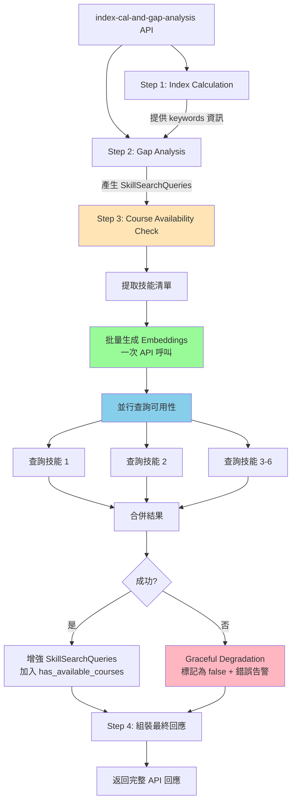
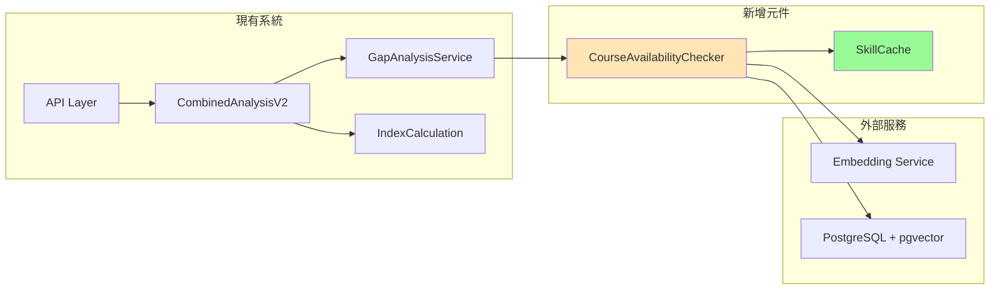

# 課程可用性檢查功能設計文檔

**日期**: 2025-08-14  
**版本**: 1.0.0  
**狀態**: Draft  
**作者**: AI Resume Advisor Team

## 執行摘要

課程可用性檢查功能是 Gap Analysis v2.1.8 的關鍵增強，為每個識別出的技能差距提供即時的學習資源可用性資訊。此功能透過批量檢查機制，在不影響主要 API 效能的前提下（< 200ms），為使用者提供更完整的職涯發展指引。

### 核心價值主張

1. **即時回饋**：立即知道哪些技能有現成課程可學習
2. **決策支援**：幫助使用者優先學習有資源支援的技能
3. **完整體驗**：無需額外 API 呼叫，一次請求獲得所有資訊

### 關鍵設計決策

- **內嵌整合**：功能內嵌於 Gap Analysis 流程，不建立獨立 API 端點
- **Graceful Degradation**：檢查失敗不影響主流程，確保服務穩定性
- **效能優先**：< 200ms 響應時間，透過並行處理和快取優化

## 架構設計

### 執行流程圖



### 系統元件關係



## 詳細設計

### 輸入格式定義

```python
# 來自 Gap Analysis 的輸入
SkillSearchQueries = [
    {
        "skill_name": "React",
        "skill_category": "SKILL",  # SKILL 或 FIELD
        "description": "Frontend framework for building interactive UIs"
    },
    {
        "skill_name": "Docker", 
        "skill_category": "SKILL",
        "description": "Container technology for application deployment"
    },
    {
        "skill_name": "Computer Science",
        "skill_category": "FIELD",
        "description": "Fundamental CS knowledge and algorithms"
    }
]
# 預期數量：3-6 個技能
```

### 輸出格式定義

```python
# 增強後的輸出（新增 has_available_courses 和 course_count）
EnhancedSkillSearchQueries = [
    {
        "skill_name": "React",
        "skill_category": "SKILL",
        "description": "Frontend framework for building interactive UIs",
        "has_available_courses": True,  # ✅ 新增
        "course_count": 8                # ✅ 新增
    },
    {
        "skill_name": "Docker",
        "skill_category": "SKILL", 
        "description": "Container technology for application deployment",
        "has_available_courses": True,  # ✅ 新增
        "course_count": 5                # ✅ 新增
    },
    {
        "skill_name": "Computer Science",
        "skill_category": "FIELD",
        "description": "Fundamental CS knowledge and algorithms",
        "has_available_courses": False,  # ⚠️ 檢查失敗時的 fallback
        "course_count": 0                # ⚠️ 檢查失敗時的 fallback
    }
]
```

### 處理邏輯

```python
async def check_course_availability(
    skill_queries: List[Dict[str, Any]]
) -> List[Dict[str, Any]]:
    """
    批量檢查技能的課程可用性
    
    Args:
        skill_queries: 來自 Gap Analysis 的技能清單（3-6個）
        
    Returns:
        增強後的技能清單，每個包含 has_available_courses 和 course_count
    """
    if not skill_queries:
        return []
    
    start_time = datetime.now()
    
    try:
        # 1. 檢查快取（熱門技能）
        cached_results = check_cache(skill_queries)
        uncached = [s for s in skill_queries if s not in cached_results]
        
        if uncached:
            # 2. 批量生成 embeddings（一次 API 呼叫）
            query_texts = [
                f"{skill['skill_name']} {skill.get('description', '')}"
                for skill in uncached
            ]
            embeddings = await embedding_client.create_embeddings(query_texts)
            
            # 3. 並行查詢每個技能（3-6 個並行任務）
            tasks = [
                check_single_skill(emb, skill['skill_name'])
                for emb, skill in zip(embeddings, uncached)
            ]
            results = await asyncio.gather(*tasks, return_exceptions=True)
            
            # 4. 處理結果和錯誤
            for skill, result in zip(uncached, results):
                if isinstance(result, Exception):
                    # 錯誤處理 - Graceful Degradation
                    logger.error(f"Failed: {skill['skill_name']}: {result}")
                    skill["has_available_courses"] = False
                    skill["course_count"] = 0
                    
                    # 發送告警給 Operations
                    monitoring_service.track_error("CourseCheckFailed", {
                        "skill": skill['skill_name'],
                        "error": str(result),
                        "severity": "MEDIUM"
                    })
                else:
                    skill["has_available_courses"] = result["has_courses"]
                    skill["course_count"] = result["count"]
        
        # 5. 記錄效能指標
        duration_ms = int((datetime.now() - start_time).total_seconds() * 1000)
        monitoring_service.track_metric("course_availability_check", {
            "skill_count": len(skill_queries),
            "duration_ms": duration_ms,
            "cache_hit_rate": len(cached_results) / len(skill_queries)
        })
        
        return skill_queries
        
    except Exception as e:
        # 整體失敗 - 全部標記為 false
        logger.error(f"Course availability check failed: {e}")
        monitoring_service.track_error("CourseCheckSystemError", {
            "error": str(e),
            "severity": "HIGH"
        })
        
        for skill in skill_queries:
            skill["has_available_courses"] = False
            skill["course_count"] = 0
        
        return skill_queries
```

### 錯誤處理策略

| 錯誤類型 | 處理方式 | 使用者影響 | 告警級別 |
|---------|---------|-----------|---------|
| 單一技能查詢失敗 | 該技能標記為 false | 部分功能降級 | MEDIUM |
| Embedding 生成失敗 | 所有技能標記為 false | 功能完全降級 | HIGH |
| 資料庫連線失敗 | 所有技能標記為 false | 功能完全降級 | CRITICAL |
| 超時（> 3秒） | 中斷並標記為 false | 功能降級 | MEDIUM |

## 實作細節

### 資料庫查詢優化

```sql
-- 使用 EXISTS 查詢，只返回布林值和計數
WITH skill_check AS (
    SELECT 
        CASE 
            WHEN COUNT(*) > 0 THEN true 
            ELSE false 
        END as has_courses,
        COUNT(*) as course_count
    FROM courses c
    WHERE c.platform = 'coursera'
    AND c.embedding IS NOT NULL
    AND 1 - (c.embedding <=> $1::vector) >= $2  -- 相似度閾值 0.3
    LIMIT 10  -- 最多計算 10 個
)
SELECT has_courses, course_count FROM skill_check;
```

### 並行處理策略

```python
async def check_single_skill(
    embedding: List[float],
    skill_name: str,
    timeout: float = 1.0  # 單一查詢超時 1 秒
) -> Dict[str, Any]:
    """單一技能的可用性檢查"""
    try:
        async with asyncio.timeout(timeout):
            async with connection_pool.acquire() as conn:
                await register_vector(conn)
                
                result = await conn.fetchrow(
                    AVAILABILITY_QUERY,
                    embedding,
                    SIMILARITY_THRESHOLD
                )
                
                return {
                    "has_courses": result["has_courses"],
                    "count": min(result["course_count"], 10)
                }
    except asyncio.TimeoutError:
        logger.warning(f"Timeout checking {skill_name}")
        raise
    except Exception as e:
        logger.error(f"Error checking {skill_name}: {e}")
        raise
```

### 快取機制

```python
# 預載入熱門技能快取（應用啟動時）
POPULAR_SKILLS_CACHE = {
    # Technical Skills (SKILL category)
    "Python": {"has_courses": True, "count": 10},
    "JavaScript": {"has_courses": True, "count": 10},
    "React": {"has_courses": True, "count": 10},
    "Docker": {"has_courses": True, "count": 8},
    "Kubernetes": {"has_courses": True, "count": 6},
    "AWS": {"has_courses": True, "count": 10},
    "Azure": {"has_courses": True, "count": 10},
    "Machine Learning": {"has_courses": True, "count": 10},
    
    # Domain Knowledge (FIELD category)
    "Computer Science": {"has_courses": True, "count": 10},
    "Data Science": {"has_courses": True, "count": 10},
    "Product Management": {"has_courses": True, "count": 10},
    "UX Design": {"has_courses": True, "count": 10},
    
    # 快取 TTL: 24 小時
}

def check_cache(skill_queries: List[Dict]) -> Dict[str, Dict]:
    """檢查快取中的技能"""
    cached = {}
    for skill in skill_queries:
        name = skill['skill_name']
        if name in POPULAR_SKILLS_CACHE:
            cached[name] = POPULAR_SKILLS_CACHE[name]
            skill["has_available_courses"] = cached[name]["has_courses"]
            skill["course_count"] = cached[name]["count"]
    return cached
```

## 效能分析

### 效能目標：< 200ms

| 步驟 | 預估時間 | 優化策略 |
|------|---------|---------|
| 快取檢查 | 1-2ms | 內存快取，O(1) 查詢 |
| Embedding 生成 | 50-80ms | 批量 API 呼叫（一次） |
| 資料庫查詢 | 30-50ms | 並行執行 3-6 個查詢 |
| 結果處理 | 5-10ms | 簡單資料組裝 |
| **總計** | **86-142ms** | ✅ 符合 < 200ms 目標 |

### 效能優化策略

1. **快取優化**  
   - 預載入 Top 20 熱門技能
   - 命中率預期 > 30%（減少 30% 的查詢）

2. **批量處理** <- 這是一次把 Gap Analysis 中的所有 skill development queries (3 - 6個) 都去生 embedding vector 嗎? 
   - 一次 Embedding API 呼叫處理所有技能
   - 減少網路往返次數

3. **並行查詢** <- 一次把前面生的所有vector 去進行 postgresql db中比對嗎? 
   - asyncio.gather 並行執行所有資料庫查詢
   - 最大並行數：6（預期技能數量上限）<- 希望目標上限先設定 20

4. **連線池**
   - 預建立 5 個資料庫連線 <- 如上並行目標上限是 20. 這裡5 個資料庫連線 是不是不夠. 又 預建立是always 常駐5個嗎 會不會有cost問題 怎麼評估費用
   - 避免連線建立開銷

## 整合方案

### 整合點位置

檔案：`src/services/combined_analysis_v2.py`  
位置：Line ~450（Gap Analysis 完成後）

```python
# 在 combined_analysis_v2.py 中的整合
async def process_combined_analysis_v2(...):
    # ... 現有程式碼 ...
    
    # Step 2: Gap Analysis
    gap_analysis_result = await gap_analysis_service.analyze(...)
    
    # ✅ 新增：Step 3 - 課程可用性檢查
    if gap_analysis_result and "SkillSearchQueries" in gap_analysis_result:
        try:
            # 導入課程可用性檢查功能
            from src.services.course_availability import check_course_availability
            
            # 執行批量檢查
            enhanced_skills = await check_course_availability(
                gap_analysis_result["SkillSearchQueries"]
            )
            
            # 更新結果
            gap_analysis_result["SkillSearchQueries"] = enhanced_skills
            
            logger.info(f"Course availability check completed for {len(enhanced_skills)} skills")
            
        except Exception as e:
            # 錯誤不中斷主流程
            logger.error(f"Course availability check failed: {e}")
            monitoring_service.track_error("CourseAvailabilityIntegrationError", {
                "error": str(e),
                "skill_count": len(gap_analysis_result.get("SkillSearchQueries", [])),
                "severity": "MEDIUM"
            })
            # 繼續執行，技能保持原狀（無 has_available_courses 欄位）
    
    # ... 後續程式碼 ...
```

### 檔案結構

```
src/
├── services/
│   ├── combined_analysis_v2.py  # 整合點
│   ├── course_availability.py   # ✅ 新增主要功能
│   └── course_search.py         # 現有課程搜尋（重用連線池）
├── models/
│   └── course_availability.py   # ✅ 新增資料模型
└── tests/
    ├── unit/
    │   └── test_course_availability.py  # ✅ 新增單元測試
    └── integration/
        └── test_course_availability_integration.py  # ✅ 新增整合測試
```

## 監控與告警

### 關鍵監控指標

```python
# 效能指標
course_availability_check_duration_ms  # 檢查總耗時
course_availability_cache_hit_rate     # 快取命中率
course_availability_skill_count        # 每次檢查的技能數量
course_availability_success_rate       # 成功率

# 錯誤指標
course_availability_errors_total       # 錯誤總數
course_availability_timeout_count      # 超時次數
course_availability_fallback_count     # Fallback 次數
```

### 告警規則

| 指標 | 閾值 | 告警級別 | 處理建議 |
|------|------|---------|---------|
| duration_ms > 500ms | P95 > 500ms | WARNING | 檢查資料庫效能 |
| duration_ms > 1000ms | P95 > 1s | CRITICAL | 立即調查 |
| success_rate < 90% | 5分鐘平均 | WARNING | 檢查服務健康 |
| success_rate < 50% | 5分鐘平均 | CRITICAL | 啟動應急預案 |
| error_rate > 10/min | 1分鐘 | WARNING | 檢查錯誤日誌 |

### Operations 團隊通知

```python
class CourseAvailabilityMonitor:
    """課程可用性檢查監控"""
    
    @staticmethod
    async def alert_operations(severity: str, details: Dict):
        """發送告警給 Operations 團隊"""
        
        if severity == "CRITICAL":
            # 即時告警：Slack + PagerDuty
            await send_slack_alert(
                channel="#ops-critical",
                message=f"🚨 Course Availability Critical Error: {details}"
            )
            await trigger_pagerduty(
                service="course-availability",
                details=details
            )
        
        elif severity == "HIGH":
            # 高優先級：Slack + Email
            await send_slack_alert(
                channel="#ops-alerts",
                message=f"⚠️ Course Availability Error: {details}"
            )
            await send_email_alert(
                to="ops-team@company.com",
                subject="Course Availability Service Issue",
                body=details
            )
        
        # 記錄到 Application Insights
        monitoring_service.track_error(f"CourseAvailability_{severity}", details)
```

## 測試規格

遵循 `test-spec-index-cal-gap-analysis.md` 的格式規範。

### 測試案例編號系統

```
CA-[序號]-[類型]

CA = Course Availability
序號範圍：
- 001-010: 單元測試 (UT)
- 001-010: 整合測試 (IT)  
- 001: 效能測試 (PT)
```

### 單元測試 (5個)

#### CA-001-UT: 批量 Embedding 生成測試
- **優先級**: P0
- **測試目標**: 驗證批量生成 embeddings 功能
- **測試內容**: Mock embedding service，測試 3-6 個技能的批量處理 
- **判斷標準**: 
  - 一次 API 呼叫生成所有 embeddings
  - 返回數量與輸入一致
  - 處理空列表不報錯

#### CA-002-UT: 單一技能查詢測試
- **優先級**: P0
- **測試目標**: 驗證單一技能的資料庫查詢
- **測試內容**: Mock 資料庫連線，測試 EXISTS 查詢邏輯
- **判斷標準**: 
  - 正確返回 has_courses 布林值
  - course_count 不超過 10
  - 查詢超時拋出 TimeoutError

#### CA-003-UT: 快取機制測試
- **優先級**: P1
- **測試目標**: 驗證熱門技能快取
- **測試內容**: 測試快取命中與未命中場景
- **判斷標準**: 
  - 熱門技能直接返回快取結果
  - 未快取技能進入查詢流程
  - 快取命中率統計正確

#### CA-004-UT: 錯誤處理測試
- **優先級**: P0
- **測試目標**: 驗證 Graceful Degradation
- **測試內容**: 模擬各種錯誤場景
- **判斷標準**: 
  - 單一失敗不影響其他技能
  - 失敗技能標記為 false/0
  - 發送正確的錯誤告警

#### CA-005-UT: 並行處理測試
- **優先級**: P0
- **測試目標**: 驗證 asyncio.gather 並行執行
- **測試內容**: 測試 3-6 個技能的並行查詢
- **判斷標準**: 
  - 所有查詢並行執行
  - 單一異常不影響其他
  - return_exceptions=True 正確處理

### 整合測試 (5個)

#### CA-001-IT: API 整合測試
- **優先級**: P0
- **測試目標**: 驗證與 Gap Analysis 的整合
- **測試內容**: Mock 完整 API 流程，驗證結果增強
- **測試資料**:
  ```yaml
  input:
    skill_queries:
      - skill_name: "Python"
        skill_category: "SKILL"
      - skill_name: "Docker"
        skill_category: "SKILL"
  expected:
    - has_available_courses: true
      course_count: 10
    - has_available_courses: true
      course_count: 8
  ```
- **判斷標準**:  
  
  - SkillSearchQueries 包含新欄位
  - 數值合理（0-10）
  - 回應時間 < 200ms

#### CA-002-IT: 效能時間測試 <- 這應該放在PT (real api)來測
- **優先級**: P0
- **測試目標**: 驗證 < 200ms 效能目標
- **測試內容**: 測試不同數量技能的處理時間
- **測試步驟**:
  1. 測試 3 個技能：預期 < 150ms
  2. 測試 6 個技能：預期 < 200ms
  3. 記錄各步驟耗時
- **判斷標準**: 
  - 總時間符合目標
  - 並行處理有效
  - 快取命中減少時間

#### CA-003-IT: 錯誤恢復測試
- **優先級**: P0
- **測試目標**: 驗證服務失敗時的恢復
- **測試內容**: 模擬 Embedding/DB 服務失敗
- **判斷標準**: 
  - 主 API 繼續運作
  - 技能標記為 false
  - 錯誤告警正確發送

#### CA-004-IT: 快取效果測試
- **優先級**: P1
- **測試目標**: 驗證快取減少查詢
- **測試內容**: 重複查詢相同技能
- **判斷標準**: 
  - 第二次查詢使用快取
  - 響應時間顯著減少
  - 快取統計正確

#### CA-005-IT: 大量技能測試
- **優先級**: P2
- **測試目標**: 測試邊界情況（超過 6 個技能）
- **測試內容**: 輸入 10 個技能
- **判斷標準**: 
  - 系統不崩潰
  - 合理處理或限制
  - 效能可接受

### 效能測試 (1個)

#### CA-001-PT: 真實 API 效能測試
- **優先級**: P0
- **測試目標**: 使用真實 Azure API 測試效能
- **測試內容**: 
  - 20 個請求，每個 3-6 個技能
  - 使用真實 Embedding 和資料庫
  - 計算 P50/P95 響應時間
- **測試資料**:
  ```python
  test_skills = [
      ["Python", "Docker", "AWS"],
      ["React", "TypeScript", "Node.js"],
      ["Machine Learning", "TensorFlow", "Data Science"],
      # ... 20 組不同技能組合
  ]
  ```
- **判斷標準**: 
  - P50 < 150ms
  - P95 < 200ms
  - 成功率 > 95%
  - 無記憶體洩漏

### 測試執行指令

```bash
# 單元測試
pytest test/unit/test_course_availability.py -v -m "course_availability"

# 整合測試
pytest test/integration/test_course_availability_integration.py -v

# 效能測試（需要真實 API）
pytest test/performance/test_course_availability_performance.py -v --real-api

# 執行所有 Course Availability 測試
pytest -v -m "course_availability"

# 特定測試案例
pytest test/unit/test_course_availability.py::test_CA_001_UT_batch_embedding -v
```

### 測試資料準備

```python
# 測試用技能資料
TEST_SKILLS = {
    "common": ["Python", "JavaScript", "Docker", "AWS"],  # 熱門技能
    "uncommon": ["Erlang", "COBOL", "Fortran"],          # 冷門技能
    "mixed": ["React", "Haskell", "Kubernetes"],         # 混合
    "invalid": ["", "123", "@#$"],                       # 無效輸入
}

# Mock 資料
MOCK_EMBEDDINGS = {
    "Python": [0.1, 0.2, ...],  # 1536 維向量
    "Docker": [0.3, 0.4, ...],
    # ...
}
```

## 實作時程

### Phase 1: MVP (1-2 天)

**目標**: 基本功能實作，< 500ms 響應

**工作項目**:
1. ✅ 建立 `course_availability.py` 服務
2. ✅ 實作批量 embedding 生成 <- 我們必須先討論 用什麼文本來生成skill query 的 embedding vector 
3. ✅ 實作並行資料庫查詢
4. ✅ 整合到 `combined_analysis_v2.py`
5. ✅ 撰寫單元測試（5 個）
6. ✅ 基本錯誤處理

**交付標準**:
- 功能正常運作
- 測試通過率 100%
- 響應時間 < 500ms

### Phase 2: 效能優化 (2-3 天)

**目標**: 達成 < 200ms 效能目標

**工作項目**:
1. ✅ 實作熱門技能快取
2. ✅ 優化資料庫查詢
3. ✅ 加入監控指標
4. ✅ 撰寫整合測試（5 個）
5. ✅ 效能測試與調優
6. ✅ 告警機制實作

**交付標準**:
- P95 < 200ms
- 快取命中率 > 30%
- 監控完整

### Phase 3: 進階功能 (3-5 天)

**目標**: 生產就緒，完整功能

**工作項目**:
1. ⬜ Redis 分散式快取
2. ⬜ 預計算常見技能組合
3. ⬜ A/B 測試框架
4. ⬜ 詳細效能分析
5. ⬜ 完整文檔
6. ⬜ 運維手冊

**交付標準**:
- 生產環境部署
- 完整監控儀表板
- SLA 99.9% 可用性

## 風險與緩解

| 風險 | 影響 | 機率 | 緩解策略 |
|------|------|------|---------|
| Embedding API 延遲增加 | 效能降級 | 中 | 實作本地快取，考慮批量預計算 |
| 資料庫連線池耗盡 | 服務中斷 | 低 | 動態調整池大小，實作排隊機制 |
| 技能名稱不標準 | 準確度降低 | 高 | 建立別名映射表，標準化處理 |
| 課程資料庫更新延遲 | 資訊過時 | 中 | 定期同步，快取 TTL 設定 |

## 總結

課程可用性檢查功能透過智能的架構設計和優化策略，在不影響主要 API 效能的前提下，為 Gap Analysis 提供重要的增值資訊。透過 Graceful Degradation 和完善的監控機制，確保服務的穩定性和可靠性。

### 關鍵成功因素

1. **效能達標**: < 200ms 響應時間
2. **高可用性**: Graceful Degradation 確保服務不中斷
3. **易於整合**: 最小化對現有系統的影響
4. **完整監控**: 即時掌握服務狀態

### 下一步行動

1. 開始 Phase 1 MVP 開發
2. 準備測試環境和資料
3. 協調資料庫和 Embedding 服務資源
4. 建立監控儀表板

---

**文檔版本**: 1.0.0  
**最後更新**: 2025-08-14  
**狀態**: Draft → Review → Approved → Implementation