# Gap Analysis v2.1.7 Design Document

**Date**: 2025-08-14  
**Version**: 2.1.7  
**Status**: Active  
**Author**: AI Resume Advisor Team

## Executive Summary

Gap Analysis v2.1.7 represents a major restructuring focused on correctly distinguishing between real skill gaps (requiring learning) and presentation gaps (requiring resume optimization). This version implements a comprehensive Chain-of-Thought (CoT) framework to improve classification accuracy and provide more actionable recommendations.

## Core Design Philosophy

### 1. Clear Separation of Concerns
- **Key Gaps**: Only contains skills the candidate genuinely lacks and needs to learn
- **Quick Improvements**: Only contains presentation optimizations for skills that exist but aren't visible

### 2. Deep Analysis Over Surface Matching
- Missing Keywords are the starting point, not the conclusion
- Each missing keyword undergoes deep analysis to determine if it's truly missing or just poorly presented

### 3. Actionable Over Generic
- Quick Improvements provides specific rewriting suggestions, not vague advice
- Key Gaps includes realistic learning timelines based on current foundation

## Architecture Overview

### Global Chain-of-Thought Framework


### Classification Decision Tree

```mermaid
graph TD
    MK[Missing Keyword] --> Q1{Does resume show<br/>related experience?}
    
    Q1 -->|YES| Q2{Is it just<br/>terminology?}
    Q2 -->|YES| PG1[Presentation Gap<br/>→ Quick Improvements]
    Q2 -->|NO| Q3{Can it be<br/>inferred?}
    Q3 -->|YES| PG2[Presentation Gap<br/>→ Quick Improvements]
    Q3 -->|NO| SG1[Skill Gap with foundation<br/>→ Key Gaps]
    
    Q1 -->|NO| Q4{Any transferable<br/>skills?}
    Q4 -->|YES| SG2[Skill Gap with base<br/>→ Key Gaps]
    Q4 -->|NO| SG3[Skill Gap from scratch<br/>→ Key Gaps]
    
    style PG1 fill:#90EE90
    style PG2 fill:#90EE90
    style SG1 fill:#FFB6C1
    style SG2 fill:#FFB6C1
    style SG3 fill:#FFB6C1
```



### Detailed CoT Process for Each Section


### Information Flow Between Sections


## Chain-of-Thought Reasoning Examples

### Example 1: Missing Keyword "Kubernetes" Analysis

**Input Context**:
- Resume shows: "Deployed applications using Docker containers"
- JD requires: "Kubernetes experience"

**CoT Reasoning Process**:
```
Step 1: Direct Search
→ "Kubernetes" not found in resume text

Step 2: Alternative Terms Check
→ Check for: K8s, container orchestration, kubectl
→ Not found

Step 3: Related Experience Analysis
→ Found: Docker containers (related technology)
→ Docker is prerequisite for Kubernetes
→ Candidate has foundation but not the skill

Step 4: Classification Decision
→ Has foundation (Docker) but lacks orchestration layer
→ Classification: Skill Gap with foundation
→ Estimated learning: 3-4 months

Step 5: Output Placement
→ Goes to KEY GAPS (Skill Gap)
→ Format: 🚨 [Skill Gap] <b>Kubernetes</b>: Container orchestration expertise...
```

### Example 2: Missing Keyword "Machine Learning" Analysis

**Input Context**:
- Resume shows: "Built recommendation engine using collaborative filtering algorithms"
- JD requires: "Machine Learning experience"

**CoT Reasoning Process**:
```
Step 1: Direct Search
→ "Machine Learning" not found

Step 2: Alternative Terms Check
→ Check for: ML, AI, deep learning, neural networks
→ Not found explicitly

Step 3: Related Experience Analysis
→ Found: "recommendation engine", "collaborative filtering"
→ These ARE machine learning techniques
→ Candidate HAS the skill, just poor terminology

Step 4: Classification Decision
→ Skill exists but not visible
→ Classification: Presentation Gap
→ Action: Add "Machine Learning" to skills

Step 5: Output Placement
→ Goes to QUICK IMPROVEMENTS (Presentation Gap)
→ Format: 💡 Add "Machine Learning" to skills section...
```

### Example 3: Dynamic Strength Count Decision

**Similarity Score**: 45% (Limited Match)

**CoT Reasoning Process**:
```
Step 1: Determine Target Count
→ 45% falls in 40-50% range
→ Target: 2 strengths maximum

Step 2: Score All Experiences
→ Project Manager at Tech Co: Score 3/10 (low relevance)
→ Data Analysis Skills: Score 7/10 (transferable)
→ Team Leadership: Score 6/10 (transferable)
→ Industry Knowledge: Score 2/10 (different industry)

Step 3: Apply Threshold
→ For 45% match, only include score ≥6
→ Qualifying: Data Analysis (7), Team Leadership (6)

Step 4: Craft Descriptions
→ Focus on transferability
→ Explain HOW skills apply to new role

Output:
🏆 Top Match: Your analytical problem-solving...
⭐ Key Strength: Strong team leadership...
(Stop at 2, don't force more)
```

## Key Changes from v2.1.6

### 1. Structural Changes

| Section | v2.1.6 | v2.1.7 |
|---------|--------|--------|
| Key Gaps | Mixed Skill + Presentation Gaps | Only Skill Gaps |
| Quick Improvements | General suggestions | Presentation Gap optimizations |
| Classification | Late-stage, mixed | Early-stage, separated |
| Examples | 3-4 examples | 6 scenario-based examples |

### 2. Content Changes

#### Key Gaps (Transformed)
- **Before**: Listed all gaps with 🚨 and 💡 markers mixed
- **After**: Only 🚨 Skill Gaps that require actual learning

#### Quick Improvements (Transformed)
- **Before**: Generic improvement suggestions
- **After**: Specific resume rewriting guidance for hidden skills

### 3. Similarity Grading System

Adopted 6-tier system aligning with realistic timelines:
- Strong (80%+): 1-2 days optimization
- Good (70-79%): 1-2 weeks improvement
- Moderate (60-70%): 3-6 months development
- Fair (50-60%): 6-9 months learning
- Limited (40-50%): 6-12 months systematic study
- Poor (<40%): 1-2 years career transition

## Implementation Details

### Dynamic Content Based on Similarity

```yaml
Core Strengths Count:
- 80%+: 4-5 strengths
- 70-79%: 3-4 strengths
- 60-70%: 3 strengths
- 50-60%: 2-3 strengths
- 40-50%: 2 strengths
- <40%: 1-2 strengths

Gap Distribution (not count-limited):
- Based on actual analysis
- No artificial limits
- Natural distribution emerges from classification
```

### Few-Shot Examples

Three comprehensive examples covering:
1. **Strong Match (85%)**: Mostly presentation gaps
2. **Moderate Match (65%)**: Mixed gaps
3. **Poor Match (35%)**: Mostly skill gaps

Each example shows:
- Context and keywords
- Classification thinking process
- Actual outputs for each section

## Quality Assurance

### Validation Checklist
- ✓ Key Gaps contains ONLY learning needs
- ✓ Quick Improvements contains ONLY presentation fixes
- ✓ No skill appears in both sections
- ✓ Realistic learning timelines
- ✓ Specific, actionable suggestions
- ✓ Consistency across sections

### Error Prevention
1. **Classification Errors**: Decision tree prevents misclassification
2. **Overly Optimistic Timelines**: Guidelines enforce realistic estimates
3. **Generic Advice**: Format requires specific examples
4. **Inconsistency**: Synthesis phase ensures alignment

## Expected Benefits

### For Users
1. **Clarity**: Clear distinction between "need to learn" vs "need to show better"
2. **Actionability**: Specific resume rewriting suggestions
3. **Realistic Expectations**: Honest learning timelines
4. **Prioritization**: Understand what to fix now vs learn later

### For System
1. **Accuracy**: Better classification through CoT
2. **Consistency**: Structured decision-making
3. **Maintainability**: Clear separation of concerns
4. **Scalability**: Framework handles all similarity levels

## Migration Strategy

### Backward Compatibility
- v2.1.7 can be toggled via environment variable
- API response structure remains the same
- Frontend parsing unchanged (but can leverage new clarity)

### Testing Strategy
- No changes needed to existing tests (they check structure, not content)
- New version can be A/B tested in production
- Rollback is simple (version toggle)

## Success Metrics

1. **Classification Accuracy**: Measure % of correctly identified presentation vs skill gaps
2. **User Satisfaction**: Track if resume improvements lead to better matches
3. **Learning Path Success**: Monitor if skill development priorities align with actual learning
4. **Time to Action**: Measure how quickly users can implement suggestions

## Technical Implementation

### Service Layer Changes
```python
# In gap_analysis_v2.py
def get_prompt_version():
    version = os.getenv("GAP_ANALYSIS_PROMPT_VERSION", "2.1.6")
    if version == "2.1.7":
        return "v2.1.7.yaml"
    return "v2.1.6.yaml"
```

### API Response (Unchanged Structure)
```json
{
    "CoreStrengths": "...",
    "KeyGaps": "... (now only skill gaps)",
    "QuickImprovements": "... (now presentation optimizations)",
    "OverallAssessment": "...",
    "SkillSearchQueries": [...]
}
```

## Decision Rationale

### Why Separate Skill and Presentation Gaps?
1. **User Confusion**: Mixed gaps made it unclear what action to take
2. **Incorrect Penalties**: Candidates penalized for poor expression, not lack of skill
3. **Action Clarity**: Users need to know what they can fix today vs what requires months

### Why Deep Analysis of Missing Keywords?
1. **Surface Matching Insufficient**: "Python" missing doesn't mean candidate can't code Python
2. **Terminology Variations**: Same skill, different words
3. **Implied Capabilities**: Django developer obviously knows Python

### Why 6-Tier Similarity System?
1. **Granularity**: Better matches user expectations
2. **Realistic Timelines**: Each tier maps to realistic improvement timeframe
3. **Industry Standard**: Aligns with common assessment scales

## Complete CoT Implementation Details

### Prompt Architecture Flow


### Detailed CoT for Missing Keywords Processing

#### Real Example: "AWS" Missing from Resume

**Scenario**: Backend Developer position requiring AWS

**Resume Content**:
```
"Deployed applications to cloud infrastructure using Docker and CI/CD pipelines.
Managed server scaling and load balancing for high-traffic applications."
```

**CoT Reasoning Chain**:
```yaml
Thought 1 - Direct Search:
  Search: "AWS", "Amazon Web Services"
  Result: Not found
  
Thought 2 - Alternative Terms:
  Search: "EC2", "S3", "Lambda", "CloudFormation"
  Result: Not found
  
Thought 3 - Generic Cloud Mentions:
  Search: "cloud", "deployment", "infrastructure"
  Result: Found "cloud infrastructure"
  
Thought 4 - Classification Analysis:
  Evidence: Uses cloud but doesn't specify which
  Question: Does "cloud infrastructure" imply AWS knowledge?
  Answer: No - could be Azure, GCP, or others
  
Thought 5 - Foundation Assessment:
  Has: Cloud deployment experience
  Missing: AWS-specific knowledge
  Learning Curve: Moderate (has cloud foundation)
  
Thought 6 - Final Classification:
  Type: Skill Gap with Foundation
  Reasoning: Has cloud experience but needs AWS specifics
  Time Estimate: 2-3 months for AWS certification level
  
Output:
  Section: Key Gaps
  Format: 🚨 [Skill Gap] <b>AWS</b>: While you have cloud deployment 
          experience, AWS-specific services require 2-3 months to master.
```

### CoT for Overall Assessment Synthesis


### Section-Specific CoT Rules

#### 1. Core Strengths CoT
```
Input: Similarity Score → Determine Count
├─ >80%: Look for 4-5 strengths
├─ 60-80%: Look for 3-4 strengths  
├─ 40-60%: Look for 2-3 strengths
└─ <40%: Find 1-2 transferable strengths

For each potential strength:
├─ Score relevance to JD (1-10)
├─ Check if already mentioned elsewhere
├─ Verify concrete evidence exists
└─ Include only if score > threshold
```

#### 2. Key Gaps CoT (Skill Gaps Only)
```
For each missing keyword:
├─ Can candidate do this today? 
│  ├─ YES → Not a skill gap (→ Presentation)
│  └─ NO → Is it a skill gap
│     ├─ Has related skills?
│     │  └─ YES → Estimate learning with foundation
│     └─ NO → Estimate learning from scratch
```

#### 3. Quick Improvements CoT (Presentation Only)
```
For each presentation gap:
├─ Find evidence in resume
├─ Identify where to add/modify
├─ Write specific suggestion
└─ Verify: Can be done in 24-48 hours?
    ├─ YES → Include
    └─ NO → Exclude (not "quick")
```

### CoT Validation Checklist

Before outputting each section, validate:


## Future Enhancements

1. **Machine Learning Integration**: Learn from user feedback on classifications
2. **Industry-Specific Tuning**: Adjust classification based on industry norms
3. **Progressive Disclosure**: Show more detail for users who want it
4. **Integration with Course Recommendations**: Link skill gaps to specific courses

## Conclusion

Gap Analysis v2.1.7 represents a significant improvement in helping candidates understand their true position relative to job requirements. By clearly separating learning needs from presentation improvements, we provide actionable, honest, and helpful guidance that respects both the candidate's existing skills and their growth potential.

---

**Document Version**: 1.0  
**Last Updated**: 2025-08-14  
**Next Review**: 2025-09-14