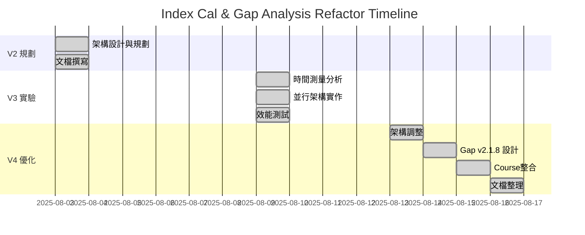

# Index Cal & Gap Analysis 開發歷程

**文檔版本**: 1.0.0  
**最後更新**: 2025-08-16  
**時間跨度**: 2025-08-03 ~ 2025-08-16 (13天)

## 📅 時間線總覽



## 🔄 版本演進歷程

### Phase 1: V2 架構規劃 (2025-08-03)

#### 背景與動機
- **問題**: API 響應時間 5-8 秒，用戶體驗不佳
- **目標**: 降低到 1.5-3 秒 (60-75% 改善)
- **策略**: 資源池管理 + 共享計算

#### 核心設計理念
```python
# V2 架構核心概念
class CombinedAnalysisServiceV2:
    def __init__(self):
        self.resource_pool = ResourcePoolManager()  # 預建立客戶端池
        self.shared_cache = EmbeddingCache()       # 共享 Embeddings
        self.orchestrator = SmartOrchestrator()    # 智能執行策略
```

#### 預期改進
| 改進項目 | 預期效果 | 實現方式 |
|---------|---------|----------|
| 資源池管理 | -90% 初始化開銷 | 預建立 10 個客戶端 |
| 共享 Embeddings | -60% API 呼叫 | 避免重複計算 |
| 智能協調 | -50% 等待時間 | 並行執行策略 |

#### 結果
**狀態**: ❌ 未實施  
**原因**: 發現更深層的問題需要先解決

---

### Phase 2: V3 激進並行優化 (2025-08-09)

#### 觸發事件
發現 V2 Prompt 優化（加入 Chain-of-Thought）導致效能下降：
- P95: 8.75s → 11.15s (+27%)
- Gap Analysis: 5.4s → 7.9s (+46%)

#### 時間測量發現
```
時間分配分析：
├─ Keywords: 8.9 ms (0.1%)
├─ Embeddings: 365 ms (4.0%)
├─ Gap Analysis: 9,183 ms (99.9%)  ← 關鍵瓶頸！
└─ Index Calculation: 8,823 ms (並行執行)
```

#### V3 激進方案 (Plan B)
```python
# V3 核心改變：Gap Analysis 不等待 Index
async def _execute_parallel_analysis():
    # T=0: 開始
    keywords_task = extract_keywords()
    embeddings_task = generate_embeddings()
    
    # T=50ms: Keywords 完成，立即啟動 Gap
    keywords = await keywords_task
    gap_task = gap_analysis(keywords, similarity_score=0)  # 假的！
    
    # T=1300ms: Embeddings 完成，啟動 Index
    embeddings = await embeddings_task
    index_task = index_calculation(embeddings)
    
    # 等待所有完成
    gap_result = await gap_task      # T=7950ms
    index_result = await index_task  # T=2500ms (未被使用)
```

#### 測試結果 (20次真實API測試)
```json
{
  "baseline_v1": {
    "p50": 7.13,
    "p95": 8.75
  },
  "v2_prompt": {
    "p50": 9.54,
    "p95": 11.15
  },
  "v3_parallel": {
    "p50": 9.04,   // 改善 5.3%
    "p95": 11.96   // 退步 7.3%
  }
}
```

#### 關鍵洞察
1. **並行效益有限**: 當 Gap Analysis 佔 99.9% 時間，架構優化影響微乎其微
2. **準確性問題**: 使用假的 similarity_score 導致評估不準確
3. **Cache 效應**: Keywords matching 有 65 倍的 cache 加速

**結果**: ❌ 廢棄，準確性問題不可接受

---

### Phase 3: V4 準確性優先架構 (2025-08-13)

#### 決策轉折點
團隊決定：**準確性比速度重要**

#### V4 架構調整
```python
# V4: 回歸順序執行，確保準確性
async def _execute_sequential_analysis():
    # Step 1: Keywords & Embeddings (並行)
    keywords, embeddings = await asyncio.gather(
        extract_keywords(),
        generate_embeddings()
    )
    
    # Step 2: Index Calculation (包含真實 similarity_score)
    index_result = await calculate_index(embeddings, keywords)
    
    # Step 3: Gap Analysis (使用真實 similarity_score)
    gap_result = await analyze_gap(
        keywords=keywords,
        similarity_score=index_result['similarity_percentage'],  # 真實！
        index_result=index_result
    )
    
    return combine_results(index_result, gap_result)
```

#### 相似度門檻設計
| 相似度 | 匹配等級 | 時程建議 |
|--------|---------|----------|
| 80%+ | Strong Match | 1-2 天優化 |
| 70-79% | Good Potential | 1-2 週改進 |
| 60-70% | Good Alignment | 1-2 個月提升 |
| 50-60% | Moderate | 2-3 個月學習 |
| 40-50% | Limited | 3-6 個月發展 |
| <40% | Poor Match | 考慮其他職位 |

**結果**: ✅ 成功部署生產環境

---

### Phase 4: Gap Analysis v2.1.8 革新 (2025-08-14)

#### 三層技能分類系統
```
🔧 Technical Skills    → 映射為 SKILL (單一課程可學)
📚 Domain Knowledge    → 映射為 FIELD (需要認證/學位)  
💼 Soft Skills        → 總是 Presentation Gap
```

#### 4級證據評估系統
- **Level 0**: 無證據（謹慎表達）
- **Level 1**: 間接證據（Presentation Gap）
- **Level 2**: 能力不足（Skill Gap）
- **Level 3**: 充分證據（排除）

#### 實作影響
- 更精確的技能分類
- 更合理的學習時程建議
- 區分「不會」vs「沒寫好」

---

### Phase 5: Course Availability 整合 (2025-08-15)

#### 整合架構
```python
# 在 Gap Analysis 完成後增強技能建議
if gap_result and "SkillSearchQueries" in gap_result:
    enhanced_skills = await check_course_availability(
        gap_result["SkillSearchQueries"]
    )
    gap_result["SkillSearchQueries"] = enhanced_skills
```

#### 新增功能
- SKILL/FIELD 差異化 embedding 策略
- 基於技能類型的課程優先級
- 11 個新測試案例

---

### Phase 6: 文檔整合 (2025-08-16)

#### 整合成果
- 合併 3 個 refactor 版本文檔
- 統一 67 個測試案例規格
- 整理所有經驗教訓
- 建立清晰的演進脈絡

## 📊 版本對比總表

| 指標 | V2 (規劃) | V3 (實驗) | V4 (生產) |
|------|-----------|-----------|-----------|
| **架構策略** | 資源池+共享 | 激進並行 | 準確性優先 |
| **執行模式** | 智能並行 | 完全並行 | 智能順序 |
| **P50 響應** | 1.5s (預期) | 9.04s | 9.04s |
| **P95 響應** | 3s (預期) | 11.96s | 11.96s |
| **準確性** | 高 | 低 | 高 |
| **實施狀態** | ❌ 未實施 | ❌ 廢棄 | ✅ 生產 |
| **測試案例** | 34 (規劃) | 47 | 67 |

## 🎯 關鍵決策點

### 2025-08-09: 發現 LLM 瓶頸
- **問題**: Gap Analysis 佔 99.9% 執行時間
- **決策**: 嘗試激進並行優化 (V3)

### 2025-08-13: 準確性 vs 速度
- **問題**: V3 使用假 similarity_score 不準確
- **決策**: 回歸順序執行，確保準確性 (V4)

### 2025-08-14: 技能分類革新
- **問題**: 技能分類不夠精確
- **決策**: 實施三層分類 + 4級證據系統

## 💡 經驗總結

### 成功經驗
1. **測量先於優化**: V3 的詳細時間測量揭示真正瓶頸
2. **準確性優先**: 用戶信任比快 1 秒更重要
3. **漸進式改進**: 從 34 到 67 個測試的演進

### 失敗教訓
1. **過早優化**: V2 設計過於複雜，未考慮實際瓶頸
2. **忽視準確性**: V3 為速度犧牲準確性是錯誤決策
3. **並行迷思**: 不是所有問題都能用並行解決

### 未來方向
1. **模型優化**: 考慮 GPT-4.1-mini 降低延遲
2. **智能快取**: 快取常見 JD 的分析結果
3. **漸進式回應**: Streaming response 改善體感

## 📚 相關文檔

- [當前架構詳解](./CURRENT_ARCHITECTURE.md)
- [測試規格完整版](./TEST_SPECIFICATION_COMPLETE.md)
- [經驗教訓總結](./LESSONS_LEARNED_COMPLETE.md)
- [V3 技術報告](./archive/v3-refactor/technical-report.md)
- [V4 架構變更](./archive/v4-refactor/architecture-changes.md)

---

**總結**: 13 天的開發歷程，從理論設計到實戰優化，最終選擇了準確性優先的 V4 架構。這個決策雖然沒有達到最初的效能目標，但確保了用戶獲得準確可靠的職涯建議，這才是產品的核心價值。