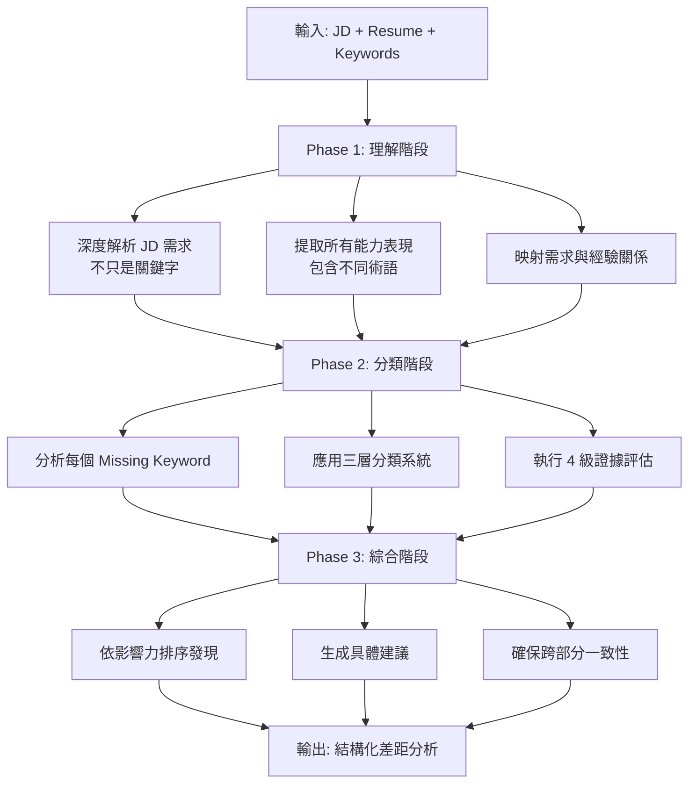
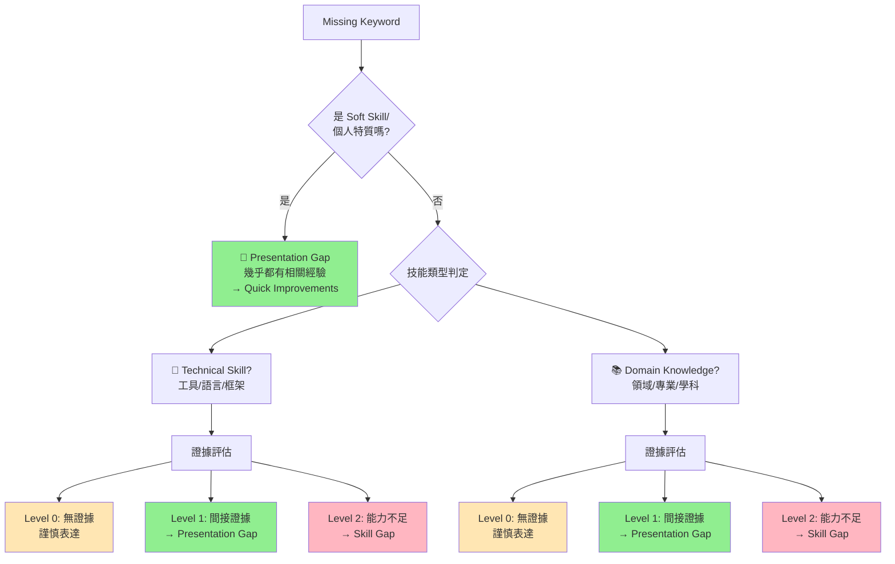
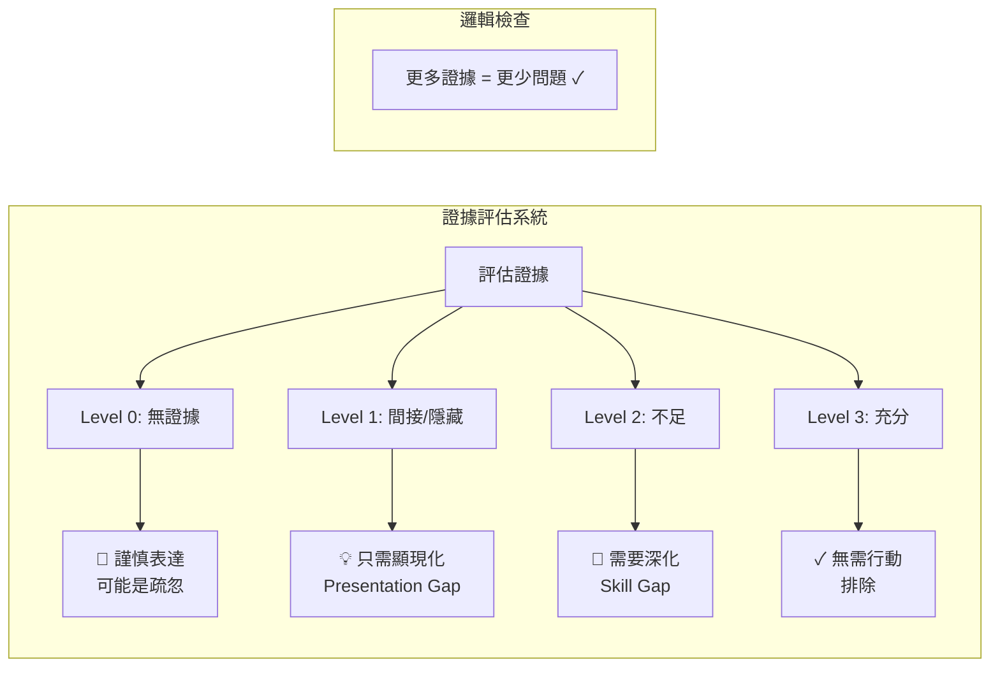
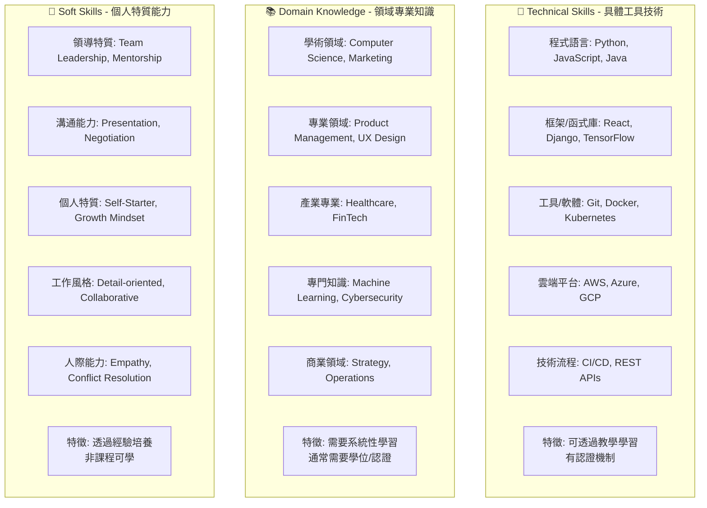
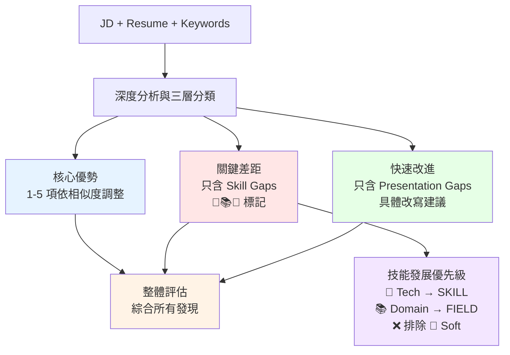
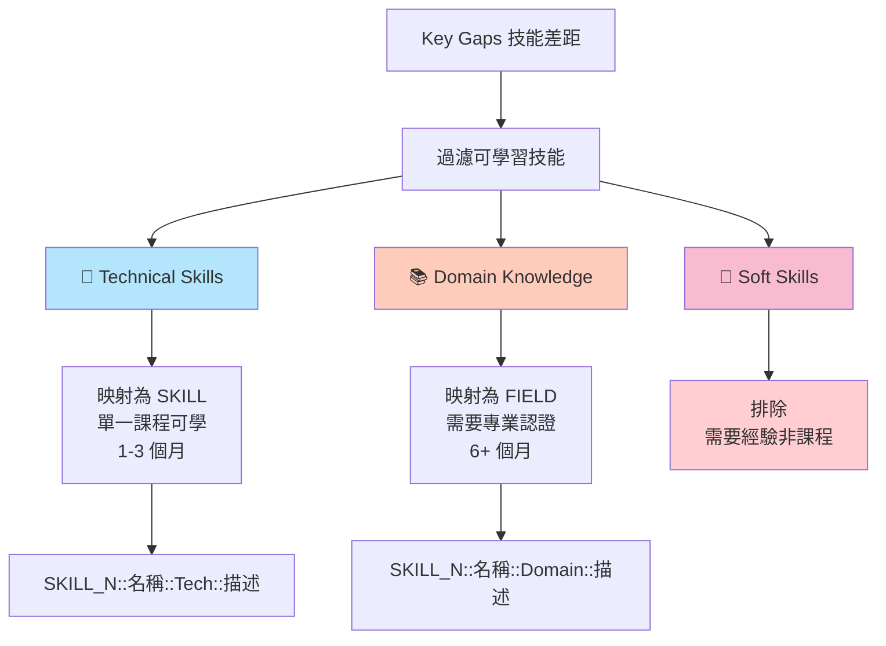
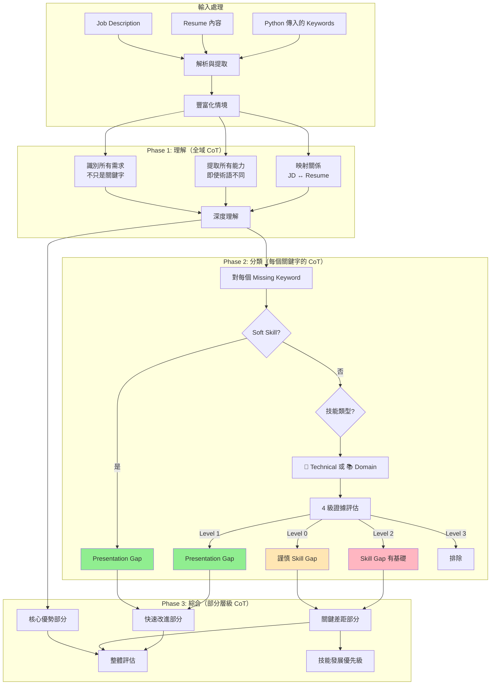
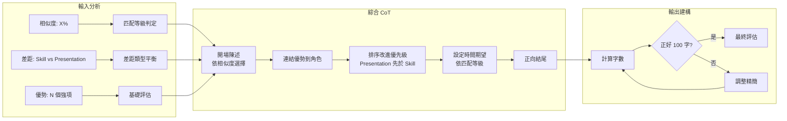

# Gap Analysis v2.1.8 設計文檔

**日期**: 2025-08-14  
**版本**: 2.1.8  
**狀態**: Active  
**作者**: AI Resume Advisor Team

## 執行摘要

Gap Analysis v2.1.8 引入了革命性的三層技能分類系統，修正了 v2.1.7 中 Domain Knowledge 被錯誤分類的問題。透過更精確的 4 級證據評估系統和謹慎的表達方式，提供更準確且可行的職涯建議。

## 核心設計理念

### 1. 三層技能分類系統
- **🔧 Technical Skills**: 具體工具與技術（可透過課程學習）
- **📚 Domain Knowledge**: 領域知識與專業（需要系統性學習）
- **💼 Soft Skills**: 個人特質與軟實力（需要經驗累積）

### 2. 4 級證據評估系統
- **Level 0**: 無證據（謹慎表達，可能是疏忽）
- **Level 1**: 間接/隱藏證據（只需顯現化）
- **Level 2**: 能力不足（有基礎但需深化）
- **Level 3**: 充分證據（符合要求）

### 3. SKILL/FIELD 使用者介面映射
- **SKILL**: 單一課程可學（1-3 個月）→ 映射自 Technical
- **FIELD**: 需要專業認證/學位（6+ 個月）→ 映射自 Domain

## 架構總覽

### 全域 Chain-of-Thought 框架



### 增強版分類決策樹（含三層系統）



### 4 級證據評估邏輯



### 三層分類系統詳細定義



### 各部分詳細 CoT 流程

```mermaid
graph LR
    subgraph 核心優勢 CoT
        CS1[依相似度決定數量] --> CS2[提取 JD 核心需求]
        CS2 --> CS3[評分履歷經驗相關性]
        CS3 --> CS4[套用相關性門檻]
        CS4 --> CS5[選擇前 N 個優勢]
        CS5 --> CS6[撰寫描述與證據]
    end
    
    subgraph "關鍵差距 CoT"
        KG1[列出 Missing Keywords] --> KG2[三層分類判定]
        KG2 --> KG3[4 級證據評估]
        KG3 --> KG4[檢查替代術語]
        KG4 --> KG5[分類: Skill 或 Presentation]
        KG5 --> KG6[估算學習時間]
        KG6 --> KG7[按重要性排序]
    end
    
    subgraph "快速改進 CoT"
        QI1[參考差距分類] --> QI2[驗證 Presentation Gaps]
        QI2 --> QI3[找出支持證據]
        QI3 --> QI4[建議具體措辭]
        QI4 --> QI5[術語對齊]
        QI5 --> QI6[確認 24-48 小時可完成]
    end
    
    subgraph "整體評估 CoT"
        OA1[綜合發現] --> OA2[判定匹配等級]
        OA2 --> OA3[連結優勢]
        OA3 --> OA4[排序改進順序]
        OA4 --> OA5[設定期望]
        OA5 --> OA6[100 字敘述]
    end
    
    subgraph "技能優先級 CoT"
        SP1[過濾可學習技能] --> SP2[排除 Soft Skills]
        SP2 --> SP3[Tech → SKILL 映射]
        SP3 --> SP4[Domain → FIELD 映射]
        SP4 --> SP5[按學習可行性排序]
        SP5 --> SP6[格式化輸出]
    end
```



### 資訊流動架構



## Chain-of-Thought 推理範例

### 範例 1: Technical Skill 分析 - "Docker"

**輸入情境**:
- Resume: "使用容器技術部署應用程式"
- JD 要求: "Docker 經驗"

**CoT 推理過程**:
```yaml
思考 1 - 直接搜尋:
  搜尋: "Docker"
  結果: 未找到
  
思考 2 - 技能分類:
  類型: 🔧 Technical Skill (工具軟體)
  特徵: 可透過課程學習，有認證
  
思考 3 - 證據評估:
  找到: "容器技術"
  分析: 容器技術暗示 Docker 知識
  評估: Level 1 (間接證據)
  
思考 4 - 最終分類:
  類型: Presentation Gap
  原因: 技能存在但未明確表達
  
思考 5 - 輸出位置:
  部分: Quick Improvements
  格式: 🔧 <b>Docker 可見性</b>: 將「容器技術」改為「Docker 容器化部署」
```

### 範例 2: Domain Knowledge 分析 - "Computer Science"

**輸入情境**:
- Resume: "5 年軟體開發經驗，精通多種程式語言"
- JD 要求: "Computer Science 背景"

**CoT 推理過程**:
```yaml
思考 1 - 直接搜尋:
  搜尋: "Computer Science", "CS"
  結果: 未找到
  
思考 2 - 技能分類:
  類型: 📚 Domain Knowledge (學術領域)
  特徵: 需要系統性學習，通常要學位
  
思考 3 - 證據評估:
  找到: 程式開發經驗
  分析: 暗示 CS 基礎但未明說
  評估: Level 1 (間接證據)
  
思考 4 - 最終分類:
  類型: Presentation Gap
  原因: 背景存在但需顯現化
  
思考 5 - 輸出位置:
  部分: Quick Improvements
  格式: 📚 <b>Computer Science 背景</b>: 在教育或技能部分加入「Computer Science 原理」
```

### 範例 3: Soft Skill 分析 - "Self-Starter"

**輸入情境**:
- Resume: "主導重構專案，減少技術債 40%"
- JD 要求: "Self-Starter 特質"

**CoT 推理過程**:
```yaml
思考 1 - 初步檢查:
  類型判定: 💼 Soft Skill (個人特質)
  決策: 幾乎總是 Presentation Gap
  
思考 2 - 證據搜尋:
  找到: "主導重構專案"
  分析: 明顯展現主動性
  
思考 3 - 最終分類:
  類型: Presentation Gap
  原因: 特質存在，需要更好的故事
  
思考 4 - 輸出位置:
  部分: Quick Improvements
  格式: 💼 <b>Self-Starter 證據</b>: 強調「主動發起並領導重構，無需管理層要求」
```

### 範例 4: Level 0 謹慎表達 - "Kubernetes"

**輸入情境**:
- Resume: 完全沒有容器或雲端相關經驗
- JD 要求: "Kubernetes 編排"

**CoT 推理過程**:
```yaml
思考 1 - 全面搜尋:
  直接: "Kubernetes", "K8s" → 未找到
  相關: "Docker", "容器", "編排" → 未找到
  雲端: "AWS", "Azure", "GCP" → 未找到
  
思考 2 - 證據評估:
  Level: 0 (完全無證據)
  注意: 缺席不代表無能力
  
思考 3 - 表達策略:
  使用 5 種輪替模式之一
  強調可能是疏忽
  
思考 4 - 輸出:
  部分: Key Gaps
  格式: 🔧 <b>Kubernetes</b>: 履歷中未呈現。如有經驗請立即補充，否則預留 3-4 個月學習。
```

## 動態內容策略

### 依相似度調整的優勢數量

```yaml
核心優勢數量:
- 80%+: 4-5 個優勢（強匹配 - 展現廣度）
- 70-79%: 3-4 個優勢（良好匹配 - 突出最佳）
- 60-70%: 3 個優勢（中等匹配 - 聚焦相關性）
- 50-60%: 2-3 個優勢（一般匹配 - 強調可轉移性）
- 40-50%: 2 個優勢（有限匹配 - 找出最佳連結）
- <40%: 1-2 個優勢（低匹配 - 聚焦可轉移技能）

品質原則: 寧願少而精，不要多而雜
```

### Level 0 表達模式（5 種輪替）

```yaml
模式 A: "履歷中未呈現。如有經驗請立即補充，否則預留 {時間} 學習。"
模式 B: "目前履歷未見。可能遺漏？請補充，或規劃 {時間} 發展。"
模式 C: "未檢測到。需採取行動：展示現有技能或投入 {時間} 學習。"
模式 D: "目前不可見。如熟悉請突顯，如陌生則分配 {時間}。"
模式 E: "未發現蹤跡。可能是履歷缺漏需修正，或需要 {時間} 培訓。"
```

### Level 2 表達模式（5 種輪替）

```yaml
模式 A: "基礎 {現有} 存在。提升至 {目標} 需時 {時間}。"
模式 B: "{基礎} 已展現。深化至 {專業級} 需 {時間}。"
模式 C: "入門級 {技能} 明顯。進階至 {要求} 透過 {時間}。"
模式 D: "{部分} 經驗已註記。擴展至 {完整} 需時 {時間}。"
模式 E: "基礎存在。銜接至 {目標} 需 {時間} 專注練習。"
```

## 技能發展優先級映射

### 提取與分類規則



### Python 層映射邏輯

```python
# gap_analysis_utils.py 映射實作
if category == 'TECH':
    category = 'SKILL'  # 單一課程可學 (1-3 個月)
elif category == 'DOMAIN':
    category = 'FIELD'  # 需要專業認證 (6+ 個月)
# 向後相容
elif category == 'TECHNICAL':
    category = 'SKILL'
elif category == 'NON_TECHNICAL':
    category = 'FIELD'
```

## 實際學習時間估算

### Technical Skills (🔧)
- 新程式語言（有相似語言基礎）：2-4 個月
- 新程式語言（第一個語言）：6-12 個月
- 框架（語言已會）：4-8 週
- 雲端平台：3-6 個月達到能力
- 設計工具：2-3 個月達到能力

### Domain Knowledge (📚)
- 學術領域（如 CS）：6-12 個月系統學習
- 專業領域（如 UX Design）：6-9 個月專業訓練
- 產業知識：3-6 個月深入了解
- 商業領域：6-12 個月 MBA 級別學習

### Soft Skills (💼)
- 領導能力：3-6 個月實踐
- 溝通技巧：持續練習
- 個人特質：需要長期培養

## 與 v2.1.7 的關鍵差異

| 面向 | v2.1.7 | v2.1.8 |
|------|--------|--------|
| 分類系統 | 二分（Skill/Presentation） | 三層（Technical/Domain/Soft） |
| Domain Knowledge | 錯誤歸類為 Soft Skills | 正確識別為可學習技能 |
| 證據評估 | 3 級系統 | 4 級系統（合併 Weak/Implicit） |
| Level 0 表達 | 較為肯定 | 謹慎表達（承認分析限制） |
| 技能優先級 | 排除 Domain | 包含 Domain 作為 FIELD |
| 表達多樣性 | 3 種模式 | 5 種輪替模式 |
| 使用者介面 | TECHNICAL/NON_TECHNICAL | SKILL/FIELD（更直觀） |

## 品質保證檢查清單

### 輸出驗證
- ✓ Key Gaps 只包含真正的 Skill Gaps（🔧📚💼 標記）
- ✓ Quick Improvements 只包含 Presentation Gaps
- ✓ 沒有技能同時出現在兩個部分
- ✓ Level 0 使用謹慎表達（可能是疏忽 vs 真的缺乏）
- ✓ 優勢數量符合相似度指引
- ✓ 整體評估正好 100 字
- ✓ 技能優先級排除 Soft Skills
- ✓ Tech → SKILL, Domain → FIELD 正確映射

### 錯誤預防
1. **分類錯誤**: 三層系統與決策樹防止錯誤分類
2. **Domain 遺漏**: 明確納入 Domain Knowledge 為可學習技能
3. **過度樂觀**: 實際的學習時間估算
4. **表達單調**: 5 種輪替模式避免重複

## 完整 CoT 實作細節

### Prompt 架構流程



### 整體評估綜合 CoT



## 實作指引

### 服務層變更
```python
# gap_analysis_v2.py
gap_analysis_version = os.environ.get('GAP_ANALYSIS_PROMPT_VERSION', 'latest')
if gap_analysis_version == '2.1.8':
    config = prompt_manager.load_prompt_config_by_filename("gap_analysis", "v2.1.8.yaml")
```

### API 回應結構（保持不變）
```json
{
    "CoreStrengths": "...",
    "KeyGaps": "... (現在包含 🔧📚💼 標記)",
    "QuickImprovements": "... (具體改寫建議)",
    "OverallAssessment": "...",
    "SkillSearchQueries": [
        {
            "skill_name": "React",
            "skill_category": "SKILL",  // 或 "FIELD"
            "description": "..."
        }
    ]
}
```

## 成功指標

1. **分類準確性**: Domain Knowledge 正確識別率 > 95%
2. **使用者滿意度**: SKILL/FIELD 分類理解度提升
3. **學習路徑成功**: 技能發展優先級與實際學習對齊
4. **行動速度**: 使用者能快速理解並執行建議

## 未來增強

1. **機器學習整合**: 從使用者回饋學習分類模式
2. **產業特定調整**: 根據產業調整技能分類
3. **進階分析**: 提供更深入的技能路徑圖
4. **課程推薦整合**: 將 SKILL/FIELD 連結到具體課程

## 結論

Gap Analysis v2.1.8 透過三層分類系統和 4 級證據評估，提供更準確、更可行的職涯建議。特別是修正了 Domain Knowledge 的分類問題，並透過 SKILL/FIELD 映射提供更直觀的學習路徑指引。

---

**文檔版本**: 1.0  
**最後更新**: 2025-08-14  
**下次審查**: 2025-09-14