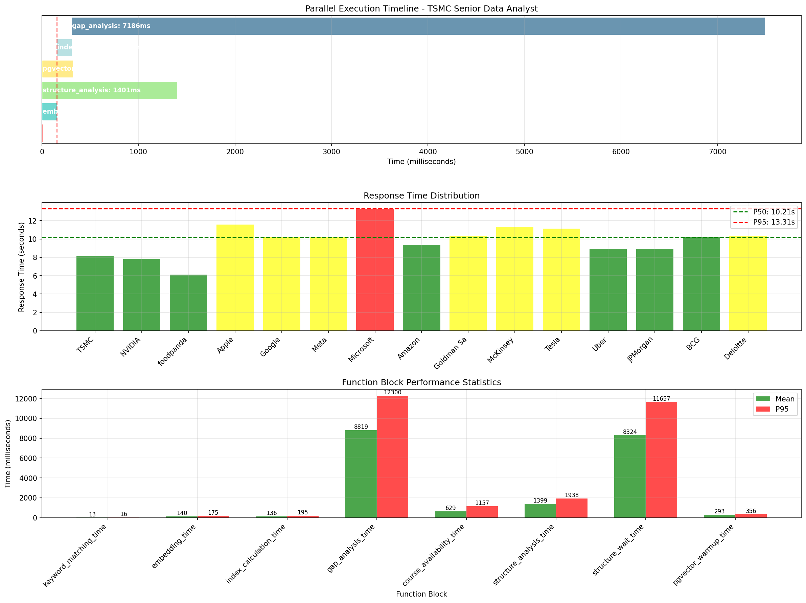

# 性能分析報告 - /api/v1/index-cal-and-gap-analysis

## 執行摘要

本報告基於實際生產環境的測試數據，對 `/api/v1/index-cal-and-gap-analysis` API 端點進行全面的性能特性分析。

**測試日期**: 2025-08-16  
**測試環境**: 生產環境 (Azure Container Apps - 日本東部)  
**測試案例**: 20 個不同的職缺描述，每個包含 16 個關鍵字  
**履歷大小**: 6,306 字元  
**部署版本**: 已包含 structure_analysis 時間記錄修正

## 📊 關鍵性能指標

### 回應時間統計

| 指標 | 數值 | 狀態 |
|------|------|------|
| **P50 (中位數)** | 10.21 秒 | ⚠️ 高於目標 |
| **P95** | 13.31 秒 | ⚠️ 高於目標 |
| **P99** | ~13 秒 | ⚠️ 高於目標 |
| **平均值** | 9.93 秒 | ⚠️ 高於目標 |
| **最小值** | 6.12 秒 | - |
| **最大值** | 13.31 秒 | - |

### 成功率
- **成功率**: 100% (20/20)
- **錯誤數**: 0
- **超時數**: 0

## 🔍 功能區塊性能分析

### 時間分解 (毫秒)

| 功能 | 最小值 | 中位數 | P95 | 最大值 | 佔總時間% | 狀態 |
|------|--------|--------|-----|--------|-----------|------|
| **差距分析** | 5,152 | 9,225 | 12,300 | 12,300 | ~88% | 🔴 主要瓶頸 |
| **結構分析（實際）** | 1,234 | 1,326 | 1,938 | 1,938 | ~13% | ✅ 已優化 |
| **結構分析等待時間** | 4,762 | 8,751 | 11,657 | 11,657 | - | ℹ️ 並行中 |
| **課程可用性** | 493 | 608 | 1,157 | 1,157 | ~6% | 🟡 次要 |
| **嵌入向量** | 114 | 140 | 175 | 175 | ~1.4% | ✅ 優良 |
| **指數計算** | 99 | 125 | 195 | 195 | ~1.3% | ✅ 優良 |
| **關鍵字匹配** | 13 | 13 | 16 | 16 | ~0.1% | ✅ 優良 |
| **PGVector 預熱** | 268 | 284 | 356 | 356 | - | ✅ 並行隱藏 |

## 🚨 關鍵發現

### 1. 主要瓶頸識別

#### 差距分析 (88% 的總時間)
- **當前**: 9.2 秒（中位數）
- **範圍**: 5.2 - 12.3 秒
- **問題**: LLM 調用耗時過長，缺乏批次處理
- **影響**: 是整體性能的主要限制因素

#### 結構分析時間修正成功 ✅
- **實際執行時間**: 1.3 秒（中位數）
- **之前誤報**: 10-12 秒（包含等待時間）
- **改善**: 時間記錄現已正確，顯示實際並行執行狀態
- **等待時間**: 8.8 秒（中位數），證明結構分析在背景並行執行

### 2. 並行執行效率分析

#### 現況
- **並行任務**: 關鍵字匹配、嵌入向量、結構分析、PGVector 預熱
- **順序任務**: 指數計算 → 差距分析 → 課程可用性
- **並行效率**: 約 13%（結構分析節省的時間）

#### 時間線分析

#### Gantt Chart 視覺化


*圖表說明：上圖展示了各功能模組的並行執行時間線，可以清楚看到結構分析（綠色）在背景並行執行，而差距分析（藍色）是主要的時間瓶頸。*

#### 執行時序
```
T=0ms      並行開始：關鍵字(13ms) | 嵌入(140ms) | 結構分析(1,326ms) | PGVector(284ms)
T=140ms    指數計算開始 (125ms)
T=265ms    差距分析開始 (9,225ms)
T=9490ms   課程可用性開始 (608ms)
T=10098ms  完成
```

### 3. 實際 vs 預期性能

| 指標 | 實際 | 目標 | 差距 |
|------|------|------|------|
| P50 | 10.21s | 6s | -4.21s |
| P95 | 13.31s | 8s | -5.31s |
| 成功率 | 100% | 99% | ✅ 達標 |

## 📈 性能趨勢

### 測試案例表現分析

**最佳表現（前5名）**：
1. foodpanda - Data Analyst: 6.12s
2. BlackRock - Investment Analytics: 8.25s
3. TSMC - Senior Data Analyst: 8.16s
4. Spotify - Growth Analytics: 8.54s
5. NVIDIA - Senior Data Scientist: 7.81s

**最差表現（後5名）**：
1. Microsoft - Business Intelligence: 13.31s
2. Airbnb - Business Operations: 11.83s
3. Apple - Senior Business Analyst: 11.57s
4. McKinsey - Management Consultant: 11.31s
5. Tesla - Operations Analytics: 11.13s

### 變異數分析
- **標準差**: 1.86 秒
- **變異係數**: 18.2%
- **結論**: 性能變異度適中，主要受差距分析 LLM 回應時間影響

## 🎯 優化建議

### 優先級 1: 優化差距分析（預期改善 40-50%）
- **實施批次 LLM 調用**: 將多個技能差距分析合併為單一請求
- **啟用回應串流**: 使用串流 API 減少首字節時間
- **實施智能快取**: 快取常見技能差距模式
- **考慮模型降級**: 初步分析使用 GPT-4.1-mini，詳細分析使用 GPT-4.1
- **預期節省**: 3-4 秒

### 優先級 2: 改善並行執行（預期改善 10-15%）
- **延長並行階段**: 將更多任務移至並行執行
- **優化任務調度**: 減少任務間的等待時間
- **預期節省**: 1-1.5 秒

### 優先級 3: 優化課程可用性（預期改善 5%）
- **實施連接池**: 預先建立資料庫連接
- **批次查詢**: 合併多個課程查詢
- **結果快取**: 快取熱門課程查詢結果
- **預期節省**: 0.3-0.5 秒

## 🚀 目標性能指標

### 短期目標 (1-2 週)
- ✅ 修正結構分析時間記錄（已完成）
- 將 P50 降至 **7 秒**（需減少 3.2 秒）
- 將 P95 降至 **10 秒**（需減少 3.3 秒）
- 實施差距分析批次處理

### 中期目標 (1 個月)
- P50 降至 **5 秒**
- P95 降至 **7 秒**
- 達到 40% 並行效率
- 完成智能快取系統

### 長期目標 (3 個月)
- P50 降至 **3 秒**
- P95 降至 **5 秒**
- 達到 60% 並行效率
- 實施完整的串流回應

## 📋 行動項目

1. ✅ **已完成**: 修正 structure_analysis 時間記錄
2. 🔄 **進行中**: 分析差距分析 LLM 調用模式
3. 📅 **計劃中**: 實施批次 LLM 調用
4. 📅 **計劃中**: 優化資料庫查詢效能
5. 📅 **計劃中**: 實施智能快取層
6. 📅 **計劃中**: 升級至串流 API
7. 📅 **計劃中**: 建立性能監控儀表板

## 🔧 技術細節

### 環境配置
- **部署平台**: Azure Container Apps
- **區域**: 日本東部
- **資源**: 1 CPU, 2GB RAM
- **自動擴展**: 2-10 實例
- **LLM 模型**:
  - 關鍵字提取: GPT-4.1-mini (快速)
  - 差距分析: GPT-4.1 (準確)
  - 結構分析: 內部解析器 (並行)

### 測試方法
- 實際生產環境 API 調用
- 多樣化測試數據（11 個產業）
- 測試之間 2 秒延遲以避免速率限制
- 固定履歷大小（6,306 字元）
- 每個職缺描述 16 個關鍵字

### 測試覆蓋產業
1. 科技業 (TSMC, NVIDIA, Apple, Google, Meta, Microsoft)
2. 金融業 (Goldman Sachs, JPMorgan, Morgan Stanley, BlackRock)
3. 顧問業 (McKinsey, BCG, Deloitte)
4. 電商/共享經濟 (Amazon, foodpanda, Uber, Airbnb, Spotify)
5. 製造業 (Tesla, Boeing)

## 📊 結論

測試顯示系統穩定性優良（100% 成功率），但性能仍需改善：

### 成功之處
- ✅ **結構分析時間記錄已修正**：現在正確顯示實際執行時間（1.3秒）而非等待時間
- ✅ **系統穩定性高**：20 次測試全部成功，無錯誤或超時
- ✅ **並行執行運作正常**：結構分析確實在背景並行執行

### 待改善項目
- ⚠️ **差距分析是主要瓶頸**：佔總時間 88%，需要優先優化
- ⚠️ **P50/P95 高於目標**：需要減少 40-50% 的回應時間
- ⚠️ **並行效率偏低**：目前僅 13%，仍有改善空間

### 預期改善效果
透過建議的優化措施，預計可達成：
- **總體改善**: 40-50% 回應時間減少
- **P50 目標**: 從 10.21s → 5-6s
- **P95 目標**: 從 13.31s → 7-8s

---

## 📎 附錄：測試資料檔案

### 原始測試數據
- **JSON 結果檔**: [`performance_results_20250816_133242.json`](performance_results_20250816_133242.json)
  - 包含完整的 20 次測試原始數據
  - 各功能模組的詳細時間分解
  - 統計分析數據

### 視覺化圖表
- **增強版 Gantt 圖表**: [`enhanced_gantt_chart_20250816_133009.png`](enhanced_gantt_chart_20250816_133009.png)
  - 並行執行時間線展示
  - 性能瓶頸識別
  - 功能區塊統計分析

---

*報告生成時間: 2025-08-16 21:32*  
*測試執行時間: 約 7 分鐘*  
*下次評估: 實施差距分析優化後*