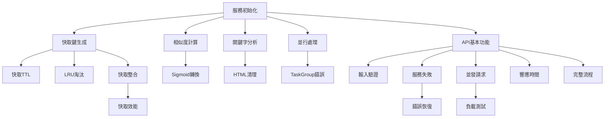

# Index Calculation V2 測試矩陣

## 測試覆蓋矩陣

### 功能 vs 測試類型矩陣

| 功能模組 | 單元測試 | 整合測試 | 效能測試 | E2E測試 |
|---------|----------|----------|----------|---------|
| **服務初始化** | IC-UNIT-001 | IC-INT-001 | - | IC-E2E-001 |
| **快取機制** | IC-UNIT-002,003,004 | IC-INT-002 | IC-PERF-002,005 | - |
| **相似度計算** | IC-UNIT-005,006 | IC-INT-001 | IC-PERF-001 | IC-E2E-001 |
| **關鍵字分析** | IC-UNIT-007 | IC-INT-001 | IC-PERF-001 | IC-E2E-001 |
| **HTML處理** | IC-UNIT-008 | IC-INT-008 | - | - |
| **並行處理** | IC-UNIT-009,010 | IC-INT-005 | IC-PERF-003 | - |
| **錯誤處理** | IC-UNIT-010 | IC-INT-003,004 | - | IC-E2E-002 |
| **API端點** | - | IC-INT-001-008 | IC-PERF-001,003 | IC-E2E-001 |
| **監控統計** | - | IC-INT-007 | - | IC-E2E-003 |

### 測試狀態追蹤

| 測試ID | 測試名稱 | 優先級 | 狀態 | 最後執行 | 通過率 |
|--------|---------|--------|------|----------|--------|
| IC-UNIT-001 | 服務初始化測試 | P0 | 🔄 待實作 | - | - |
| IC-UNIT-002 | 快取鍵生成測試 | P0 | 🔄 待實作 | - | - |
| IC-UNIT-003 | 快取TTL測試 | P1 | 🔄 待實作 | - | - |
| IC-UNIT-004 | 快取LRU淘汰測試 | P1 | 🔄 待實作 | - | - |
| IC-UNIT-005 | 相似度計算測試 | P0 | 🔄 待實作 | - | - |
| IC-UNIT-006 | Sigmoid轉換測試 | P0 | 🔄 待實作 | - | - |
| IC-UNIT-007 | 關鍵字覆蓋分析測試 | P0 | 🔄 待實作 | - | - |
| IC-UNIT-008 | HTML清理測試 | P1 | 🔄 待實作 | - | - |
| IC-UNIT-009 | 並行處理測試 | P0 | 🔄 待實作 | - | - |
| IC-UNIT-010 | TaskGroup錯誤處理測試 | P1 | 🔄 待實作 | - | - |
| IC-INT-001 | API端點基本功能測試 | P0 | 🔄 待實作 | - | - |
| IC-INT-002 | 快取行為整合測試 | P0 | 🔄 待實作 | - | - |
| IC-INT-003 | 輸入驗證測試 | P0 | 🔄 待實作 | - | - |
| IC-INT-004 | 外部服務失敗測試 | P0 | 🔄 待實作 | - | - |
| IC-INT-005 | 並發請求測試 | P1 | 🔄 待實作 | - | - |
| IC-INT-006 | 大文檔處理測試 | P1 | 🔄 待實作 | - | - |
| IC-INT-007 | 統計端點測試 | P2 | 🔄 待實作 | - | - |
| IC-INT-008 | 跨語言測試 | P1 | 🔄 待實作 | - | - |
| IC-PERF-001 | 響應時間基準測試 | P0 | 🔄 待實作 | - | - |
| IC-PERF-002 | 快取效能測試 | P0 | 🔄 待實作 | - | - |
| IC-PERF-003 | 並發負載測試 | P0 | 🔄 待實作 | - | - |
| IC-PERF-004 | 記憶體使用測試 | P1 | 🔄 待實作 | - | - |
| IC-PERF-005 | 快取大小限制測試 | P1 | 🔄 待實作 | - | - |
| IC-E2E-001 | 完整工作流程測試 | P0 | 🔄 待實作 | - | - |
| IC-E2E-002 | 錯誤恢復測試 | P1 | 🔄 待實作 | - | - |
| IC-E2E-003 | 監控整合測試 | P2 | 🔄 待實作 | - | - |

### 測試依賴關係



### 環境與測試類型矩陣

| 測試類型 | 本地開發 | CI/CD | 預生產 | 生產 |
|---------|----------|-------|--------|------|
| 單元測試 | ✅ 每次提交 | ✅ 必須通過 | ✅ 部署前 | - |
| 整合測試 | ✅ 功能完成 | ✅ 必須通過 | ✅ 部署前 | - |
| 效能測試 | ⚠️ 選擇性 | ✅ 每日執行 | ✅ 部署前 | - |
| E2E測試 | ⚠️ 選擇性 | ✅ 發布前 | ✅ 必須通過 | ✅ 部署後驗證 |

### 測試資料矩陣

| 測試場景 | 小型資料 | 中型資料 | 大型資料 | 極端案例 |
|---------|---------|---------|---------|----------|
| 履歷長度 | < 1KB | 1-10KB | 10-50KB | > 50KB |
| 職缺長度 | < 500字 | 500-2000字 | 2000-5000字 | > 5000字 |
| 關鍵字數 | 1-5個 | 5-20個 | 20-50個 | > 50個 |
| 並發請求 | 1-10 | 10-50 | 50-100 | > 100 |

### 效能基準矩陣

| 指標 | 目標值 | 警告閾值 | 錯誤閾值 |
|------|--------|----------|----------|
| **響應時間 (P50)** | < 1秒 | 1-1.5秒 | > 1.5秒 |
| **響應時間 (P95)** | < 2秒 | 2-2.5秒 | > 2.5秒 |
| **響應時間 (P99)** | < 3秒 | 3-4秒 | > 4秒 |
| **快取命中率** | > 60% | 40-60% | < 40% |
| **並發處理 (QPS)** | > 50 | 30-50 | < 30 |
| **錯誤率** | < 0.1% | 0.1-1% | > 1% |
| **記憶體使用** | < 1.5GB | 1.5-2GB | > 2GB |
| **CPU使用率** | < 60% | 60-80% | > 80% |

### 測試執行策略

#### 快速測試 (< 5分鐘)
```bash
# 執行 P0 單元測試
pytest tests/unit/ -m "priority_0"
```

#### 標準測試 (< 30分鐘)
```bash
# 執行所有單元測試和整合測試
pytest tests/unit/ tests/integration/
```

#### 完整測試 (< 2小時)
```bash
# 執行所有測試包含效能測試
./run_complete_test_suite.sh
```

### 測試結果判定標準

| 優先級 | 通過標準 | 發布決策 |
|--------|---------|----------|
| P0 | 100% 通過 | 必須修復才能發布 |
| P1 | 95% 通過 | 應該修復，可有條件發布 |
| P2 | 80% 通過 | 建議修復，不影響發布 |

### 回歸測試策略

當以下情況發生時，需要執行完整回歸測試：
1. 核心邏輯變更（相似度計算、快取機制）
2. 依賴升級（Python、FastAPI、第三方套件）
3. 配置變更（環境變數、系統參數）
4. 效能優化後

### 測試報告模板

```
Index Calculation V2 測試報告
============================
執行日期: YYYY-MM-DD HH:MM:SS
執行環境: [本地/CI/預生產]
Python版本: 3.11.8

測試摘要
--------
總測試數: XX
通過: XX (XX%)
失敗: XX
跳過: XX

優先級統計
----------
P0: XX/XX (100%)
P1: XX/XX (XX%)
P2: XX/XX (XX%)

效能指標
--------
P50響應時間: XXXms
P95響應時間: XXXms
快取命中率: XX%

詳細結果
--------
[測試結果詳細列表]
```

---

**文檔版本**: 1.0.0  
**建立日期**: 2025-08-02  
**最後更新**: 2025-08-02