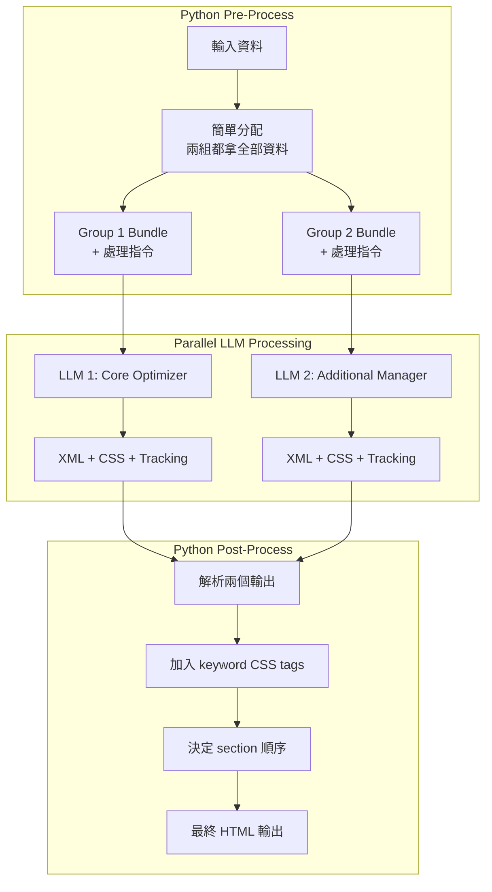
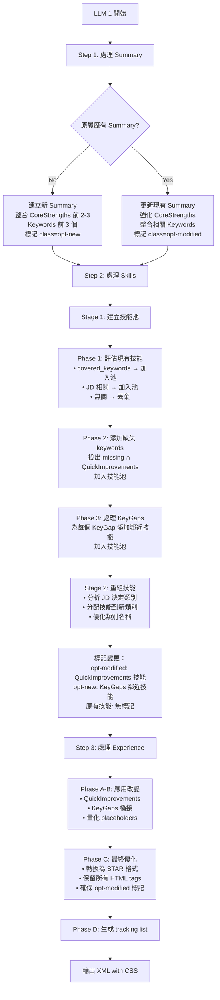
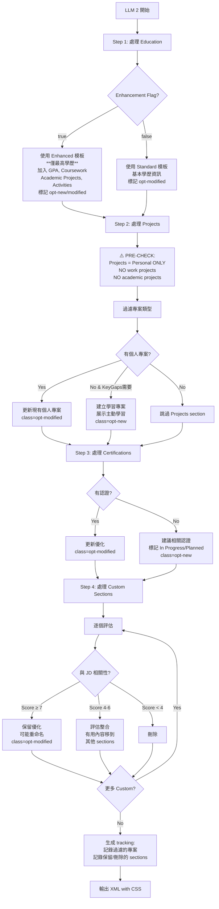

# Resume Tailoring v3.1.0 - 2 LLM Pipeline 架構設計文檔

## 📄 文件資訊
- **版本**: v3.1.0
- **建立日期**: 2025-08-22
- **目的**: 設計 Resume Tailoring v3.1.0 的 2 LLM Pipeline 架構
- **狀態**: 架構設計完成，待實作

---

## 🏗️ 架構概覽

### Pipeline 架構對比

#### v2.1.0 架構（現有）
```
Stage 1: InstructionCompiler (GPT-4.1 mini) → 分析結構
Stage 2: ResumeTailoringService (GPT-4.1) → 執行優化
```

#### v3.1.0 架構（新設計）
```
Python Pre-Process: 簡單資料分配
Parallel LLMs:
  - LLM 1: Core Optimizer (Summary + Skills + Experience)
  - LLM 2: Additional Manager (Education + Projects + Certifications + Custom)
Python Post-Process: 組合結果 + Keyword CSS 標記
```

---

## 📊 完整系統流程圖



---

## 🤖 LLM 1: Core Optimizer 決策流程

### 處理責任
- **Professional Summary** (必須有，沒有則建立)
- **Core Competencies / Skills**
- **Professional Experience**

### 決策流程圖



### LLM 1 Decision Flow (resume_core v1.0.0)

```mermaid
graph TD
    Start[LLM 1 開始: 處理 Summary + Skills + Experience] --> Step1
    
    %% ============= STEP 1: PROFESSIONAL SUMMARY =============
    Step1["═══ Step 1: Professional Summary ═══<br/>MANDATORY SECTION"] --> SummaryEx{"🔍 Summary 異常檢查"}
    
    %% Summary-specific Exception Handling
    SummaryEx --> SEx1{CoreStrengths < 3?}
    SEx1 -->|Yes| UseAvailableCS["使用現有 CoreStrengths<br/>(可能少於 4 句)"]
    SEx1 -->|No| SEx2{無 CoreStrengths?}
    SEx2 -->|Yes| FocusKeywords["聚焦於 QuickImprovements<br/>∩ missing_keywords"]
    SEx2 -->|No| SEx3{QuickImprovements 空?}
    SEx3 -->|Yes| UseDirectKeywords["直接使用 missing_keywords<br/>(智能選擇 3-5 個)"]
    SEx3 -->|No| ProceedNormalSummary[正常處理 Summary]
    
    UseAvailableCS --> CheckSummary
    FocusKeywords --> CheckSummary
    UseDirectKeywords --> CheckSummary
    ProceedNormalSummary --> CheckSummary
    
    CheckSummary{Summary 存在?} -->|Yes| ModifySummary[B. 修改現有 Summary]
    CheckSummary -->|No| CreateSummary[C. 建立新 Summary]
    
    %% Modify Existing Summary Flow
    ModifySummary --> MS1[提取原始內容]
    MS1 --> MS2[識別 top 3 CoreStrengths]
    MS2 --> MS3["識別前 10 個 keywords<br/>在 QuickImprovements 中的<br/>使用 3-5 個"]
    MS3 --> MS4[過濾 KeyGaps keywords]
    MS4 --> MS5["重構為 4 句：<br/>• 句1: 身份+經驗+CoreStrength#1<br/>• 句2: CoreStrength#2+領域專長<br/>• 句3: CoreStrength#3+技術技能<br/>• 句4: 價值主張或職業目標"]
    MS5 --> MS6["CSS: p class='opt-modified'<br/>內部: span class='opt-modified'"]
    
    %% Create New Summary Flow
    CreateSummary --> CS1[識別 top 3 CoreStrengths]
    CS1 --> CS2["識別前 10 個 keywords<br/>在 QuickImprovements 中的<br/>使用 3-5 個"]
    CS2 --> CS3[過濾 KeyGaps keywords]
    CS3 --> CS4["建立 4 句結構<br/>套用相同句型模式"]
    CS4 --> CS5["CSS: div class='opt-new'"]
    
    MS6 --> TrackS["追蹤 Summary 改變"]
    CS5 --> TrackS
    
    %% ============= STEP 2: SKILLS PROCESSING =============
    TrackS --> Step2["═══ Step 2: Core Competencies/Skills ═══"]
    
    Step2 --> SkillEx{"🔍 Skills 異常檢查"}
    SkillEx --> SkEx1{無現有 skills?}
    SkEx1 -->|Yes| SkipPhase1[跳過 Phase 1 → Phase 2]
    SkEx1 -->|No| SkEx2{covered_keywords 空?}
    SkEx2 -->|Yes| SkipPhase1
    SkEx2 -->|No| SkEx3{QuickImprovements 空?}
    SkEx3 -->|Yes| UseDirectInPhase2["Phase 2: 直接使用<br/>missing_keywords"]
    SkEx3 -->|No| CollectPhase
    
    %% === STAGE 1: BUILD SKILLS POOL ===
    CollectPhase["🏊 Stage 1: 建立技能池<br/>(Skills Pool)"] --> InitPool["初始化空的技能池<br/>skills_pool = []"]
    
    InitPool --> Phase1["Phase 1: 從現有技能收集"]
    SkipPhase1 --> InitPool2["初始化空的技能池<br/>skills_pool = []"]
    InitPool2 --> Phase2
    UseDirectInPhase2 --> Phase2
    
    Phase1 --> SkillLoop{對每個現有技能}
    SkillLoop --> InCovered{在 covered_keywords?}
    InCovered -->|Yes| AddToPool["➕ 加入 skills_pool"]
    InCovered -->|No| RelevantToJD{與 JD 相關?}
    RelevantToJD -->|Yes| AddToPool
    RelevantToJD -->|No| Discard[❌ 不加入 skills_pool]
    
    AddToPool --> NextSkill{更多技能?}
    Discard --> NextSkill
    NextSkill -->|Yes| SkillLoop
    NextSkill -->|No| Phase2
    
    Phase2["Phase 2: 添加 missing keywords"] --> FindIntersection["找出要添加的 keywords：<br/>missing_keywords ∩ QuickImprovements<br/>(或直接用 missing_keywords)"]
    FindIntersection --> AddMissing["➕ 加入 skills_pool<br/>標記來源: opt-modified"]
    
    AddMissing --> Phase3["Phase 3: 處理 KeyGaps"]
    Phase3 --> ForEachGap{對每個 KeyGap}
    ForEachGap --> MapAdjacent["映射鄰近技能：<br/>Kubernetes → Container Orchestration<br/>React → Modern JS Frameworks"]
    MapAdjacent --> AddAdjacent["➕ 加入 skills_pool<br/>標記來源: opt-new"]
    AddAdjacent --> MoreGaps{更多 KeyGaps?}
    MoreGaps -->|Yes| ForEachGap
    MoreGaps -->|No| PoolComplete
    
    PoolComplete["✅ Skills Pool 完成<br/>包含所有要展示的技能"] --> ReorgPhase
    
    %% === STAGE 2: REORGANIZE FROM POOL ===
    ReorgPhase["🔄 Stage 2: 重組技能池"] --> AnalyzeJD["分析 JD 需求<br/>決定最佳類別結構"]
    AnalyzeJD --> CreateCat["建立新類別<br/>(如: Backend, DevOps, Data)"]
    CreateCat --> DistributeFromPool["從 skills_pool 分配技能：<br/>• 每個技能分到適合類別<br/>• 保留原始 CSS 標記<br/>• 優化類別名稱"]
    DistributeFromPool --> FormatOutput["格式化輸出：<br/><strong>類別名:</strong> 技能1 • 技能2 • ..."]
    FormatOutput --> TrackSkills["追蹤 Skills 改變"]
    
    %% ============= STEP 3: EXPERIENCE PROCESSING =============
    TrackSkills --> Step3["═══ Step 3: Professional Experience ═══"]
    
    Step3 --> ExpEx{"🔍 Experience 異常檢查"}
    ExpEx --> EEx1{QuickImprovements 空?}
    EEx1 -->|Yes| SkipPhaseA["跳過 Phase A<br/>直接進入 Phase B & C"]
    EEx1 -->|No| EEx2{無 experience section?}
    EEx2 -->|Yes| ReturnEmpty[返回空字串]
    EEx2 -->|No| EEx3{HTML 格式異常?}
    EEx3 -->|Yes| ApplyTemplate[套用 Resume Format V3 模板]
    EEx3 -->|No| PhaseA
    
    ReturnEmpty --> TrackExp
    ApplyTemplate --> PhaseA
    SkipPhaseA --> PhaseBAnalyze
    
    PhaseA["Phase A: 應用 QuickImprovements<br/>100% 強制執行"] --> ApplyEach["對每個 QuickImprovement：<br/>1. 定位目標內容<br/>2. 精確應用轉換<br/>3. 標記 opt-modified"]
    
    ApplyEach --> PhaseB
    
    %% Phase B 處理（包含異常情況的 keyword 分析）
    PhaseBAnalyze["Phase B: 分析 missing_keywords<br/>選擇最相關的 3-5 個"] --> PhaseB
    
    PhaseB[Phase B: KeyGaps 橋接策略] --> BridgeStrategy["60-70% Bridge Strategy：<br/>展示通往 Gap 的基礎<br/>CSS: span class='opt-new'"]
    BridgeStrategy --> FoundationEmphasis["30-40% Foundation Emphasis：<br/>強調可轉移技能<br/>CSS: li class='opt-new'"]
    
    FoundationEmphasis --> PhaseC[Phase C: STAR 優化]
    
    %% Phase C: STAR Decision Tree
    PhaseC --> STARTree[C.1 STAR Decision Tree]
    STARTree --> AnalyzeBullet{分析 bullet 結構}
    
    AnalyzeBullet --> HasSTAR{Has Action + Result?}
    HasSTAR -->|Yes| SkipBullet[SKIP - 已是 STAR]
    HasSTAR -->|No| OnlyAction{只有 Action?}
    
    OnlyAction -->|Yes| AddResult["ADD Result with metrics"]
    OnlyAction -->|No| OnlyResp{只有 Responsibility?}
    
    OnlyResp -->|Yes| ConvertAchieve[CONVERT to Achievement]
    OnlyResp -->|No| TooVague{太模糊?}
    
    TooVague -->|Yes| Rewrite[REWRITE with specifics]
    TooVague -->|No| NextBullet
    
    SkipBullet --> NextBullet{更多 bullets?}
    AddResult --> ApplyRanges
    ConvertAchieve --> ApplyRanges
    Rewrite --> ApplyRanges
    
    ApplyRanges["C.2 套用量化範圍"]
    
    ApplyRanges --> PreserveTags["C.3 保留 HTML 標籤"]
    PreserveTags --> CheckCSS["C.4 檢查 CSS 標記"]
    
    CheckCSS --> NextBullet
    NextBullet -->|Yes| AnalyzeBullet
    NextBullet -->|No| TrackExp
    
    TrackExp["追蹤 Experience 改變"]
    
    TrackExp --> Output[輸出 JSON with tracking]
```



### LLM 1 Prompt 結構

```yaml
system: |
  You are a Core Resume Optimizer focusing on the most critical sections:
  Professional Summary, Skills, and Experience.
  
  ## Your Responsibilities
  1. ENSURE Professional Summary exists (create if missing)
  2. Optimize Skills section with all relevant competencies
  3. Enhance Experience bullets with achievements and metrics
  
  ## CSS Marking Rules
  - opt-modified: Enhanced existing content
  - opt-new: Newly created content
  - opt-placeholder: Quantification placeholders [X%]

user: |
  Optimize these core sections based on the following inputs:
  
  ## Original Resume (Full Access)
  {original_resume}
  
  ## Job Description
  {job_description}
  
  ## Gap Analysis Insights
  CoreStrengths: {core_strengths}
  KeyGaps: {key_gaps}  
  QuickImprovements: {quick_improvements}
  
  ## Keywords
  Covered: {covered_keywords}
  Missing: {missing_keywords}  # 完整清單
  
  ## Special Instructions
  - Summary is MANDATORY (create if missing)
  - You can extract relevant content from Custom Sections but DO NOT output them
  - Apply ALL QuickImprovements related to your sections
  
  ## Chain of Thought Process
  
  ### Step 1: Summary Processing
  1. Check if Summary exists
  2. If NO: Create using CoreStrengths[0:3] + relevant keywords
  3. If YES: Enhance with CoreStrengths + keywords
  4. Mark with appropriate CSS class
  
  ### Step 2: Skills Processing  
  1. Extract existing skills from original resume
  2. Evaluate each skill:
     - If in covered_keywords → Keep as-is
     - If not keyword but relevant → Keep with possible enhancement
     - If outdated/irrelevant → Consider removing
  3. Integrate new content:
     - Add missing_keywords naturally
     - Apply skill-related Quick Improvements
     - Extract relevant skills from Custom Sections (but don't output Custom)
  4. Do NOT add Key Gaps as skills (they represent missing skills)
  5. Mark changes with CSS classes:
     - Enhanced existing skills: opt-modified
     - New skills added: opt-new
  
  ### Step 3: Experience Processing
  1. Apply each relevant QuickImprovement exactly as specified
  2. Quantify achievements with appropriate placeholder types:
     - Percentage improvements: [X%], [15-20%]
     - Team sizes: [TEAM SIZE], [8-12]
     - Dollar amounts: [$XXK], [dollar amount]
     - Time periods: [X months], [time period]
     - Volumes: [user/transaction volume]
  3. Integrate keywords naturally in context
  4. Extract achievements from Custom Sections (read but don't output)
  5. Mark all modifications:
     - Modified content: class="opt-modified"
     - New bullets: class="opt-new"
     - Placeholders: class="opt-placeholder"
  
  ## Output Format
  <summary class="opt-new|opt-modified">...</summary>
  <skills>...</skills>
  <experience>...</experience>
  
  ## Tracking Format
  [
    "[Summary] Created: Added professional summary with 3 core strengths",
    "[Skills] Enhanced: Added 5 keywords and 2 learning skills",
    "[Experience] Optimized: Quantified 8 bullets, added 3 achievements"
  ]
```

---

## 🎨 LLM 2: Additional Manager 決策流程

### 處理責任
- **Education** (根據 enhancement flag)
- **Projects** (ONLY personal/side projects)
- **Certifications**
- **所有 Custom Sections**

### 🚨 專案放置核心規則
```
┌─────────────────────────────────────────────┐
│ Project Type → Correct Section              │
├─────────────────────────────────────────────┤
│ Work/Client → Experience ✓ (DON'T MOVE)     │
│ Academic    → Education ✓ (IF ENHANCED)     │
│ Personal    → Projects ✓ (ONLY THESE)       │
└─────────────────────────────────────────────┘
```

### 決策流程圖



### 📝 Education Enhancement 重要說明

**關鍵規則**：Education Enhancement (無論 Standard 或 Enhanced 模式) **只適用於最高學歷**
- **最高學歷**：獲得完整優化處理
  - Standard 模式：加入相關課程 (Coursework) 和論文/專案
  - Enhanced 模式：加入 GPA、Coursework、Academic Projects、Leadership & Activities
- **其他學歷**：僅保留基本資訊 (學位、學校、日期)
  - 不加入任何額外內容
  - 保持簡潔格式

**範例**：如果有碩士和學士學位
- 碩士（最高學歷）→ 完整優化處理
- 學士（其他學歷）→ 僅基本資訊

### LLM 2 Prompt 結構

```yaml
system: |
  You are an Additional Content Manager handling Education, Projects, 
  Certifications, and ALL Custom Sections.
  
  ## 🚨 CRITICAL PROJECT PLACEMENT RULES 🚨
  ┌─────────────────────────────────────────────┐
  │ Project Type → Correct Section              │
  ├─────────────────────────────────────────────┤
  │ Work/Client → Experience ✓ (DON'T MOVE)     │
  │ Academic    → Education ✓ (IF ENHANCED)     │
  │ Personal    → Projects ✓ (ONLY THESE)       │
  └─────────────────────────────────────────────┘
  
  ## Your Responsibilities
  1. Process Education based on enhancement flag
  2. Handle Projects section (ONLY personal/side projects)
  3. Optimize Certifications
  4. Evaluate and manage ALL Custom Sections
  
  ## Common Mistakes to AVOID ❌
  1. DON'T move work projects from Experience to Projects
  2. DON'T duplicate academic projects in Projects section
  3. DON'T include internship projects in Projects
  4. DON'T create Projects if only work/academic projects exist
  
  ## CSS Marking Rules
  - opt-modified: Enhanced existing content
  - opt-new: Newly created content
  - opt-placeholder: Quantification placeholders

user: |
  Process these additional sections:
  
  ## Original Resume (Full Access)
  {original_resume}
  
  ## Job Description
  {job_description}
  
  ## Gap Analysis Insights
  KeyGaps: {key_gaps}
  QuickImprovements: {quick_improvements}
  
  ## Keywords
  Covered: {covered_keywords}
  Missing: {missing_keywords}  # 完整清單
  
  ## Structure Information
  Custom Sections: {custom_sections}
  Education Enhancement: {education_enhancement_needed}
  
  ## Chain of Thought Process
  
  ### Step 1: Education Processing
  if education_enhancement_needed == true:
    Use Enhanced Template:
    - Add GPA (if >= 3.0)
    - Add Relevant Coursework (6-8 courses)
    - Add Academic Projects (max 3) → STAY IN EDUCATION
    - Add Leadership & Activities
    - Mark new content with opt-new
  else:
    Use Standard Template:
    - Keep basic degree info
    - Add relevant coursework briefly
    - Mark modifications with opt-modified
  
  ### Step 2: Projects Processing
  ⚠️ PRE-CHECK: Filter project types first!
  1. EXCLUDE work projects (keep in Experience)
  2. EXCLUDE academic projects (keep in Education if Enhanced)
  3. INCLUDE ONLY personal/side/open-source projects
  4. If no personal projects but KeyGaps exist → Create learning projects
  5. Mark appropriately (opt-modified or opt-new)
  
  ### Step 3: Certifications Processing
  1. Update existing certifications
  2. Suggest relevant certifications for KeyGaps
  3. Mark as "In Progress" or "Planned"
  4. Mark changes (opt-modified or opt-new)
  
  ### Step 4: Custom Sections Processing
  For each custom section:
    1. Calculate relevance score (0-10)
    2. Score ≥ 7 → Keep and optimize (may rename)
    3. Score 4-6 → Consider integration elsewhere
    4. Score < 4 → Remove
    5. Mark all changes
  
  ## Output Format
  <education class="...">...</education>
  <projects class="..."><!-- Only personal projects --></projects>
  <certifications class="...">...</certifications>
  <custom>
    <section title="Publications" class="opt-modified">...</section>
    <!-- Only high-relevance custom sections -->
  </custom>
  
  ## Tracking Format
  [
    "[Education] Enhanced: Added GPA, 6 courses, 2 academic projects, 2 activities",
    "[Projects] Filtered: excluded work and academic projects",
    "[Projects] Enhanced: 1 personal project updated, 1 learning project created",
    "[Certifications] Suggested: AWS and Docker certifications for gaps",
    "[Custom: Publications] Retained: High relevance (score 8/10)",
    "[Custom: Hobbies] Removed: Low relevance (score 2/10)"
  ]
```

---

## 🐍 Python 處理邏輯

### Pre-Process: 資料分配

```python
def allocate_bundles(request):
    """極簡分配：兩組都拿全部資料"""
    
    common_data = {
        "original_resume": request.original_resume,
        "job_description": request.job_description,
        "gap_analysis": request.gap_analysis,
        "covered_keywords": request.covered_keywords,
        "missing_keywords": request.missing_keywords,
    }
    
    group1_bundle = {
        **common_data,
        "covered_keywords": request.covered_keywords,
        "missing_keywords": request.missing_keywords,  # 完整清單
        "focus": "Summary, Skills, Experience",
        "instructions": "Summary is MANDATORY"
    }
    
    group2_bundle = {
        **common_data,
        "covered_keywords": request.covered_keywords,
        "missing_keywords": request.missing_keywords,  # 完整清單
        "education_enhancement": request.education_enhancement_needed,
        "custom_sections": request.custom_sections,
        "focus": "Education, Projects, Certifications, Custom"
    }
    
    return group1_bundle, group2_bundle
```

### Post-Process: 組合與標記

```python
def post_process(llm1_output, llm2_output, request):
    """組合結果並加入 keyword CSS"""
    
    # 1. 解析 XML 輸出
    sections1 = parse_xml_sections(llm1_output.sections)
    sections2 = parse_xml_sections(llm2_output.sections)
    
    # 2. 合併 tracking
    tracking = llm1_output.tracking + llm2_output.tracking
    
    # 3. 加入 keyword CSS tags
    all_sections = {**sections1, **sections2}
    for section_name, content in all_sections.items():
        content = add_keyword_css(
            content, 
            request.covered_keywords,  # → opt-keyword-existing
            request.missing_keywords   # → opt-keyword-new
        )
        all_sections[section_name] = content
    
    # 4. 決定 section 順序
    if request.education_enhancement_needed:
        order = ["summary", "skills", "education", "experience", 
                 "projects", "certifications", "custom"]
    else:
        order = ["summary", "skills", "experience", "projects",
                 "education", "certifications", "custom"]
    
    # 5. 組合最終 HTML
    final_html = build_html_from_sections(all_sections, order)
    
    return {
        "optimized_resume": final_html,
        "applied_improvements": tracking
    }
```

---

## 📊 CSS 標記策略總結

### CSS Class 責任分配

| CSS Class | 負責方 | 應用時機 | 用途 |
|-----------|--------|----------|------|
| `opt-modified` | LLM 1 & 2 | 生成時 | 修改的現有內容 |
| `opt-new` | LLM 1 & 2 | 生成時 | 全新建立的內容 |
| `opt-placeholder` | LLM 1 & 2 | 生成時 | 量化佔位符 (多種類型) |
| `opt-keyword-existing` | Python | 後處理 | 已存在的關鍵字 |
| `opt-keyword-new` | Python | 後處理 | 新增的關鍵字 |

### Placeholder 類型詳細說明

根據現有 codebase，`opt-placeholder` 支援多種量化佔位符類型：

| 類型 | 格式範例 | 使用場景 |
|------|---------|----------|
| 百分比 | `[X%]`, `[15-20%]` | 改善率、成長率 |
| 團隊規模 | `[TEAM SIZE]`, `[8-12]` | 人數、團隊大小 |
| 金額 | `[dollar amount]`, `[$XXK]` | 預算、營收、成本節省 |
| 數量/容量 | `[user/transaction volume]` | 用戶數、交易量、資料量 |
| 時間週期 | `[time period]`, `[X months]` | 專案期間、交付時間 |
| 精確度 | `[accuracy %]` | 模型準確率、成功率 |
| 資料集大小 | `[dataset size]` | 訓練資料量 |

### 標記範例

```html
<!-- LLM 生成的標記 -->
<p class="opt-modified">Led Python development team of 
   <span class="opt-placeholder">[8-12]</span> engineers</p>

<div class="opt-new">
  <h2>Professional Summary</h2>
  <p>Senior developer with expertise in scalable systems...</p>
</div>

<!-- Python 後處理加入的 keyword 標記 -->
<p class="opt-modified">Expert in 
   <span class="opt-keyword-existing">Python</span> and 
   <span class="opt-keyword-new">FastAPI</span> development</p>
```

---

## ✅ 關鍵設計決策

### 1. Summary 必須存在
- LLM 1 負責確保 Summary 存在
- 沒有則建立，整合 CoreStrengths 和 Keywords

### 2. Custom Sections 處理
- LLM 1 可以提取內容但不輸出 custom sections
- LLM 2 全權處理所有 custom sections
- 二元決策：保留優化 or 刪除

### 3. Education Enhancement
- 根據 flag 選擇不同模板
- Enhanced: 加入 GPA, Coursework, Projects, Activities
- Standard: 只保留基本資訊

### 4. Keyword 處理策略
- 兩個 LLM 都獲得完整的 keyword 清單
- 各自根據負責的 sections 自然整合相關 keywords
- 避免人為切分造成的不合理分配

### 5. 並行處理
- 兩個 LLM 同時處理
- 各自生成 tracking
- Python 最終組合

---

## 🚀 實作步驟

1. **Phase 1**: 創建 v1.0.0 YAML prompts (全新版本號)
   - `src/prompts/resume_tailoring/v1.0.0-resume-core.yaml`
   - `src/prompts/resume_tailoring/v1.0.0-resume-additional.yaml`

2. **Phase 2**: 實作 ResumeTailoringServiceV31
   - 實作 allocate_bundles
   - 實作並行 LLM 調用
   - 實作 post_process

3. **Phase 3**: 移除舊程式碼
   - 刪除 InstructionCompiler
   - 更新 API endpoint

4. **Phase 4**: 測試驗證
   - 單元測試
   - 整合測試
   - 效能測試

---

## 📝 版本歷史

- **v3.1.0** (2025-08-22): 2 LLM Pipeline 架構設計，加強專案放置規則
- **v3.0.0** (2025-08-21): 單 LLM 架構（已廢棄）
- **v2.1.0** (2025-08): 雙階段架構（現有）

### v3.1.0 重要更新
- ✅ 加入視覺化專案放置規則卡
- ✅ LLM 2 決策流程加入 PRE-CHECK 步驟
- ✅ 明確區分 Work/Academic/Personal 專案處理
- ✅ Custom Sections 相關性評分機制 (0-10)
- ✅ Tracking 記錄過濾的專案類型
- ✅ 明確 Education Enhancement 只適用於最高學歷

---

**維護者**: AIResumeAdvisor Team
**狀態**: 架構設計完成，Prompt YAML 已實作