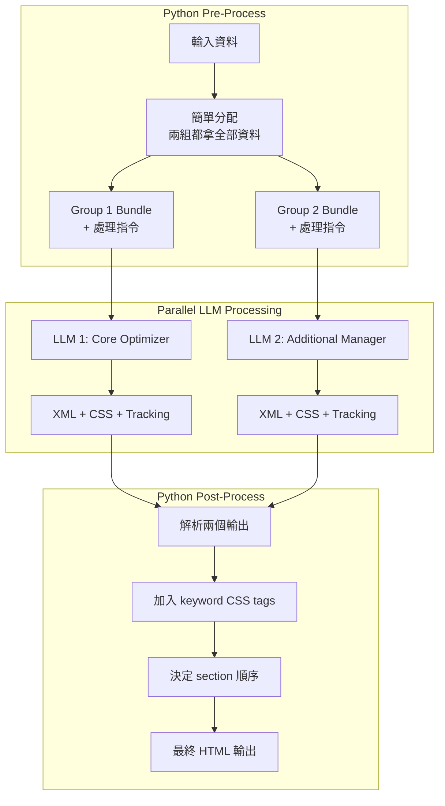
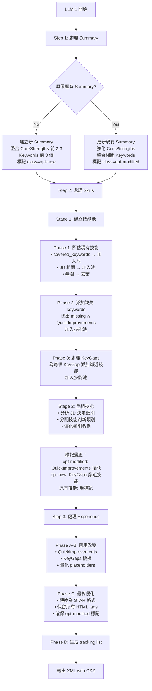

# Resume Tailoring Service v3.1.0 - 2 LLM Pipeline 架構設計文檔

## 📄 文件資訊
- **服務版本**: v3.1.0 (2 LLM Pipeline 架構)
- **Prompt 版本**: v1.0.0 (resume-core + resume-additional)
- **建立日期**: 2025-08-22
- **目的**: 設計 Resume Tailoring Service v3.1.0 架構，使用 Prompt v1.0.0
- **狀態**: Prompt v1.0.0 已完成，Service v3.1.0 待實作

---

## 🏗️ 架構概覽

### Pipeline 架構對比

#### v2.1.0 架構（現有）
```
Stage 1: InstructionCompiler (GPT-4.1 mini) → 分析結構
Stage 2: ResumeTailoringService (GPT-4.1) → 執行優化
```

#### v3.1.0 架構（新設計，使用 Prompt v1.0.0）
```
Python Pre-Process: 簡單資料分配
Parallel LLMs:
  - LLM 1: Core Optimizer (使用 v1.0.0-resume-core.yaml)
    → Summary + Skills + Experience
  - LLM 2: Additional Manager (使用 v1.0.0-resume-additional.yaml) 
    → Education + Projects + Certifications + Custom
Python Post-Process: 組合結果 + Keyword CSS 標記
```

---

## 📊 完整系統流程圖



---

## 🤖 LLM 1: Core Optimizer 決策流程

### 處理責任
- **Professional Summary** (必須有，沒有則建立)
- **Core Competencies / Skills**
- **Professional Experience**

### 決策流程圖



### LLM 1 Decision Flow (基於實際 v1.0.0-resume-core.yaml)

```mermaid
graph TD
    Start[LLM 1 開始: Core Optimizer] --> PreProcess[UNIFIED PROCESSORS<br/>QI_MAP 預處理]
    
    %% ============= UNIFIED PROCESSORS =============
    PreProcess --> QIMap["📋 QI_MAP 分類:<br/>summary: ['summary', 'objective', 'profile']<br/>skills: ['skill', 'competency', 'technology']<br/>experience: ['achievement', 'responsibility', 'bullet']<br/>general: 其他所有改進"]
    
    QIMap --> EmptyCheck{QuickImprovements 空?}
    EmptyCheck -->|Yes| SetEmpty["QI_MAP.all = []<br/>使用 missing_keywords"]
    EmptyCheck -->|No| Step1
    SetEmpty --> Step1
    
    %% ============= STEP 1: PROFESSIONAL SUMMARY =============
    Step1["═══ Step 1: Professional Summary ═══<br/>MANDATORY SECTION"] --> SummaryEx{"🔍 Summary 異常檢查"}
    
    SummaryEx --> SEx1{CoreStrengths < 3?}
    SEx1 -->|Yes| UseAvailableCS["使用現有 CoreStrengths<br/>(可能少於 4 句)"]
    SEx1 -->|No| SEx2{無 CoreStrengths?}
    SEx2 -->|Yes| FocusKeywords["聚焦於 QI_MAP.summary<br/>∩ missing_keywords"]
    SEx2 -->|No| SEx3{QI_MAP.summary 空?}
    SEx3 -->|Yes| UseDirectKeywords["直接使用 missing_keywords<br/>(智能選擇 3-5 個)"]
    SEx3 -->|No| ApplyQISummary
    
    UseAvailableCS --> CheckSummary
    FocusKeywords --> CheckSummary
    UseDirectKeywords --> CheckSummary
    ApplyQISummary["A. 應用 QI_MAP.summary"] --> CheckSummary
    
    CheckSummary{原履歷有 Summary?} 
    CheckSummary -->|Yes| UnifiedSummaryMod["B. 統一 Summary 處理 (修改)"]
    CheckSummary -->|No| UnifiedSummaryNew["B. 統一 Summary 處理 (建立)"]
    
    %% Unified Summary Processing
    UnifiedSummaryMod --> CollectElements["1. 收集要素:<br/>• Top 3 CoreStrengths<br/>• Keywords: missing_keywords ∩ QI_MAP.summary<br/>• 過濾 KeyGap 術語"]
    UnifiedSummaryNew --> CollectElements
    
    CollectElements --> Build4Sentences["2. 建立 4 句結構:<br/>• 句1: 身份+經驗+CoreStrength#1<br/>• 句2: CoreStrength#2+領域專長<br/>• 句3: CoreStrength#3+技術技能<br/>• 句4: 價值主張+職業目標"]
    
    Build4Sentences --> SummaryCSS{原本有 Summary?}
    SummaryCSS -->|Yes| SummaryModCSS["CSS: p class='opt-modified'<br/>內部: span class='opt-modified'"]
    SummaryCSS -->|No| SummaryNewCSS["CSS: div class='opt-new'<br/><h2>Professional Summary</h2>"]
    
    SummaryModCSS --> TrackS["追蹤 Summary 改變"]
    SummaryNewCSS --> TrackS
    
    %% ============= STEP 2: SKILLS PROCESSING =============
    TrackS --> Step2["═══ Step 2: Core Competencies/Skills ═══"]
    
    Step2 --> SkillEx{"🔍 Skills 異常檢查"}
    SkillEx --> SkEx1{無現有 skills?}
    SkEx1 -->|Yes| SkipPhase1[跳過 Phase 1 → Phase 2]
    SkEx1 -->|No| SkEx2{covered_keywords 空?}
    SkEx2 -->|Yes| SkipPhase1
    SkEx2 -->|No| SkEx3{QI_MAP.skills 空?}
    SkEx3 -->|Yes| UseDirectInPhase2["Phase 2: 直接使用<br/>missing_keywords"]
    SkEx3 -->|No| ApplyQISkills
    
    ApplyQISkills["A. 應用 QI_MAP.skills"] --> BuildPool
    SkipPhase1 --> InitPool2["初始化空技能池<br/>skills_pool = []"]
    UseDirectInPhase2 --> InitPool2
    InitPool2 --> Phase2
    
    %% === STAGE 1: BUILD SKILLS POOL ===
    BuildPool["🏊 Stage 1: 建立技能池<br/>(Skills Pool)"] --> InitPool["初始化結構化技能池<br/>skills_pool = [{skill, source, css_class}]"]
    
    InitPool --> Phase1["Phase 1: 從現有技能收集"]
    Phase1 --> SkillLoop{對每個現有技能}
    SkillLoop --> InCovered{在 covered_keywords?}
    InCovered -->|Yes| AddExisting["➕ 加入: {skill, 'existing', ''}"]
    InCovered -->|No| RelevantToJD{與 JD 相關?}
    RelevantToJD -->|Yes| AddExisting
    RelevantToJD -->|No| Discard[❌ 不加入 skills_pool]
    
    AddExisting --> NextSkill{更多技能?}
    Discard --> NextSkill
    NextSkill -->|Yes| SkillLoop
    NextSkill -->|No| Phase2
    
    Phase2["Phase 2: 添加 missing keywords"] --> FindIntersection["找出要添加的 keywords:<br/>missing_keywords ∩ QI_MAP.skills<br/>(或直接用 missing_keywords)"]
    FindIntersection --> AddMissing["➕ 加入 skills_pool<br/>{skill, 'quickimprovements', 'opt-modified'}"]
    
    AddMissing --> Phase3["Phase 3: 處理 KeyGaps 鄰近技能"]
    Phase3 --> ForEachGap{對每個 KeyGap}
    ForEachGap --> MapAdjacent["映射鄰近技能 (不是 KeyGap 本身):<br/>Kubernetes → Container Orchestration<br/>React → Modern JS Frameworks<br/>ML → Statistical Analysis"]
    MapAdjacent --> AddAdjacent["➕ 加入 skills_pool<br/>{skill, 'keygaps', 'opt-new'}"]
    AddAdjacent --> MoreGaps{更多 KeyGaps?}
    MoreGaps -->|Yes| ForEachGap
    MoreGaps -->|No| PoolComplete
    
    PoolComplete["✅ Skills Pool 完成<br/>包含所有技能+預標記"] --> ReorgPhase
    
    %% === STAGE 2: REORGANIZE FROM POOL ===
    ReorgPhase["🔄 Stage 2: 重組技能池"] --> AnalyzeJD["分析 JD 需求<br/>決定最佳類別結構"]
    AnalyzeJD --> CreateCat["建立新類別<br/>(如: Backend, DevOps, Data)"]
    CreateCat --> DistributeFromPool["從 skills_pool 分配技能:<br/>• 每個技能分到適合類別<br/>• 使用預標記的 css_class<br/>• 優化類別名稱"]
    DistributeFromPool --> FormatSkillsOutput["格式化輸出:<br/><strong>類別:</strong> 技能1 • 技能2<br/>應用預標記 CSS"]
    FormatSkillsOutput --> TrackSkills["追蹤 Skills 改變"]
    
    %% ============= STEP 3: EXPERIENCE PROCESSING =============
    TrackSkills --> Step3["═══ Step 3: Professional Experience ═══"]
    
    Step3 --> ExpEx{"🔍 Experience 異常檢查"}
    ExpEx --> EEx1{QI_MAP.experience 空?}
    EEx1 -->|Yes| SkipPhaseA["跳過 Phase A<br/>直接進入 Phase B & C"]
    EEx1 -->|No| EEx2{無 experience section?}
    EEx2 -->|Yes| ReturnEmpty[返回空字串]
    EEx2 -->|No| EEx3{HTML 格式異常?}
    EEx3 -->|Yes| ApplyTemplate[套用 Resume Format V3 模板]
    EEx3 -->|No| ApplyQIExp
    
    ReturnEmpty --> TrackExp
    ApplyTemplate --> ApplyQIExp
    SkipPhaseA --> PhaseBKeywords
    
    ApplyQIExp["A. 應用 QI_MAP.experience"] --> PhaseAMandatory["Phase A: 應用 QuickImprovements<br/>100% 強制執行"]
    PhaseAMandatory --> ApplyEach["對每個 QuickImprovement:<br/>1. 定位目標內容<br/>2. 精確應用轉換<br/>3. 標記 opt-modified"]
    
    ApplyEach --> PhaseBKeywords
    PhaseBKeywords["Phase B 前置: 分析 missing_keywords<br/>選擇最相關的 3-5 個"] --> PhaseB
    
    PhaseB["Phase B: KeyGaps 橋接策略"] --> BridgeStrategy["60-70% Bridge Strategy:<br/>展示通往 Gap 的基礎<br/>CSS: span class='opt-new'<br/><br/>30-40% Foundation Emphasis:<br/>強調可轉移技能<br/>CSS: li class='opt-new'"]
    
    BridgeStrategy --> PhaseC["Phase C: STAR 優化決策樹"]
    
    %% Phase C: STAR Decision Tree
    PhaseC --> STARTree["C.1 STAR Decision Tree"]
    STARTree --> AnalyzeBullet{分析每個 bullet 結構}
    
    AnalyzeBullet --> HasSTAR{Has Action + Result?}
    HasSTAR -->|Yes| SkipBullet["SKIP - 已是 STAR"]
    HasSTAR -->|No| OnlyAction{只有 Action?}
    
    OnlyAction -->|Yes| AddResult["ADD Result with metrics<br/>opt-placeholder: [X%], [TEAM SIZE]"]
    OnlyAction -->|No| OnlyResp{只有 Responsibility?}
    
    OnlyResp -->|Yes| ConvertAchieve["CONVERT to Achievement<br/>opt-modified"]
    OnlyResp -->|No| TooVague{太模糊?}
    
    TooVague -->|Yes| Rewrite["REWRITE with specifics<br/>opt-modified"]
    TooVague -->|No| NextBullet
    
    SkipBullet --> NextBullet{更多 bullets?}
    AddResult --> ApplyRanges["C.2 套用量化範圍<br/>[15-40%], [3-12], [$10K-100K]"]
    ConvertAchieve --> ApplyRanges
    Rewrite --> ApplyRanges
    
    ApplyRanges --> PreserveTags["C.3 保留 HTML 標籤<br/><strong>, <em>"]
    PreserveTags --> CheckCSS["C.4 檢查 CSS 標記<br/>opt-modified, opt-placeholder"]
    
    CheckCSS --> NextBullet
    NextBullet -->|Yes| AnalyzeBullet
    NextBullet -->|No| TrackExp
    
    TrackExp["追蹤 Experience 改變<br/>• QuickImprovements 應用數<br/>• Gap 橋接數<br/>• STAR 轉換數<br/>• Placeholders 數"] --> OutputJSON["輸出 JSON with tracking"]
```



### LLM 1 Prompt 結構 (基於實際 v1.0.0-resume-core.yaml)

```yaml
system: |
  You are Resume Core Optimizer v1.0.0, focusing on the most critical sections:
  Professional Summary, Skills, and Professional Experience.
  
  ## UNIFIED PROCESSORS (執行一次，處處使用)
  
  **Pre-categorize QuickImprovements by section:**
```
  QI_MAP = categorize_improvements(QuickImprovements):
    summary: improvements containing ["summary", "objective", "profile", "professional"]
    skills: improvements containing ["skill", "competency", "technology", "expertise"]  
    experience: improvements containing ["achievement", "responsibility", "bullet", "accomplished"]
    general: all other improvements
  ```
  
  **Empty Handling Rule:**
  ```
  IF QuickImprovements empty:
    → QI_MAP.all = []
    → Use missing_keywords directly where needed
    → Skip all "Apply QI_MAP" steps
  ```
  
  ## CSS CLASS APPLICATION RULES
  
  **Universal CSS marking based on content source:**
  - CoreStrengths/QuickImprovements → class="opt-modified" (優化現有證據)
  - KeyGaps (no evidence) → class="opt-new" (填補技能缺口)
  - Placeholders for user input → class="opt-placeholder" ([X], [Y], etc.)
  - Unchanged original content → No CSS class

user: |
  Optimize these core sections based on the following inputs:
  
  ## Original Resume (Full Access)
  {original_resume}
  
  ## Job Description
  {job_description}
  
  ## Gap Analysis Insights
  CoreStrengths: {core_strengths}
  KeyGaps: {key_gaps}  
  QuickImprovements: {quick_improvements}
  
  ## Keywords
  Covered: {covered_keywords}
  Missing: {missing_keywords}  # 完整清單
  
  ## Chain of Thought Process
  
  ### Step 1: Summary Processing (MANDATORY)
  **A. Apply QI_MAP.summary Improvements**
  **B. Unified Summary Processing:**
  1. Collect Elements: Top 3 CoreStrengths + Keywords from QI_MAP.summary ∩ missing_keywords (3-5 total)
  2. Build 4-Sentence Structure: Identity → Domain → Technical → Value
  3. CSS Marking: opt-modified (if exists) or opt-new (if created)
  
  ### Step 2: Skills Processing  
  **A. Apply QI_MAP.skills Improvements**
  **Stage 1: Build Skills Pool** (Structure: {skill: str, source: str, css_class: str})
  - Phase 1: Evaluate existing skills (covered_keywords → keep)
  - Phase 2: Add missing_keywords ∩ QI_MAP.skills → opt-modified
  - Phase 3: Add adjacent skills for KeyGaps → opt-new
  **Stage 2: Reorganize from Pool**
  - Analyze JD → Create categories → Distribute with pre-assigned CSS
  
  ### Step 3: Experience Processing
  **A. Apply QI_MAP.experience Improvements**
  **Phase A:** Apply ALL QuickImprovements (100% mandatory)
  **Phase B:** KeyGaps bridge strategy (60-70% bridge, 30-40% foundation)
  **Phase C:** STAR optimization with placeholders ([X%], [TEAM SIZE], [$XXK])
  
  ## Output Format
  <summary class="opt-new|opt-modified">...</summary>
  <skills>...</skills>
  <experience>...</experience>
  
  ## Tracking Format
  [
    "[Summary] Created/Modified: integrated 3 CoreStrengths, 4 keywords",
    "[Skills] Enhanced: reorganized into 3 categories, added 5 keywords",
    "[Experience] Optimized: applied 8 improvements, 12 placeholders"
  ]
  ```

---

## 🎨 LLM 2: Additional Manager 決策流程

### 處理責任
- **Education** (根據 enhancement flag)
- **Projects** (ONLY personal/side projects)
- **Certifications**
- **所有 Custom Sections**

### 🚨 專案放置核心規則
```
┌─────────────────────────────────────────────┐
│ Project Type → Correct Section              │
├─────────────────────────────────────────────┤
│ Work/Client → Experience ✓ (DON'T MOVE)     │
│ Academic    → Education ✓ (IF ENHANCED)     │
│ Personal    → Projects ✓ (ONLY THESE)       │
└─────────────────────────────────────────────┘
```

### 決策流程圖 (基於實際 v1.0.0-resume-additional.yaml)

```mermaid
graph TD
    Start[LLM 2 開始: Additional Manager] --> PreProcess["UNIFIED PROCESSORS<br/>QI_MAP 預處理"]
    
    %% ============= UNIFIED PROCESSORS =============
    PreProcess --> QIMap["📋 QI_MAP 分類:<br/>education: education, degree, coursework, GPA<br/>projects: project, GitHub, portfolio, demo<br/>certifications: certification, credential, license<br/>general: 其他所有改進"]
    
    QIMap --> EmptyCheck{QuickImprovements 空?}
    EmptyCheck -->|Yes| SetEmpty["QI_MAP.all = 空<br/>使用 missing_keywords"]
    EmptyCheck -->|No| Step1
    SetEmpty --> Step1
    
    %% ============= STEP 1: EDUCATION PROCESSING =============
    Step1["═══ Step 1: Education Processing ═══<br/>MANDATORY SECTION"] --> EduEx{"🔍 Education 異常檢查"}
    
    EduEx --> EEx1{無 education?}
    EEx1 -->|Yes| CreateMinimal["建立 Minimal Education:<br/>• Traditional placeholder for degree-required<br/>• Self-learning focus for skill-based<br/>標記 class=opt-new"]
    EEx1 -->|No| EEx2{enhancement flag undefined?}
    EEx2 -->|Yes| DefaultFalse["設為 false Standard 模式"]
    EEx2 -->|No| CheckEnhanceFlag
    
    CreateMinimal --> Step2
    DefaultFalse --> CheckEnhanceFlag
    
    CheckEnhanceFlag{Enhancement Flag?}
    CheckEnhanceFlag -->|true| EnhancedMode["Enhanced 模式<br/>⚠️ ONLY HIGHEST DEGREE ⚠️"]
    CheckEnhanceFlag -->|false| StandardMode["Standard 模式<br/>⚠️ ONLY HIGHEST DEGREE ⚠️"]
    
    %% Enhanced Mode Processing
    EnhancedMode --> ApplyQIEdu1[A. 應用 QI_MAP.education]
    ApplyQIEdu1 --> ProcessHighest["B. 處理最高學歷:<br/>• GPA if ≥3.0<br/>• Coursework 6-8門<br/>• Academic Projects max 3<br/>• Leadership & Activities<br/>標記 opt-new/modified"]
    ProcessHighest --> ProcessOthers["C. 處理其他學歷:<br/>僅基本資訊 學位、學校、日期"]
    
    %% Standard Mode Processing  
    StandardMode --> ApplyQIEdu2[A. 應用 QI_MAP.education]
    ApplyQIEdu2 --> ProcessHighestStd["B. 處理最高學歷:<br/>• 相關 Coursework 3-5門<br/>• Thesis/Capstone if exists<br/>• Keywords 自然融入<br/>標記 opt-modified"]
    ProcessHighestStd --> ProcessOthersStd["C. 處理其他學歷:<br/>僅基本資訊 學位、學校、日期"]
    
    ProcessOthers --> TrackEdu[追蹤 Education 改變]
    ProcessOthersStd --> TrackEdu
    
    %% ============= STEP 2: PROJECTS PROCESSING =============
    TrackEdu --> Step2["═══ Step 2: Projects Processing ═══"]
    
    Step2 --> ProjectEx{"🔍 Projects 異常檢查"}
    ProjectEx --> PEx1{"無個人專案 且<br/>KeyGaps 不需要學習專案?"}
    PEx1 -->|Yes| ReturnEmptyProj["返回空字串"]
    PEx1 -->|No| PEx2{"過多專案 >3?"}
    PEx2 -->|Yes| SelectRelevant[選擇最相關的 3 個]
    PEx2 -->|No| PreCheck
    
    ReturnEmptyProj --> Step3
    SelectRelevant --> PreCheck
    
    PreCheck["⚠️ PRE-CHECK: 專案放置規則<br/>• Work/Client → Experience ✓ 別移動<br/>• Academic → Education ✓ 如果 Enhanced<br/>• Personal → Projects ✓ 只有這些"]
    
    PreCheck --> ApplyQIProj[A. 應用 QI_MAP.projects]
    ApplyQIProj --> FilterProjects["B. 過濾專案類型:<br/>排除 work projects 保留在 Experience<br/>排除 academic projects 保留在 Education<br/>只包含 personal/side/open-source"]
    
    FilterProjects --> CheckPersonal{有符合的個人專案?}
    
    CheckPersonal -->|Yes| UpdateProj["C. 優化現有個人專案:<br/>• 加入 keywords<br/>• 量化影響 users, stars<br/>• GitHub/portfolio 連結<br/>class=opt-modified"]
    CheckPersonal -->|No| CheckKeyGaps{"KeyGaps 需要展示 且<br/>適合建立學習專案?"}
    
    CheckKeyGaps -->|Yes| CreateLearning["D. 建立學習專案:<br/>• 1-2 個誠實的學習專案<br/>• 連結到基礎技能<br/>• 明確標註學習狀態<br/>class=opt-new"]
    CheckKeyGaps -->|No| SkipProj["跳過 Projects section<br/>返回空字串"]
    
    UpdateProj --> TrackProj["追蹤 Projects 改變<br/>記錄排除的 work/academic 專案數"]
    CreateLearning --> TrackProj
    SkipProj --> Step3
    
    %% ============= STEP 3: CERTIFICATIONS PROCESSING =============
    TrackProj --> Step3["═══ Step 3: Certifications Processing ═══"]
    
    Step3 --> CertEx{"🔍 Certifications 異常檢查"}
    CertEx --> CEx1{"無認證 且<br/>KeyGaps 不需要認證?"}
    CEx1 -->|Yes| ReturnEmptyCert["返回空字串"]
    CEx1 -->|No| CEx2{已過期認證?}
    CEx2 -->|Yes| IncludeExpired["包含過期認證 + 年份<br/>讓用戶決定"]
    CEx2 -->|No| ApplyQICert
    
    ReturnEmptyCert --> Step4
    IncludeExpired --> ApplyQICert
    
    ApplyQICert[A. 應用 QI_MAP.certifications] --> CheckExistingCert{有現有認證?}
    
    CheckExistingCert -->|Yes| OptimizeExisting["B. 優化現有認證:<br/>• 按 JD 相關性重排<br/>• 統一格式 組織 + 年份<br/>• 突出 keyword 匹配<br/>class=opt-modified"]
    CheckExistingCert -->|No| SuggestForGaps["C. 為 KeyGaps 建議認證:<br/>• AWS → AWS Solutions Architect<br/>• Agile → Certified Scrum Master<br/>• Security → CompTIA Security+<br/>標記 In Progress 或 Target Q1 2025<br/>class=opt-new"]
    
    OptimizeExisting --> SuggestForGaps
    SuggestForGaps --> TrackCert[追蹤 Certifications 改變]
    
    %% ============= STEP 4: CUSTOM SECTIONS PROCESSING =============
    TrackCert --> Step4["═══ Step 4: Custom Sections Processing ═══"]
    
    Step4 --> CustomEx{"🔍 Custom Sections 異常檢查"}
    CustomEx --> CSEx1{無 custom sections?}
    CSEx1 -->|Yes| ReturnEmptyCustom["返回空字串"]
    CSEx1 -->|No| CSEx2{所有內容無關?}
    CSEx2 -->|Yes| ReturnEmptyCustom
    CSEx2 -->|No| AnalyzeTypes
    
    ReturnEmptyCustom --> Track
    
    AnalyzeTypes["A. 分析 Section 類型:<br/>Professional: Awards, Publications<br/>Community: Volunteer, Leadership<br/>Practical: Visa, Languages, Availability<br/>Personal: Hobbies, Interests"]
    
    AnalyzeTypes --> SetUnifiedName["B. 設定統一名稱:<br/>Supplementary Details"]
    
    SetUnifiedName --> PriorityFilter["C. Priority-Based 過濾:<br/><br/>P1 - ALWAYS KEEP:<br/>• Work Authorization/Visa<br/>• Security Clearance<br/>• Languages, Availability<br/><br/>P2 - CONDITIONALLY KEEP:<br/>• Publications for research role<br/>• Patents for innovation role<br/>• Memberships industry-specific<br/><br/>P3 - USUALLY REMOVE:<br/>• Hobbies unless job-related<br/>• References statement"]
    
    PriorityFilter --> CheckFiltered{過濾後有內容?}
    
    CheckFiltered -->|Yes| OutputSupplementary["D. 輸出 Supplementary Details:<br/>合併所有相關內容<br/>class=opt-modified"]
    CheckFiltered -->|No| ReturnEmptyCustom
    
    OutputSupplementary --> Track
    
    Track["生成完整 tracking 記錄:<br/>• Education: 模式 + 處理細節<br/>• Projects: 個人專案統計 + 排除數<br/>• Certifications: 現有/新增統計<br/>• Custom: 合併到 Supplementary Details"] --> OutputJSON["輸出 JSON:<br/>optimized_sections + tracking"]
```



### 📝 Education Enhancement 重要說明

**關鍵規則**：Education Enhancement (無論 Standard 或 Enhanced 模式) **只適用於最高學歷**
- **最高學歷**：獲得完整優化處理
  - Standard 模式：加入相關課程 (Coursework) 和論文/專案
  - Enhanced 模式：加入 GPA、Coursework、Academic Projects、Leadership & Activities
- **其他學歷**：僅保留基本資訊 (學位、學校、日期)
  - 不加入任何額外內容
  - 保持簡潔格式

**範例**：如果有碩士和學士學位
- 碩士（最高學歷）→ 完整優化處理
- 學士（其他學歷）→ 僅基本資訊

### LLM 2 Prompt 結構 (基於實際 v1.0.0-resume-additional.yaml)

```yaml
system: |
  You are Resume Additional Manager v1.0.0, specializing in educational credentials, 
  projects, certifications, and custom sections.
  
  ## 🚨 CRITICAL PROJECT PLACEMENT RULES 🚨
  ┌─────────────────────────────────────────────┐
  │ Project Type → Correct Section              │
  ├─────────────────────────────────────────────┤
  │ Work/Client → Experience ✓ (DON'T MOVE)     │
  │ Academic    → Education ✓ (IF ENHANCED)     │
  │ Personal    → Projects ✓ (ONLY THESE)       │
  └─────────────────────────────────────────────┘
  
  ## UNIFIED PROCESSORS (執行一次，處處使用)
  
  **Pre-categorize QuickImprovements by section:**
```
  QI_MAP = categorize_improvements(QuickImprovements):
    education: improvements containing ["education", "degree", "coursework", "GPA", "thesis"]
    projects: improvements containing ["project", "GitHub", "portfolio", "demo", "repository"]  
    certifications: improvements containing ["certification", "credential", "license", "cert"]
    general: all other improvements
  ```
  
  ## CSS CLASS APPLICATION RULES
  
  **Universal CSS marking based on content source:**
  - CoreStrengths/QuickImprovements → class="opt-modified" (優化現有證據)
  - KeyGaps (no evidence) → class="opt-new" (填補技能缺口)
  - Placeholders for user input → class="opt-placeholder" ([X], [Y], etc.)

user: |
  Process these additional sections based on the following inputs:
  
  ## Original Resume (Full Access)
  {original_resume}
  
  ## Job Description
  {job_description}
  
  ## Gap Analysis Insights
  KeyGaps: {key_gaps}
  QuickImprovements: {quick_improvements}
  
  ## Keywords
  Covered: {covered_keywords}
  Missing: {missing_keywords}  # 完整清單
  
  ## Structure Information
  Custom Sections: {custom_sections}
  Education Enhancement: {education_enhancement_needed}
  
  ## Chain of Thought Process
  
  ### Step 1: Education Processing
  **A. Apply QI_MAP.education Improvements**
  **B. Determine Mode:** enhancement_flag → Enhanced vs Standard
  **C. Process HIGHEST degree only:**
  - Enhanced: GPA + Coursework (6-8) + Academic Projects (max 3) + Leadership
  - Standard: Coursework (3-5) + Thesis/Capstone
  **D. Other degrees:** Basic format only (degree, school, dates)
  **E. Missing education:** Create minimal template
  
  ### Step 2: Projects Processing (⚠️ PRE-CHECK: Personal projects ONLY)
  **A. Apply QI_MAP.projects Improvements**
  **B. Filter projects:**
  - EXCLUDE work projects (stay in Experience)
  - EXCLUDE academic projects (stay in Education if Enhanced)
  - INCLUDE ONLY personal/side/open-source projects
  **C. Optimize existing personal projects or create learning projects for KeyGaps**
  
  ### Step 3: Certifications Processing
  **A. Apply QI_MAP.certifications Improvements**
  **B. Optimize existing:** Reorder by relevance, consistent format
  **C. Suggest for KeyGaps:** Add "In Progress" or "Target: Q1 2025" certifications
  
  ### Step 4: Custom Sections Processing (簡化版 - 二元決策)
  **A. Priority-Based Filtering:**
  - P1 (Always Keep): Work Authorization, Languages, Availability
  - P2 (Conditionally): Publications, Patents, Professional Memberships
  - P3 (Usually Remove): Hobbies, Personal Interests
  **B. Merge into single "Supplementary Details" if content remains**
  
  ## Output Format
  <education class="...">...</education>
  <projects class="..."><!-- Only personal projects --></projects>
  <certifications class="...">...</certifications>
  <additional class="...">
    <section title="Supplementary Details" class="opt-modified">...</section>
  </additional>
  
  ## Tracking Format
  [
    "[Education] Enhanced: HIGHEST degree only - Added GPA, 6 courses, 2 projects",
    "[Projects] Filtered: excluded 3 work and 2 academic projects, optimized 1 personal",
    "[Certifications] Expanded: reordered 2 existing, added 2 in-progress for gaps",
    "[Custom → Supplementary Details] Merged: 3 sections consolidated, removed irrelevant content"
  ]
  ```

---

## 🐍 Python 處理邏輯

### Pre-Process: 資料分配

```python
def allocate_bundles(request):
    """極簡分配：兩組都拿全部資料"""
    
    common_data = {
        "original_resume": request.original_resume,
        "job_description": request.job_description,
        "gap_analysis": request.gap_analysis,
        "covered_keywords": request.covered_keywords,
        "missing_keywords": request.missing_keywords,
    }
    
    group1_bundle = {
        **common_data,
        "covered_keywords": request.covered_keywords,
        "missing_keywords": request.missing_keywords,  # 完整清單
        "focus": "Summary, Skills, Experience",
        "instructions": "Summary is MANDATORY"
    }
    
    group2_bundle = {
        **common_data,
        "covered_keywords": request.covered_keywords,
        "missing_keywords": request.missing_keywords,  # 完整清單
        "education_enhancement": request.education_enhancement_needed,
        "custom_sections": request.custom_sections,
        "focus": "Education, Projects, Certifications, Custom"
    }
    
    return group1_bundle, group2_bundle
```

### Post-Process: 組合與標記

```python
def post_process(llm1_output, llm2_output, request):
    """組合結果並加入 keyword CSS"""
    
    # 1. 解析 XML 輸出
    sections1 = parse_xml_sections(llm1_output.sections)
    sections2 = parse_xml_sections(llm2_output.sections)
    
    # 2. 合併 tracking
    tracking = llm1_output.tracking + llm2_output.tracking
    
    # 3. 加入 keyword CSS tags
    all_sections = {**sections1, **sections2}
    for section_name, content in all_sections.items():
        content = add_keyword_css(
            content, 
            request.covered_keywords,  # → opt-keyword-existing
            request.missing_keywords   # → opt-keyword-new
        )
        all_sections[section_name] = content
    
    # 4. 決定 section 順序
    if request.education_enhancement_needed:
        order = ["summary", "skills", "education", "experience", 
                 "projects", "certifications", "custom"]
    else:
        order = ["summary", "skills", "experience", "projects",
                 "education", "certifications", "custom"]
    
    # 5. 組合最終 HTML
    final_html = build_html_from_sections(all_sections, order)
    
    return {
        "optimized_resume": final_html,
        "applied_improvements": tracking
    }
```

---

## 📊 CSS 標記策略總結

### CSS Class 責任分配

| CSS Class | 負責方 | 應用時機 | 用途 |
|-----------|--------|----------|------|
| `opt-modified` | LLM 1 & 2 | 生成時 | 修改的現有內容 |
| `opt-new` | LLM 1 & 2 | 生成時 | 全新建立的內容 |
| `opt-placeholder` | LLM 1 & 2 | 生成時 | 量化佔位符 (多種類型) |
| `opt-keyword-existing` | Python | 後處理 | 已存在的關鍵字 |
| `opt-keyword-new` | Python | 後處理 | 新增的關鍵字 |

### Placeholder 類型詳細說明

根據現有 codebase，`opt-placeholder` 支援多種量化佔位符類型：

| 類型 | 格式範例 | 使用場景 |
|------|---------|----------|
| 百分比 | `[X%]`, `[15-20%]` | 改善率、成長率 |
| 團隊規模 | `[TEAM SIZE]`, `[8-12]` | 人數、團隊大小 |
| 金額 | `[dollar amount]`, `[$XXK]` | 預算、營收、成本節省 |
| 數量/容量 | `[user/transaction volume]` | 用戶數、交易量、資料量 |
| 時間週期 | `[time period]`, `[X months]` | 專案期間、交付時間 |
| 精確度 | `[accuracy %]` | 模型準確率、成功率 |
| 資料集大小 | `[dataset size]` | 訓練資料量 |

### 標記範例

```html
<!-- LLM 生成的標記 -->
<p class="opt-modified">Led Python development team of 
   <span class="opt-placeholder">[8-12]</span> engineers</p>

<div class="opt-new">
  <h2>Professional Summary</h2>
  <p>Senior developer with expertise in scalable systems...</p>
</div>

<!-- Python 後處理加入的 keyword 標記 -->
<p class="opt-modified">Expert in 
   <span class="opt-keyword-existing">Python</span> and 
   <span class="opt-keyword-new">FastAPI</span> development</p>
```

---

## ✅ 關鍵設計決策 (基於實際 Prompt v1.0.0)

### 1. UNIFIED PROCESSORS (QI_MAP) 系統
- **LLM 1 & 2**: 開始前統一執行 QuickImprovements 分類
- **分類策略**: 按關鍵詞匹配分配到 summary/skills/experience/education/projects/certifications
- **空值處理**: QuickImprovements 為空時，直接使用 missing_keywords
- **一次處理，處處使用**: 避免重複分類，提高一致性

### 2. Summary 必須存在 (MANDATORY - LLM 1)
- **LLM 1 責任**: 確保 Summary 存在，沒有則建立
- **統一處理**: B/C 模式統一，都使用 4 句結構
- **異常處理**: 完整的異常檢查分支 (CoreStrengths < 3, 無 CoreStrengths, 等)
- **CSS 邏輯**: 修改用 opt-modified，建立用 opt-new

### 3. Education 必須存在 (MANDATORY - LLM 2)
- **LLM 2 責任**: 確保 Education 存在，沒有則建立
- **無教育時**: 建立 Minimal Education Template
  - Option 1: Traditional Placeholder Format (學位要求的職位)
  - Option 2: Self-Learning Focus (技能導向的職位)
- **異常處理**: 完整的教育異常檢查邏輯
- **CSS 邏輯**: 建立用 opt-new，修改用 opt-modified

### 4. Skills Pool 結構化系統
- **資料結構**: `{skill: str, source: str, css_class: str}` 預標記格式
- **三階段收集**: Phase 1 (現有) → Phase 2 (missing keywords) → Phase 3 (KeyGaps 鄰近)
- **預先標記**: 在池中就決定 CSS class，輸出時直接應用
- **重組策略**: 分析 JD 決定類別，從池中分配

### 5. 專案放置核心規則 (PROJECT PLACEMENT)
- **Work/Client** → Experience ✓ (絕不移動)
- **Academic** → Education ✓ (如果 Enhanced)
- **Personal** → Projects ✓ (只有這些)
- **PRE-CHECK**: LLM 2 執行前置檢查，過濾專案類型
- **Tracking**: 記錄排除的 work/academic 專案數量

### 6. Education Enhancement 精確規則
- **只適用於最高學歷**: 其他學歷僅保留基本資訊 (學位、學校、日期)
- **Enhanced 模式**: GPA + Coursework (6-8) + Academic Projects (max 3) + Leadership
- **Standard 模式**: Coursework (3-5) + Thesis/Capstone
- **異常處理**: 無教育背景時建立 Minimal Template

### 7. Custom Sections 簡化邏輯 (二元決策)
- **Priority-Based 過濾**: P1 (必保) → P2 (條件) → P3 (通常移除)
- **統一命名**: 合併為單一 "Supplementary Details"
- **二元結果**: 有相關內容就保留，無內容就返回空字串
- **不再使用**: 複雜的相關性評分機制

### 8. CSS 標記統一邏輯
- **Content-Source-Based**: CoreStrengths/QuickImprovements → opt-modified
- **KeyGaps → opt-new**: 無現有證據的技能缺口填補
- **Placeholders**: 多種類型 ([X%], [TEAM SIZE], [$XXK], [time period])
- **Keyword 後處理**: Python 加入 opt-keyword-existing/opt-keyword-new

### 9. 異常處理系統
- **統一異常檢查**: 每個處理步驟開始前的 "🔍 異常檢查"
- **DEFAULT VALUES**: 統一的預設值和空值處理邏輯
- **優雅降級**: 異常情況下仍能產生有效輸出

---

## 🚀 實作狀態

### ✅ 已完成
1. **Phase 1**: Prompt v1.0.0 開發
   - ✅ `src/prompts/resume_tailoring/v1.0.0-resume-core.yaml` - 完成
   - ✅ `src/prompts/resume_tailoring/v1.0.0-resume-additional.yaml` - 完成
   - ✅ UNIFIED PROCESSORS (QI_MAP) 系統實作
   - ✅ Skills Pool 結構化處理邏輯
   - ✅ 完整異常處理和 DEFAULT VALUES
   - ✅ CSS 標記統一邏輯

### 🚧 待實作
2. **Phase 2**: ResumeTailoringServiceV31 開發
   - ⏳ 實作 allocate_bundles (資料分配邏輯)
   - ⏳ 實作並行 LLM 調用 (prompt v1.0.0)
   - ⏳ 實作 post_process (組合與 keyword CSS 標記)

3. **Phase 3**: 系統整合
   - ⏳ 刪除舊 InstructionCompiler 
   - ⏳ 更新 API endpoint 使用新服務
   - ⏳ 向後相容性處理

4. **Phase 4**: 測試與驗證
   - ⏳ 單元測試 (prompt 解析與邏輯)
   - ⏳ 整合測試 (端到端流程)
   - ⏳ 效能測試 (與 v2.1.0 對比)

---

## 📝 版本歷史

### Resume Tailoring Service 版本
- **v3.1.0** (2025-08-22): 2 LLM Pipeline 架構 - 使用 Prompt v1.0.0
- **v3.0.0** (2025-08-21): 單 LLM 架構（已廢棄）
- **v2.1.0** (2025-08): 雙階段架構（現有生產版本）

### Prompt 版本對應
- **v1.0.0** (2025-08-22): 
  - resume-core.yaml - Core Optimizer (Summary + Skills + Experience)
  - resume-additional.yaml - Additional Manager (Education + Projects + Certifications + Custom)
  - 支援服務: v3.1.0

### v3.1.0 + Prompt v1.0.0 重要特性
- ✅ **MANDATORY SECTIONS**: Summary (LLM 1) 和 Education (LLM 2) 必須存在
- ✅ **UNIFIED PROCESSORS**: QI_MAP 預處理系統，一次分類處處使用
- ✅ **Skills Pool 結構化**: `{skill, source, css_class}` 預標記機制
- ✅ **專案放置規則**: PRE-CHECK 過濾，Work→Experience, Personal→Projects
- ✅ **異常處理系統**: 統一的 "🔍 異常檢查" 和 DEFAULT VALUES
- ✅ **Education Enhancement**: 僅最高學歷適用，其他保持基本格式
- ✅ **Custom Sections 簡化**: Priority-Based 過濾 + 二元決策
- ✅ **CSS 標記統一**: Content-source-based 邏輯 + 多種 Placeholder 類型

---

**維護者**: AIResumeAdvisor Team  
**狀態**: Prompt v1.0.0 完成，Service v3.1.0 待實作