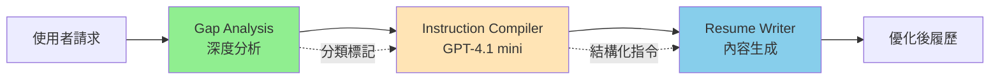

# Resume Tailoring v2.0.0 實作計畫

## 📋 執行摘要

將現有的單體式 Resume Tailoring 服務拆分為三階段管線架構，透過職責分離降低複雜度，提升品質與效能。

## 🎯 問題分析

### 現有 v1.1.0 的核心問題

1. **認知負荷過重**
   - 589 行的 prompt 試圖同時處理多項任務
   - LLM 需要分析、決策、寫作一次完成
   - 導致輸出品質不穩定

2. **效能瓶頸**
   - Token 使用量約 8000，成本高
   - 回應時間 P50 5-6s，P95 8-10s
   - 重複計算已有的指標

3. **維護困難**
   - 邏輯混雜難以調試
   - 修改一處可能影響全局
   - 測試覆蓋困難

## 🏗️ 三階段架構設計

### 整體流程


### 各階段職責

#### 1. Gap Analysis（分析階段）
- **模型**: GPT-4.1
- **職責**: 深度分析履歷與職缺的差距
- **增強輸出**: 在 KeyGaps 中加入分類標記
- **格式**: `[Skill Gap]` 或 `[Presentation Gap]`

#### 2. Instruction Compiler（編譯階段）
- **模型**: GPT-4.1 mini（新增）
- **職責**: 將分析結果轉換為精確指令
- **輸入**: Gap Analysis 結果 + 履歷結構
- **輸出**: JSON 格式的改寫指令

#### 3. Resume Writer（寫作階段）
- **模型**: GPT-4.1
- **職責**: 根據指令生成高品質內容
- **Prompt**: 簡化至 150-200 行
- **重點**: 執行品質，而非分析

## 📝 詳細實作步驟

### 階段 1：增強 Gap Analysis（第 1 天）

#### 1.1 修改 Prompt
```yaml
# src/prompts/gap_analysis/v2.1.0.yaml
# 在 KeyGaps 部分調整輸出格式

<key_gaps>
Format each gap with classification:
• For skills candidate doesn't have: Start with "[Skill Gap]"
• For skills candidate has but not visible: Start with "[Presentation Gap]"

Examples:
• [Skill Gap] Kubernetes orchestration - No container orchestration experience. Learning required: 4-6 weeks
• [Presentation Gap] Machine Learning - Has scikit-learn projects but doesn't mention "ML" or "Machine Learning"
• [Presentation Gap] Python - Django/Flask experience implies Python but not explicitly stated
</key_gaps>
```

#### 1.2 驗證輸出
- 確保標記正確加入
- 保持其他部分不變
- 測試向後相容性

#### 1.3 測試要求
```bash
# 必須通過完整測試
python test/scripts/pre_commit_check_advanced.py
```

### 階段 2：建立 Instruction Compiler（第 2-3 天）

#### 2.1 新增服務類別
```python
# src/services/instruction_compiler.py

class InstructionCompiler:
    """使用 GPT-4.1 mini 生成改寫指令"""
    
    def __init__(self):
        self.llm_client = get_llm_client("gpt41-mini")
    
    async def compile_instructions(
        self,
        resume_html: str,
        gap_analysis: dict,
        job_description: str
    ) -> dict:
        """
        將 Gap Analysis 結果編譯為結構化指令
        
        Returns:
            {
                "summary": {
                    "action": "CREATE" or "MODIFY",
                    "instructions": ["具體指令1", "具體指令2"],
                    "keywords_to_add": ["keyword1", "keyword2"]
                },
                "skills": {
                    "add": ["skill1", "skill2"],
                    "reorganize": true,
                    "categories": ["Technical", "Soft Skills"]
                },
                "experience": [
                    {
                        "role": "Software Engineer at Company",
                        "bullets": [
                            {
                                "original": "原始內容",
                                "instruction": "加入量化指標和關鍵字",
                                "keywords": ["Python", "API"]
                            }
                        ]
                    }
                ]
            }
        """
```

#### 2.2 Prompt 設計
```yaml
# src/prompts/instruction_compiler/v1.0.0.yaml

system: |
  You are an Instruction Compiler for resume optimization.
  
  Your task: Convert gap analysis into PRECISE instructions.
  Do NOT write content, only instructions.
  
  Output structured JSON with exact changes needed.

user: |
  Resume: {{resume_html}}
  Gap Analysis: {{gap_analysis}}
  Job Description: {{job_description}}
  
  Analyze gaps marked with [Skill Gap] and [Presentation Gap].
  
  For [Skill Gap]: Create transferable skill instructions
  For [Presentation Gap]: Create surfacing instructions
  
  Output JSON instructions for each section.
```

#### 2.3 整合到 LLM Factory
```python
# src/services/llm_factory.py
LLM_CONFIG = {
    "instruction_compiler": "gpt41-mini",  # 新增
    # ... 其他配置
}
```

### 階段 3：簡化 Resume Tailoring Prompt（第 4 天）

#### 3.1 新 Prompt 結構
```yaml
# src/prompts/resume_tailoring/v2.0.0-en.yaml

version: "2.0.0"
metadata:
  description: "Simplified execution-focused prompt"
  lines: 150-200  # 從 589 行大幅簡化

prompts:
  system: |
    You are a Professional Resume Writer.
    Follow the provided instructions to optimize the resume.
    
    ## Your Focus
    - Execute instructions precisely
    - Maintain professional tone
    - Integrate keywords naturally
    - Use {NEW} and {MODIFIED} markers
    
    ## Chain of Thought Process
    For each instruction:
    1. Locate the target content
    2. Apply the specified change
    3. Verify keyword integration
    4. Check natural flow

  user: |
    Original Resume: {{original_resume}}
    
    ## Compiled Instructions
    {{instructions_json}}
    
    ## Few-Shot Examples
    
    ### Example 1: Adding metrics
    Instruction: "Add metrics to achievement"
    Original: "Improved system performance"
    Output: "Improved system performance <span class='opt-modified'>by 45%, reducing load time from 3s to 1.6s</span>"
    
    ### Example 2: Surfacing skills
    Instruction: "Surface Python from Django experience"
    Original: "Built Django web application"
    Output: "Built <span class='opt-modified'>Python-based</span> Django web application"
    
    ### Example 3: Creating summary
    Instruction: "Create professional summary with cloud focus"
    Output: "<p class='opt-new'>Cloud Solutions Architect with 8 years experience designing scalable AWS infrastructure. Led migration of monolithic applications to microservices, reducing costs by 40%.</p>"
    
    Generate the optimized resume following instructions.
```

#### 3.2 修改 ResumeTailoringService
```python
# src/services/resume_tailoring.py

class ResumeTailoringService:
    
    async def tailor_resume(self, request: TailorResumeRequest):
        # Step 1: 編譯指令 (300ms)
        compiler = InstructionCompiler()
        instructions = await compiler.compile_instructions(
            request.original_resume,
            request.gap_analysis,
            request.job_description
        )
        
        # Step 2: 生成優化履歷 (3s)
        prompt_vars = {
            "original_resume": request.original_resume,
            "instructions_json": json.dumps(instructions)
        }
        
        # 使用簡化的 v2.0.0 prompt
        optimized = await self._generate_with_llm(
            prompt_version="v2.0.0",
            variables=prompt_vars
        )
        
        # Step 3: 計算改善指標（使用傳入的原始值）
        metrics = self._calculate_improvements(
            original_similarity=request.original_similarity,
            original_coverage=request.original_coverage_percentage,
            optimized_resume=optimized
        )
        
        return {
            "resume": optimized,
            "metrics": metrics
        }
```

### 階段 4：整合測試（第 5-6 天）

#### 4.1 單元測試
```python
# test/unit/test_instruction_compiler.py
def test_compiler_parses_gap_types():
    """測試編譯器正確解析 [Skill Gap] 和 [Presentation Gap]"""
    
# test/unit/test_resume_tailoring_v2.py
def test_uses_instructions_not_analysis():
    """測試新版本使用指令而非分析"""
```

#### 4.2 整合測試
```python
# test/integration/test_three_stage_pipeline.py
async def test_end_to_end_pipeline():
    """測試完整三階段流程"""
    # 1. Gap Analysis with markers
    # 2. Instruction compilation
    # 3. Resume generation
    # 驗證總時間 < 4s
```

#### 4.3 效能測試
```python
# test/performance/test_v2_performance.py
def test_p50_under_4s():
    """驗證 P50 < 4s"""
    
def test_p95_under_6s():
    """驗證 P95 < 6s"""
```

## 📊 成本效益分析

### Token 使用比較
| 組件 | v1.1.0 | v2.0.0 | 節省 |
|------|--------|--------|------|
| 主 LLM | 8000 tokens | 3000 tokens | -62% |
| GPT-4.1 mini | - | 2000 tokens | 新增 |
| **總計** | 8000 | 5000 | -37% |

### 成本比較
| 組件 | v1.1.0 | v2.0.0 |
|------|--------|--------|
| 主 LLM | $0.06 | $0.03 |
| GPT-4.1 mini | - | $0.0008 |
| **總成本** | $0.06 | $0.031 (-48%) |

### 延遲分析
| 階段 | 時間 |
|------|------|
| Gap Analysis | 不變（已完成） |
| Instruction Compiler | +300ms |
| Resume Writer | -2s |
| **淨改善** | -1.7s |

## 🔧 技術考量

### 為什麼選擇 GPT-4.1 mini？
1. **速度快**：推理時間 < 300ms
2. **成本低**：每次調用 < $0.001
3. **能力足夠**：結構化任務表現優秀
4. **穩定性高**：輸出格式一致

### 保留的最佳實踐
1. **Chain of Thought**：保留推理步驟
2. **Few-shot examples**：精選範例
3. **結構化思考**：清晰的處理流程

### 風險與緩解
| 風險 | 緩解策略 |
|------|----------|
| Instruction Compiler 失敗 | Fallback 到 v1.1.0 |
| 指令解析錯誤 | 結構化 JSON 驗證 |
| 效能未達標 | 逐步優化各階段 |

## 📈 監控指標

### 關鍵指標
- **P50 延遲**: 目標 < 4s
- **P95 延遲**: 目標 < 6s
- **Token 使用**: 目標 < 5000
- **錯誤率**: 目標 < 1%

### 品質指標
- **關鍵字覆蓋率提升**: > 20%
- **相似度提升**: > 15%
- **使用者滿意度**: 維持或提升

## 🚀 上線計畫

### Day 1-2: 開發
- 實作三階段架構
- 撰寫測試

### Day 3-4: 測試
- 單元測試
- 整合測試
- 效能測試

### Day 5-6: 優化與部署
- 效能調優
- 文檔更新
- 部署上線

## ✅ 檢查清單

### 階段 1 完成標準
- [ ] Gap Analysis 輸出包含分類標記
- [ ] 通過所有 137 個測試
- [ ] 向後相容性驗證

### 階段 2 完成標準
- [ ] Instruction Compiler 服務完成
- [ ] JSON 指令格式驗證
- [ ] 單元測試覆蓋 > 80%

### 階段 3 完成標準
- [ ] Prompt 簡化至 150-200 行
- [ ] 保留 COT 和 few-shot
- [ ] 整合測試通過

### 階段 4 完成標準
- [ ] P50 < 4s
- [ ] P95 < 6s
- [ ] 品質分數維持或提升

---

**文檔版本**: 2.0.0  
**最後更新**: 2025-01-16  
**作者**: Claude Code + WenHao