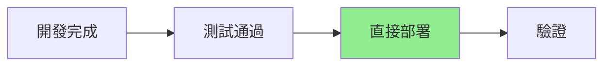

# Resume Tailoring v2.0.0 測試與部署計畫

## 📋 測試策略總覽

採用分層測試策略，確保每個階段的品質與整體系統的穩定性。

## 🧪 測試架構

### 測試金字塔
```
          /\
         /  \  E2E Tests (10%)
        /    \  端到端測試
       /------\
      /        \ Integration Tests (30%)
     /          \ 整合測試
    /------------\
   /              \ Unit Tests (60%)
  /                \ 單元測試
 /------------------\
```

## 📝 各階段測試計畫

### 階段 1：Gap Analysis 增強測試

#### 1.1 單元測試
```python
# test/unit/test_gap_analysis_v2.py

def test_gap_classification_markers():
    """測試 KeyGaps 包含正確的分類標記"""
    prompt = load_prompt("gap_analysis", "v2.1.0")
    response = mock_llm_response(prompt)
    
    # 驗證包含 [Skill Gap] 或 [Presentation Gap]
    assert "[Skill Gap]" in response["KeyGaps"]
    assert "[Presentation Gap]" in response["KeyGaps"]

def test_backward_compatibility():
    """測試向後相容性"""
    # 確保其他欄位不受影響
    assert "CoreStrengths" in response
    assert "QuickImprovements" in response
    assert "OverallAssessment" in response
```

#### 1.2 整合測試
```python
# test/integration/test_gap_analysis_integration.py

async def test_gap_analysis_with_markers():
    """測試實際 API 調用包含分類標記"""
    response = await client.post(
        "/api/v1/index-cal-and-gap-analysis",
        json=test_payload
    )
    
    gaps = response.json()["data"]["gap_analysis"]["KeyGaps"]
    # 解析 HTML，確認標記存在
    soup = BeautifulSoup(gaps, 'html.parser')
    gaps_text = soup.get_text()
    
    assert "[Skill Gap]" in gaps_text or "[Presentation Gap]" in gaps_text
```

#### 1.3 驗證步驟
```bash
# 執行完整測試套件
python test/scripts/pre_commit_check_advanced.py

# 預期結果：137 個測試全部通過
```

### 階段 2：Instruction Compiler 測試

#### 2.1 單元測試
```python
# test/unit/test_instruction_compiler.py

class TestInstructionCompiler:
    
    def test_parse_skill_gaps(self):
        """測試解析 [Skill Gap] 標記"""
        compiler = InstructionCompiler()
        gaps = "<li>[Skill Gap] Kubernetes - No experience</li>"
        
        instructions = compiler._parse_gaps(gaps)
        assert instructions["skill_gaps"] == ["Kubernetes"]
    
    def test_parse_presentation_gaps(self):
        """測試解析 [Presentation Gap] 標記"""
        gaps = "<li>[Presentation Gap] Python - Has Django experience</li>"
        
        instructions = compiler._parse_gaps(gaps)
        assert instructions["presentation_gaps"] == ["Python"]
    
    def test_generate_instructions_json(self):
        """測試生成結構化 JSON 指令"""
        instructions = compiler.compile_instructions(
            resume_html=sample_resume,
            gap_analysis=sample_gaps,
            job_description=sample_jd
        )
        
        # 驗證 JSON 結構
        assert "summary" in instructions
        assert "skills" in instructions
        assert "experience" in instructions
        assert isinstance(instructions, dict)
```

#### 2.2 效能測試
```python
# test/performance/test_compiler_performance.py

async def test_compiler_latency():
    """測試 GPT-4.1 mini 延遲"""
    start = time.time()
    
    compiler = InstructionCompiler()
    await compiler.compile_instructions(...)
    
    elapsed = time.time() - start
    assert elapsed < 0.5  # 應該在 500ms 內完成
```

### 階段 3：Resume Tailoring 簡化測試

#### 3.1 Prompt 驗證
```python
# test/unit/test_prompt_simplification.py

def test_prompt_line_count():
    """驗證 prompt 行數減少"""
    v1_prompt = load_prompt("resume_tailoring", "v1.1.0")
    v2_prompt = load_prompt("resume_tailoring", "v2.0.0")
    
    v1_lines = len(v1_prompt.split('\n'))
    v2_lines = len(v2_prompt.split('\n'))
    
    assert v2_lines < 200  # 目標：150-200 行
    assert v2_lines < v1_lines * 0.4  # 減少 60% 以上

def test_cot_preserved():
    """確認保留 Chain of Thought"""
    v2_prompt = load_prompt("resume_tailoring", "v2.0.0")
    assert "Chain of Thought" in v2_prompt
    assert "For each instruction:" in v2_prompt

def test_few_shot_examples():
    """確認保留 Few-shot examples"""
    v2_prompt = load_prompt("resume_tailoring", "v2.0.0")
    assert "Example 1:" in v2_prompt
    assert "Example 2:" in v2_prompt
```

#### 3.2 服務整合測試
```python
# test/integration/test_resume_tailoring_v2.py

async def test_uses_instruction_compiler():
    """測試新版本使用 Instruction Compiler"""
    with patch('InstructionCompiler.compile_instructions') as mock_compile:
        service = ResumeTailoringService()
        await service.tailor_resume(request)
        
        # 確認調用了編譯器
        mock_compile.assert_called_once()

async def test_no_duplicate_calculation():
    """測試不重複計算指標"""
    request = TailorResumeRequest(
        original_similarity=75,
        original_coverage_percentage=60,
        ...
    )
    
    # 確認使用傳入的值，而非重新計算
    with patch('calculate_similarity') as mock_calc:
        await service.tailor_resume(request)
        mock_calc.assert_not_called()
```

### 階段 4：端到端測試

#### 4.1 完整流程測試
```python
# test/e2e/test_three_stage_pipeline.py

async def test_complete_pipeline():
    """測試完整三階段流程"""
    
    # Step 1: Gap Analysis
    gap_response = await client.post(
        "/api/v1/index-cal-and-gap-analysis",
        json={
            "resume": test_resume,
            "job_description": test_jd,
            "keywords": test_keywords
        }
    )
    
    assert gap_response.status_code == 200
    gap_data = gap_response.json()["data"]
    
    # 驗證包含分類標記
    assert "[Skill Gap]" in gap_data["gap_analysis"]["KeyGaps"] or \
           "[Presentation Gap]" in gap_data["gap_analysis"]["KeyGaps"]
    
    # Step 2: Resume Tailoring
    tailor_response = await client.post(
        "/api/v1/tailor-resume",
        json={
            "job_description": test_jd,
            "original_resume": test_resume,
            "original_similarity": gap_data["similarity_percentage"],
            "original_coverage_percentage": gap_data["keyword_coverage"]["coverage_percentage"],
            "gap_analysis": gap_data["gap_analysis"]
        }
    )
    
    assert tailor_response.status_code == 200
    
    # Step 3: 驗證結果
    result = tailor_response.json()["data"]
    assert "resume" in result
    assert result["similarity"]["after"] > result["similarity"]["before"]
```

#### 4.2 效能基準測試
```python
# test/benchmarks/performance_benchmark.py

class PerformanceBenchmark:
    
    async def run_benchmark(self, iterations=100):
        """執行效能基準測試"""
        latencies = []
        
        for _ in range(iterations):
            start = time.time()
            await self.run_single_request()
            latencies.append(time.time() - start)
        
        # 計算統計
        p50 = np.percentile(latencies, 50)
        p95 = np.percentile(latencies, 95)
        p99 = np.percentile(latencies, 99)
        
        print(f"P50: {p50:.2f}s")
        print(f"P95: {p95:.2f}s")
        print(f"P99: {p99:.2f}s")
        
        # 驗證目標
        assert p50 < 4.0  # P50 < 4s
        assert p95 < 6.0  # P95 < 6s
```

#### 4.3 負載測試
```python
# test/load/test_concurrent_requests.py

async def test_concurrent_load():
    """測試並發請求處理"""
    
    async def single_request():
        return await client.post("/api/v1/tailor-resume", json=test_data)
    
    # 10 個並發請求
    tasks = [single_request() for _ in range(10)]
    responses = await asyncio.gather(*tasks)
    
    # 驗證所有請求成功
    for response in responses:
        assert response.status_code == 200
    
    # 驗證延遲在合理範圍
    assert max(r.elapsed.total_seconds() for r in responses) < 10
```

## 🚀 部署計畫

### 部署策略

由於**沒有 live users**，採用簡化的直接替換策略：



### 部署步驟

#### Step 1：準備部署
```bash
# 1. 確認所有測試通過
python test/scripts/pre_commit_check_advanced.py

# 2. 建立 Docker 映像
docker build -t airesumeadvisor-api:v2.0.0 .

# 3. 本地測試映像
docker run -p 8000:8000 --env-file .env airesumeadvisor-api:v2.0.0
```

#### Step 2：推送到 Azure Container Registry
```bash
# 登入 ACR
az acr login --name airesumeadvisorregistry

# 標記映像
docker tag airesumeadvisor-api:v2.0.0 \
  airesumeadvisorregistry.azurecr.io/airesumeadvisor-api:v2.0.0

# 推送映像
docker push airesumeadvisorregistry.azurecr.io/airesumeadvisor-api:v2.0.0
```

#### Step 3：更新 Container Apps
```bash
# 更新 Container App
az containerapp update \
  --name airesumeadvisor-api-production \
  --resource-group airesumeadvisorfastapi \
  --image airesumeadvisorregistry.azurecr.io/airesumeadvisor-api:v2.0.0
```

#### Step 4：驗證部署
```python
# test/deployment/verify_deployment.py

async def verify_production():
    """驗證生產環境部署"""
    
    base_url = "https://airesumeadvisor-api-production.calmisland-ea7fe91e.japaneast.azurecontainerapps.io"
    
    # 1. 健康檢查
    health = await client.get(f"{base_url}/health")
    assert health.status_code == 200
    
    # 2. 測試 Gap Analysis（應包含分類標記）
    gap_response = await client.post(
        f"{base_url}/api/v1/index-cal-and-gap-analysis",
        headers={"X-API-Key": os.getenv("API_KEY")},
        json=test_payload
    )
    assert "[Skill Gap]" in gap_response.json()["data"]["gap_analysis"]["KeyGaps"] or \
           "[Presentation Gap]" in gap_response.json()["data"]["gap_analysis"]["KeyGaps"]
    
    # 3. 測試 Resume Tailoring（應接受新欄位）
    tailor_response = await client.post(
        f"{base_url}/api/v1/tailor-resume",
        headers={"X-API-Key": os.getenv("API_KEY")},
        json={
            "original_similarity": 75,  # 新欄位
            "original_coverage_percentage": 60,  # 新欄位
            ...
        }
    )
    assert tailor_response.status_code == 200
    
    print("✅ 部署驗證成功")
```

## 📊 監控與觀測

### 關鍵監控指標

```python
# 使用 Application Insights 監控

METRICS = {
    "latency": {
        "p50": {"target": 4.0, "alert": 4.5},
        "p95": {"target": 6.0, "alert": 7.0},
        "p99": {"target": 10.0, "alert": 12.0}
    },
    "success_rate": {
        "target": 0.99,
        "alert": 0.95
    },
    "token_usage": {
        "average": {"target": 5000, "alert": 6000}
    }
}
```

### 監控儀表板

1. **效能儀表板**
   - P50/P95/P99 延遲趨勢
   - Token 使用量
   - 各階段耗時分析

2. **品質儀表板**
   - 關鍵字覆蓋率提升
   - 相似度提升
   - 錯誤率

3. **成本儀表板**
   - GPT-4.0 使用量
   - GPT-4.1 mini 使用量
   - 總成本趨勢

## 🔄 回滾計畫

雖然沒有 live users，但仍準備回滾機制：

```bash
# 快速回滾到 v1.1.0
az containerapp update \
  --name airesumeadvisor-api-production \
  --resource-group airesumeadvisorfastapi \
  --image airesumeadvisorregistry.azurecr.io/airesumeadvisor-api:v1.1.0

# 驗證回滾
curl https://airesumeadvisor-api-production.../health
```

## ✅ 部署檢查清單

### 部署前
- [ ] 所有測試通過（137 個）
- [ ] Ruff 檢查無錯誤
- [ ] 效能基準測試達標
- [ ] Docker 映像建立成功
- [ ] 本地環境測試通過

### 部署中
- [ ] 映像推送到 ACR
- [ ] Container App 更新成功
- [ ] 健康檢查通過

### 部署後
- [ ] API 端點可訪問
- [ ] Gap Analysis 包含分類標記
- [ ] Resume Tailoring 接受新欄位
- [ ] 效能指標正常
- [ ] 監控儀表板更新

## 📈 成功指標追蹤

### Week 1 目標
- P50 < 4s 達成率：> 90%
- P95 < 6s 達成率：> 85%
- 錯誤率：< 1%

### Week 2-4 目標
- 收集使用反饋
- 優化 Instruction Compiler
- 進一步降低延遲

## 🐛 已知問題與限制

1. **GPT-4.1 mini 限制**
   - 複雜指令可能需要多次嘗試
   - JSON 格式偶爾不一致

2. **緩解措施**
   - 實作重試機制
   - JSON schema 驗證
   - Fallback 到 v1.1.0

## 📚 相關文檔

- [實作計畫](./implementation-plan.md)
- [API 參考](../../API_REFERENCE.md)
- [架構總覽](./README.md)

---

**文檔版本**: 2.0.0  
**最後更新**: 2025-01-16  
**作者**: Claude Code + WenHao