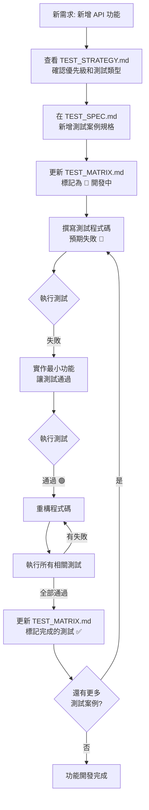

# TDD 開發工作流程

## 🎯 核心理念
「先寫測試規格，再寫程式碼」- 確保每個功能都有明確的驗收標準

## 🔄 TDD 流程圖



## 📋 標準 TDD 流程

### Step 1: 需求分析與測試規劃
當要新增功能（如 index-calculation）時：

```bash
# 1. 確認需求
- 查看 API 規格文件
- 了解輸入/輸出格式
- 確認錯誤處理需求

# 2. 查看測試策略
- 參考 TEST_STRATEGY.md 確認優先級
- 決定需要哪些類型的測試（單元/整合/效能）
```

### Step 2: 建立測試規格
```bash
# 1. 在 TEST_SPEC.md 新增測試案例
## 範例：匹配指數計算
#### API-IDX-201-UT: 基本匹配計算
- **名稱**: 履歷與職缺匹配度計算
- **優先級**: P0
- **類型**: 單元測試
- **需求編號**: REQ-003
- **測試目標**: 驗證匹配演算法正確性

#### API-IDX-202-UT: 空履歷處理
- **名稱**: 空履歷輸入錯誤處理
- **優先級**: P0
- **類型**: 單元測試
- **需求編號**: REQ-003
- **測試目標**: 驗證錯誤處理邏輯
```

### Step 3: 更新測試矩陣
```bash
# 編輯 TEST_MATRIX.md
| `/api/v1/index-calculation` | POST | ⏳ 0/5 | ⏳ 0/2 | ⏳ 0/1 | ⏳ | 規劃中 | 2025-08-15 |
                                         ↓
| `/api/v1/index-calculation` | POST | 🔄 0/5 | ⏳ 0/2 | ⏳ 0/1 | ⏳ | 開發中 | 2025-08-15 |
```

### Step 4: 撰寫測試程式碼（紅燈）
```python
# test/unit/test_index_calculation.py
class TestIndexCalculation:
    def test_API_IDX_201_UT_basic_matching(self):
        """測試案例: API-IDX-201-UT - 基本匹配計算"""
        # Arrange
        resume = {"skills": ["Python", "FastAPI"]}
        jd = {"required_skills": ["Python", "FastAPI"]}
        
        # Act
        result = calculate_matching_index(resume, jd)  # 此時函數還不存在
        
        # Assert
        assert result["matching_score"] >= 0.8
        assert result["status"] == "success"
```

### Step 5: 實作功能（綠燈）
```python
# src/services/index_calculation.py
def calculate_matching_index(resume: dict, jd: dict) -> dict:
    """實作匹配指數計算"""
    # 最小可行實作
    matching_skills = set(resume["skills"]) & set(jd["required_skills"])
    score = len(matching_skills) / len(jd["required_skills"])
    
    return {
        "matching_score": score,
        "status": "success"
    }
```

### Step 6: 重構與優化
```python
# 測試通過後，進行重構
# - 加入更複雜的演算法
# - 處理邊界情況
# - 優化效能
```

### Step 7: 更新測試狀態
```bash
# 更新 TEST_MATRIX.md
| `/api/v1/index-calculation` | POST | ✅ 3/5 | ⏳ 0/2 | ⏳ 0/1 | ⏳ | 開發中 | 2025-08-15 |
```

## 🔄 持續整合流程

### 自動化檢查點
```yaml
# .github/workflows/tdd-check.yml
name: TDD Compliance Check

on: [pull_request]

jobs:
  check-test-first:
    steps:
      - name: 檢查測試規格存在
        run: |
          # 確認 TEST_SPEC.md 有對應的測試案例
          # 確認 TEST_MATRIX.md 已更新
          
      - name: 檢查測試先於實作
        run: |
          # 確認測試檔案的 commit 時間早於實作
```

### Git Hooks
```bash
# .git/hooks/pre-commit
#!/bin/bash
# 檢查是否有新 API 但沒有對應測試

NEW_ENDPOINTS=$(git diff --staged --name-only | grep -E "api/.*\.py")
if [ ! -z "$NEW_ENDPOINTS" ]; then
  # 檢查 TEST_MATRIX.md 是否更新
  if ! git diff --staged --name-only | grep -q "TEST_MATRIX.md"; then
    echo "❌ 錯誤：新增 API 端點但未更新 TEST_MATRIX.md"
    echo "請先更新測試文檔再提交程式碼"
    exit 1
  fi
fi
```

## 📊 實踐建議

### 1. 小步快跑
- 每次只實作一個小功能
- 確保測試快速執行（< 5 秒）
- 頻繁提交（每個綠燈都提交）

### 2. 測試命名規範
```python
def test_[測試編號]_[描述]_[情境]():
    """
    測試編號對應 TEST_SPEC.md
    確保可追溯性
    """
```

### 3. 開發節奏
```
寫測試(5分鐘) → 寫程式碼(10分鐘) → 重構(5分鐘)
= 20分鐘一個循環
```

### 4. 團隊協作
- **開發者 A**: 寫測試規格和測試程式碼
- **開發者 B**: 實作功能讓測試通過
- **程式碼審查**: 確認測試覆蓋完整

## ⚡ 快速參考

### 新功能 TDD Checklist
- [ ] 需求文檔已確認
- [ ] TEST_SPEC.md 已更新測試案例
- [ ] TEST_MATRIX.md 已新增端點
- [ ] 測試程式碼已撰寫（紅燈）
- [ ] 功能實作完成（綠燈）
- [ ] 程式碼已重構
- [ ] TEST_MATRIX.md 狀態已更新
- [ ] 所有測試通過

### 常用指令
```bash
# 只執行新增的測試
pytest test/unit/test_index_calculation.py::test_API_IDX_201_UT -v

# 監控模式（檔案變更自動執行測試）
pytest-watch test/unit/test_index_calculation.py

# 產生覆蓋率報告
pytest --cov=src.services.index_calculation test/unit/test_index_calculation.py
```

## 🎯 預期效益

1. **品質保證**: 每個功能都有測試保護
2. **需求追溯**: 測試即文檔，清楚知道功能預期
3. **快速回饋**: 改壞東西立即知道
4. **信心重構**: 有測試保護，敢於優化程式碼
5. **團隊協作**: 測試規格是最好的溝通工具